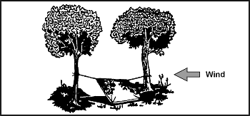
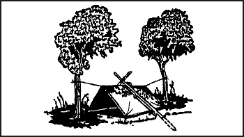
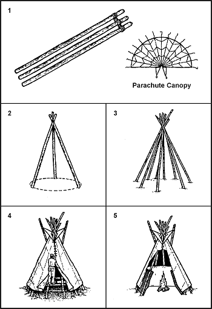
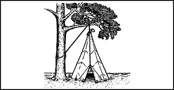
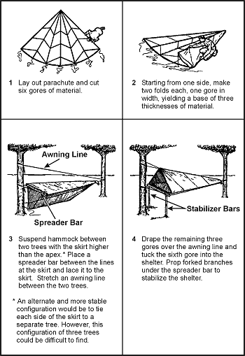
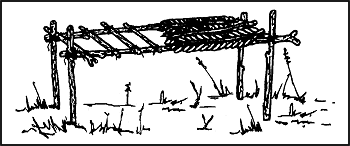
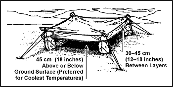

> A shelter can protect you from the sun, insects, wind, rain, snow, hot or cold temperatures, and enemy observation. It can give you a feeling of well-being and help you maintain your will to survive.
> 
> In some areas, your need for shelter may take precedence over your need for food and possibly even your need for water. For example, prolonged exposure to cold can cause excessive fatigue and weakness (exhaustion). An exhausted person may develop a "passive" outlook, thereby losing the will to survive.
> 
> Seek natural shelters or alter them to meet your needs, therefore, saving energy. A common error in making a shelter is to make it too large. A shelter must be large enough to protect you and small enough to contain your body heat, especially in cold climates.

### PRIMARY SHELTER—UNIFORM

5-1\. Your primary shelter in a survival situation will be your uniform. This point is true regardless of whether you are in a hot, cold, tropical, desert, or arctic situation. For your uniform to protect you, it must be in as good of a condition as possible and be worn properly. We use the term COLDER which is addressed in [Chapter 15](15) to remind us of what to do.

### SHELTER SITE SELECTION

5-2\. When you are in a survival situation and realize that shelter is a high priority, start looking for shelter as soon as possible. As you do so, remember what you will need at the site. Two requisites for shelter are that it must—

*   Contain material to make the type of shelter you need.

*   Be large enough and level enough for you to lie down comfortably.

5-3\. You should focus on your tactical situation and your safety when considering these requisites. You must also consider whether the site—

*   Provides concealment from enemy observation.

*   Has camouflaged escape routes.

*   Is suitable for signaling, if necessary.

*   Provides protection against wild animals and rocks and dead trees that might fall.

*   Is free from insects, reptiles, and poisonous plants.

5-4\. You must remember the problems that could arise in your environment. For instance, avoid—

*   Flash flood areas in foothills.

*   Avalanche or rockslide areas in mountainous terrain.

*   Sites near bodies of water that are below the high-water mark.

5-5\. In some areas, the season of the year has a strong bearing on the site you select. Ideal sites for a shelter differ in winter and summer. During cold winter months you will want a site that will protect you from the cold and wind, but will have a source of fuel and water. During summer months in the same area you will want a source of water, but you will also want the site to be almost insect free.

5-6\. When you are considering shelter site selection, remember the word BLISS and the following guidelines:

*   B-Blend in with the surroundings.

*   L-Low silhouette.

*   I-Irregular shape.

*   S-Small.

*   S-Secluded location.

### TYPES OF SHELTERS

5-7\. When looking for a shelter site, keep in mind the type of shelter you need. However, you must also consider the questions below:

*   How much time and effort will you need to build the shelter?

*   Will the shelter adequately protect you from the elements (sun, wind, rain, snow)?

*   Do you have the tools to build it? If not, can you make improvised tools?

*   Do you have the type and amount of materials needed to build it?

5-8\. To answer these questions, you need to know how to make various types of shelters and what materials you need to make them.

**PONCHO LEAN-TO**

5-9\. It takes only a short time and minimal equipment to build this lean-to ([Figure 5-1](#fig5-1)). You need a poncho, 2 to 3 meters (7 to 10 feet) of rope or parachute suspension line, three stakes about 30 centimeters (1 foot) long, and two trees or two poles 2 to 3 meters (7 to 10 feet) apart. Before selecting the trees you will use or the location of your poles, check the wind direction. Ensure that the back of your lean-to will be into the wind.

**Figure 5-1\. Poncho Lean-to**

5-10\. To make the lean-to, you should—

*   Tie off the hood of the poncho. Pull the drawstring tight, roll the hood longways, fold it into thirds, and tie it off with the drawstring.

*   Cut the rope in half. On one long side of the poncho, tie half of the rope to the corner grommet. Tie the other half to the other corner grommet.

*   Attach a drip stick (about a 10-centimeter [4-inch] stick) to each rope about 2.5 centimeters (about 1 inch) from the grommet. These drip sticks will keep rainwater from running down the ropes into the lean-to. Tying strings (about 10 centimeters [4 inches] long) to each grommet along the poncho's top edge will allow the water to run to and down the line without dripping into the shelter.

*   Tie the ropes about waist high on the trees. Use a round turn and two half hitches with a quick-release knot.

*   Spread the poncho and anchor it to the ground, putting sharpened sticks through the grommets and into the ground.

5-11\. If you plan to use the lean-to for more than one night, or you expect rain, make a center support for the lean-to. Make this support with a line. Attach one end of the line to the poncho hood and the other end to an overhanging branch. Make sure there is no slack in the line.

5-12\. Another method is to place a stick upright under the center of the lean-to. However, this method will restrict your space and movements in the shelter.

5-13\. For additional protection from wind and rain, place some brush, your rucksack, or other equipment at the sides of the lean-to.

5-14\. To reduce heat loss to the ground, place some type of insulating material, such as leaves or pine needles, inside your lean-to.

**NOTE:** When at rest, you lose as much as 80 percent of your body heat to the ground.

5-15\. To increase your security from enemy observation, lower the lean-to's silhouette by making two changes. First, secure the support lines to the trees at knee height (not at waist height) using two knee-high sticks in the two center grommets (sides of lean-to). Second, angle the poncho to the ground, securing it with sharpened sticks, as above.

**PONCHO TENT**

5-16\. This tent ([Figure 5-2](#fig5-2)) provides a low silhouette. It also protects you from the elements on two sides. It has, however, less usable space and observation area than a lean-to, decreasing your reaction time to enemy detection. To make this tent, you need a poncho, two 1.5- to 2.5-meter (5- to 8-foot) ropes, six sharpened sticks about 30 centimeters (1 foot) long, and two trees 2 to 3 meters (7 to 10 feet) apart.

**Figure 5-2\. Poncho Tent Using Overhanging Branch**

5-17\. To make the tent, you should—

*   Tie off the poncho hood in the same way as the poncho lean-to.

*   Tie a 1.5- to 2.5-meter (5- to 8-foot) rope to the center grommet on each side of the poncho.

*   Tie the other ends of these ropes at about knee height to two trees 2 to 3 meters (7 to 10 feet) apart and stretch the poncho tight.

*   Draw one side of the poncho tight and secure it to the ground pushing sharpened sticks through the grommets.

*   Follow the same procedure on the other side.

5-18\. If you need a center support, use the same methods as for the poncho lean-to. Another center support is an A-frame set outside but over the center of the tent ([Figure 5-3](#fig5-3)). Use two 90- to 120-centimeter-long (12- to 16-foot-long) sticks, one with a forked end, to form the A-frame. Tie the hood's drawstring to the A-frame to support the center of the tent.

**Figure 5-3\. Poncho Tent With A-Frame**

**THREE-POLE PARACHUTE TEPEE**

5-19\. If you have a parachute and three poles and the tactical situation allows, make a parachute tepee. It is easy and takes very little time to make this tepee. It provides protection from the elements and can act as a signaling device by enhancing a small amount of light from a fire or candle. It is large enough to hold several people and their equipment and to allow sleeping, cooking, and storing firewood.

5-20\. You can make this tepee ([Figure 5-4](#fig5-4)) using parts of or a whole personnel main or reserve parachute canopy. If using a standard personnel parachute, you need three poles 3.5 to 4.5 meters (12 to 15 feet) long and about 5 centimeters (2 inches) in diameter.

**Figure 5-4\. Three-Pole Parachute Tepee**

5-21\. To make this tepee, you should—

*   Lay the poles on the ground and lash them together at one end.

*   Stand the framework up and spread the poles to form a tripod.

*   For more support, place additional poles against the tripod. Five or six additional poles work best, but do not lash them to the tripod.

*   Determine the wind direction and locate the entrance 90 degrees or more from the mean wind direction.

*   Lay out the parachute on the "backside" of the tripod and locate the bridle loop (nylon web loop) at the top (apex) of the canopy.

*   Place the bridle loop over the top of a freestanding pole. Then place the pole back up against the tripod so that the canopy's apex is at the same height as the lashing on the three poles.

*   Wrap the canopy around one side of the tripod. The canopy should be of double thickness, as you are wrapping an entire parachute. You need only wrap half of the tripod, as the remainder of the canopy will encircle the tripod in the opposite direction.

*   Construct the entrance by wrapping the folded edges of the canopy around two free-standing poles. You can then place the poles side by side to close the tepee's entrance.

*   Place all extra canopy underneath the tepee poles and inside to create a floor for the shelter.

*   Leave a 30- to 50-centimeter (12- to 20-inch) opening at the top for ventilation if you intend to have a fire inside the tepee.

5-22\. You need a 14-gore section (normally) of canopy, stakes, a stout center pole, and an inner core and needle to construct this tepee ([Figure 5-5](#fig5-5)). You cut the suspension lines except for 40- to 45-centimeter (16- to 18-inch) lengths at the canopy's lower lateral band.

**Figure 5-5\. One-Pole Parachute Tepee**

5-23\. To make this tepee, you should—

*   Select a shelter site and scribe a circle about 4 meters (13 feet) in diameter on the ground.

*   Stake the parachute material to the ground using the lines remaining at the lower lateral band.

*   After deciding where to place the shelter door, emplace a stake and tie the first line (from the lower lateral band) securely to it.

*   Stretch the parachute material taut to the next line, emplace a stake on the scribed line, and tie the line to it.

*   Continue the staking process until you have tied all the lines.

*   Loosely attach the top of the parachute material to the center pole with a suspension line you previously cut and, through trial and error, determine the point at which the parachute material will be pulled tight once the center pole is upright.

*   Securely attach the material to the pole.

*   Using a suspension line (or inner core), sew the end gores together leaving 1 to 1.2 meters (3 to 4 feet) for a door.

**NO-POLE PARACHUTE TEPEE**

5-24\. Except for the center pole, you use the same materials for a no-pole parachute tepee ([Figure 5-6](#fig5-6)), as for the one-pole parachute tepee.

**Figure 5-6\. No-Pole Parachute Tepee**

5-25\. To make this tepee, you should—

*   Tie a line to the top of parachute material with a previously cut suspension line.

*   Throw the line over a tree limb, and tie it to the tree trunk.

*   Starting at the opposite side from the door, emplace a stake on the scribed 3.5- to 4.3-meter (12- to 14-foot) circle.

*   Tie the first line on the lower lateral band.

*   Continue emplacing the stakes and tying the lines to them.

5-26\. After staking down the material, unfasten the line tied to the tree trunk, tighten the tepee material by pulling on this line, and tie it securely to the tree trunk.

**ONE-MAN SHELTER**

5-27\. A one-man shelter ([Figure 5-7](#fig5-7)) you can easily make using a parachute requires a tree and three poles. One pole should be about 4.5 meters (15 feet) long and the other two about 3 meters (10 feet) long.

**Figure 5-7\. One-Man Shelter**

5-28\. To make this shelter, you should—

*   Secure the 4.5-meter (15-foot) pole to the tree at about waist height.

*   Lay the two 3-meter (10-foot) poles on the ground on either side of and in the same direction as the 4.5-meter (15-foot) pole.

*   Lay the folded canopy over the 4.5-meter (15-foot) pole so that about the same amount of material hangs on both sides.

*   Tuck the excess material under the 3-meter (10-foot) poles and spread it on the ground inside to serve as a floor.

*   Stake down or put a spreader between the two 3-meter (10-foot) poles at the shelter's entrance so they will not slide inward.

*   Use any excess material to cover the entrance.

5-29\. The parachute cloth makes this shelter wind-resistant, and the shelter is small enough that it is easily warmed. A candle, used carefully, can keep the inside temperature comfortable. However, this shelter is unsatisfactory when snow is falling, as even a light snowfall will cave it in.

**PARACHUTE HAMMOCK**

5-30\. You can make a hammock using six to eight gores of parachute canopy and two trees about 4.5 meters (15 feet) apart ([Figure 5-8](#fig5-8)).

**Figure 5-8\. Parachute Hammock**

**FIELD-EXPEDIENT LEAN-TO**

5-31\. If you are in a wooded area and have enough natural materials, you can make a field-expedient lean-to ([Figure 5-9](#fig5-9)) without the aid of tools or with only a knife. It takes longer to make this type of shelter than it does to make other types, but it will protect you from the elements.

**Figure 5-9\. Field-Expedient Lean-to and Fire Reflector**

5-32\. You will need two trees (or upright poles) about 2 meters (7 feet) apart; one pole about 2 meters (7 feet) long and 2.5 centimeters (1 inch) in diameter; five to eight poles about 3 meters (10 feet) long and 2.5 centimeters (1 inch) in diameter for beams; cord or vines for securing the horizontal support to the trees; and other poles, saplings, or vines to crisscross the beams.

5-33\. To make this lean-to, you should—

*   Tie the 2-meter (7-foot) pole to the two trees at waist to chest height. This is the horizontal support. If a standing tree is not available, construct a bipod using Y-shaped sticks or two tripods.

*   Place one end of the beams (3-meter [10-foot] poles) on one side of the horizontal support. As with all lean-to type shelters, be sure to place the lean-to's backside into the wind.

*   Crisscross saplings or vines on the beams.

*   Cover the framework with brush, leaves, pine needles, or grass, starting at the bottom and working your way up like shingling.

*   Place straw, leaves, pine needles, or grass inside the shelter for bedding.

5-34\. In cold weather, add to your lean-to's comfort by building a fire reflector wall ([Figure 5-9](#fig5-9)). Drive four 1.5-meter-long (5-foot-long) stakes into the ground to support the wall. Stack green logs on top of one another between the support stakes. Form two rows of stacked logs to create an inner space within the wall that you can fill with dirt. This action not only strengthens the wall but makes it more heat reflective. Bind the top of the support stakes so that the green logs and dirt will stay in place.

5-35\. With just a little more effort you can have a drying rack. Cut a few 2-centimeter-diameter (3/4-inch-diameter) poles long enough to span the distance between the lean-to's horizontal support and the top of the fire reflector wall. Lay one end of the poles on the lean-to support and the other end on top of the reflector wall. Place and tie smaller sticks across these poles. You now have a place to dry clothes, meat, or fish.

**SWAMP BED**

5-36\. In a marsh or swamp, or any area with standing water or continually wet ground, the swamp bed ([Figure 5-10](#fig5-10)) keeps you out of the water. When selecting such a site, consider the weather, wind, tides, and available materials.

**Figure 5-10\. Swamp Bed**

5-37\. To make a swamp bed, you should—

*   Look for four trees clustered in a rectangle, or cut four poles (bamboo is ideal) and drive them firmly into the ground so they form a rectangle. They should be far enough apart and strong enough to support your height and weight, to include equipment.

*   Cut two poles that span the width of the rectangle. They, too, must be strong enough to support your weight.

*   Secure these two poles to the trees (or poles). Be sure they are high enough above the ground or water to allow for tides and high water.

*   Cut additional poles that span the rectangle's length. Lay them across the two side poles and secure them.

*   Cover the top of the bed frame with broad leaves or grass to form a soft sleeping surface.

*   Build a fire pad by laying clay, silt, or mud on one corner of the swamp bed and allow it to dry.

5-38\. Another shelter designed to get you above and out of the water or wet ground uses the same rectangular configuration as the swamp bed. You simply lay sticks and branches lengthwise on the inside of the trees (or poles) until there is enough material to raise the sleeping surface above the water level.

**NATURAL SHELTERS**

5-39\. Do not overlook natural formations that provide shelter. Examples are caves, rocky crevices, clumps of bushes, small depressions, large rocks on leeward sides of hills, large trees with low-hanging limbs, and fallen trees with thick branches. However, when selecting a natural formation—

*   Stay away from low ground such as ravines, narrow valleys, or creek beds. Low areas collect the heavy cold air at night and are therefore colder than the surrounding high ground. Thick, brushy, low ground also harbors more insects.

*   Check for poisonous snakes, ticks, mites, scorpions, and stinging ants.

*   Look for loose rocks, dead limbs, coconuts, or other natural growth than could fall on your shelter.

**DEBRIS HUT**

5-40\. For warmth and ease of construction, the debris hut ([Figure 5-11](#fig5-11)) is one of the best. When shelter is essential to survival, build this shelter.

**Figure 5-11\. Debris Hut**

5-41\. To make a debris hut, you should—

*   Build it by making a tripod with two short stakes and a long ridgepole or by placing one end of a long ridgepole on top of a sturdy base.

*   Secure the ridgepole (pole running the length of the shelter) using the tripod method or by anchoring it to a tree at about waist height.

*   Prop large sticks along both sides of the ridgepole to create a wedge-shaped ribbing effect. Ensure the ribbing is wide enough to accommodate your body and steep enough to shed moisture.

*   Place finer sticks and brush crosswise on the ribbing. These form a latticework that will keep the insulating material (grass, pine needles, leaves) from falling through the ribbing into the sleeping area.

*   Add light, dry, if possible, soft debris over the ribbing until the insulating material is at least 1 meter (3 feet) thick—the thicker the better.

*   Place a 30-centimeter (1-foot) layer of insulating material inside the shelter.

*   At the entrance, pile insulating material that you can drag to you once inside the shelter to close the entrance or build a door.

*   As a final step in constructing this shelter, add shingling material or branches on top of the debris layer to prevent the insulating material from blowing away in a storm.

**TREE-PIT SNOW SHELTER**

5-42\. If you are in a cold, snow-covered area where evergreen trees grow and you have a digging tool, you can make a tree-pit shelter ([Figure 5-12](#fig5-12)).

**Figure 5-12\. Tree-Pit Snow Shelter**

5-43\. To make this shelter, you should—

*   Find a tree with bushy branches that provides overhead cover.

*   Dig out the snow around the tree trunk until you reach the depth and diameter you desire, or until you reach the ground.

*   Pack the snow around the top and the inside of the hole to provide support.

*   Find and cut other evergreen boughs. Place them over the top of the pit to give you additional overhead cover. Place evergreen boughs in the bottom of the pit for insulation.

5-44\. See [Chapter 15](15) for other arctic or cold weather shelters.

**BEACH SHADE SHELTER**

5-45\. The beach shade shelter ([Figure 5-13](#fig5-13)) protects you from the sun, wind, rain, and heat. It is easy to make using natural materials.

**Figure 5-13\. Beach Shade Shelter**

5-46\. To make this shelter, you should—

*   Find and collect driftwood or other natural material to use as support beams and as a digging tool.

*   Select a site that is above the high water mark.

*   Scrape or dig out a trench running north to south so that it receives the least amount of sunlight. Make the trench long and wide enough for you to lie down comfortably.

*   Mound soil on three sides of the trench. The higher the mound, the more space inside the shelter.

*   Lay support beams (driftwood or other natural material) that span the trench on top of the mound to form the framework for a roof.

*   Enlarge the shelter's entrance by digging out more sand in front of it.

*   Use natural materials such as grass or leaves to form a bed inside the shelter.

**DESERT SHELTERS**

5-47\. In an arid environment, consider the time, effort, and material needed to make a shelter. If you have material such as a poncho, canvas, or a parachute, use it along with such terrain features as rock outcroppings, mounds of sand, or depressions between dunes or rocks to make your shelter.

5-48\. When using rock outcroppings, you should—

*   Anchor one end of your poncho (canvas, parachute, or other material) on the edge of the outcrop using rocks or other weights.

*   Extend and anchor the other end of the poncho so it provides the best possible shade.

5-49\. In a sandy area, you should—

*   Build a mound of sand or use the side of a sand dune for one side of the shelter.

*   Anchor one end of the material on top of the mound using sand or other weights.

*   Extend and anchor the other end of the material so it provides the best possible shade.

**NOTE:** If you have enough material, fold it in half and form a 30- to 45-centimeter (12- to 18-inch) airspace between the two halves. This airspace will reduce the temperature under the shelter.

5-50\. A belowground shelter ([Figure 5-14](#fig5-14)) can reduce the midday heat as much as 16 to 22 degrees C (30 to 40 degrees F). However, building it requires more time and effort than for other shelters. Since your physical effort will make you sweat more and increase dehydration, construct it before the heat of the day.

**Figure 5-14\. Belowground Desert Shelter**

5-51\. To make this shelter, you should—

*   Find a low spot or depression between dunes or rocks. If necessary, dig a trench 45 to 60 centimeters (18 to 24 inches) deep, and long and wide enough for you to lie in comfortably.

*   Pile the sand you take from the trench to form a mound around three sides.

*   On the open end of the trench, dig out more sand so you can get in and out of your shelter easily.

*   Cover the trench with your material.

*   Secure the material in place using sand, rocks, or other weights.

5-52\. If you have extra material, you can further decrease the midday temperature in the trench by securing the material 30 to 45 centimeters (12 to 18 inches) above the other cover. This layering of the material will reduce the inside temperature 11 to 22 degrees C (20 to 40 degrees F).

5-53\. The open desert shelter is of similar construction, except all sides are open to air currents and circulation. For maximum protection, you need a minimum of two layers of parachute material ([Figure 5-15](#fig5-15)). White is the best color to reflect heat; the innermost layer should be of darker material.

**Figure 5-15\. Open Desert Shelter**
