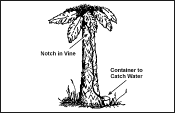
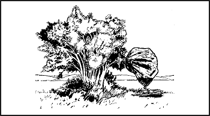

> Water is one of your most urgent needs in a survival situation. You can't live long without it, especially in hot areas where you lose water rapidly through perspiration. Even in cold areas, you need a minimum of 2 liters of water each day to maintain efficiency.
> 
> More than three-fourths of your body is composed of fluids. Your body loses fluid because of heat, cold, stress, and exertion. To function effectively, you must replace the fluid your body loses. So, one of your first goals is to obtain an adequate supply of water.

### WATER SOURCES

6-1\. Almost any environment has water present to some degree. [Figure 6-1](#fig6-1) lists possible sources of water in various environments. It also provides information on how to make the water potable.

**NOTE:** If you do not have a canteen, cup, can, or other type of container, improvise one from plastic or water-resistant cloth. Shape the plastic or cloth into a bowl by pleating it. Use pins or other suitable items—even your hands—to hold the pleats.

**Figure 6-1\. Water Sources in Different Environments**

**Figure 6-1\. Water Sources in Different Environments (Continued)**

6-2\. If you do not have a reliable source to replenish your water supply, stay alert for ways in which your environment can help you.

**NOTE: DO NOT** substitute the fluids listed in [Figure 6-2](#fig6-2) for water.

**Figure 6-2\. The Effects of Substitute Fluids**

6-3\. Heavy dew can provide water. Tie rags or tufts of fine grass around your ankles and walk through dew-covered grass before sunrise. As the rags or grass tufts absorb the dew, wring the water into a container. Repeat the process until you have a supply of water or until the dew is gone. Australian natives sometimes mop up as much as 1 liter an hour this way.

6-4\. Bees or ants going into a hole in a tree may point to a water-filled hole. Siphon the water with plastic tubing or scoop it up with an improvised dipper. You can also stuff cloth in the hole to absorb the water and then wring it from the cloth.

6-5\. Water sometimes gathers in tree crotches or rock crevices. Use the above procedures to get the water. In arid areas, bird droppings around a crack in the rocks may indicate water in or near the crack.

6-6\. Green bamboo thickets are an excellent source of fresh water. Water from green bamboo is clear and odorless. To get the water, bend a green bamboo stalk, tie it down, and cut off the top ([Figure 6-3](#fig6-3)). The water will drip freely during the night. Old, cracked bamboo may also contain water.

**Figure 6-3\. Water From Green Bamboo**

> **CAUTION**
> 
> Purify the water before drinking it.

6-7\. Wherever you find banana trees, plantain trees, or sugarcane, you can get water. Cut down the tree, leaving about a 30-centimeter (12-inch) stump, and scoop out the center of the stump so that the hollow is bowl-shaped. Water from the roots will immediately start to fill the hollow. The first three fillings of water will be bitter, but succeeding fillings will be palatable. The stump ([Figure 6-4](#fig6-4)) will supply water for up to 4 days. Be sure to cover it to keep out insects.

**Figure 6-4\. Water From Plantain or Banana Tree Stump**

6-8\. Some tropical vines can give you water. Cut a notch in the vine as high as you can reach, then cut the vine off close to the ground. Catch the dropping liquid in a container or in your mouth ([Figure 6-5](#fig6-5)).

> **CAUTION**
> 
> Ensure that the vine is not poisonous.

**Figure 6-5\. Water From a Vine**

6-9\. The milk from young, green (unripe) coconuts is a good thirst quencher. However, the milk from mature, brown, coconuts contains an oil that acts as a laxative. Drink in moderation only.

> **CAUTION**
> 
> Do not drink the liquid if it is sticky, milky, or bitter tasting.

6-10\. In the American tropics you may find large trees whose branches support air plants. These air plants may hold a considerable amount of rainwater in their overlapping, thickly growing leaves. Strain the water through a cloth to remove insects and debris.

6-11\. You can get water from plants with moist pulpy centers. Cut off a section of the plant and squeeze or smash the pulp so that the moisture runs out. Catch the liquid in a container.

6-12\. Plant roots may provide water. Dig or pry the roots out of the ground, cut them into short pieces, and smash the pulp so that the moisture runs out. Catch the liquid in a container.

6-13\. Fleshy leaves, stems, or stalks, such as bamboo, contain water. Cut or notch the stalks at the base of a joint to drain out the liquid.

6-14\. The following trees can also provide water:

*   _Palms._ The buri, coconut, sugar, rattan, and nips contain liquid. Bruise a lower frond and pull it down so the tree will "bleed" at the injury.

*   _Traveler's tree._ Found in Madagascar, this tree has a cuplike sheath at the base of its leaves in which water collects.

*   _Umbrella tree._ The leaf bases and roots of this tree of western tropical Africa can provide water.

*   _Baobab tree._ This tree of the sandy plains of northern Australia and Africa collects water in its bottlelike trunk during the wet season. Frequently, you can find clear, fresh water in these trees after weeks of dry weather.

> **CAUTION**
> 
> Do not keep the sap from plants longer than 24 hours. It begins fermenting, becoming dangerous as a water source.

### STILL CONSTRUCTION

6-15\. You can use stills in various areas of the world. They draw moisture from the ground and from plant material. You need certain materials to build a still, and you need time to let it collect the water. It takes about 24 hours to get 0.5 to 1 liter of water.

**ABOVEGROUND STILLS**

6-16\. You can construct two types of aboveground stills. To make the **vegetation bag still**, you need a sunny slope on which to place the still, a clear plastic bag, green leafy vegetation, and a small rock ([Figure 6-6](#fig6-6)).

**Figure 6-6\. Vegetation Bag Still**

6-17\. To make the still, you should—

*   Fill the bag with air by turning the opening into the breeze or by "scooping" air into the bag.

*   Fill the plastic bag one-half to three-fourths full of green leafy vegetation. Be sure to remove all hard sticks or sharp spines that might puncture the bag.

*   Place a small rock or similar item in the bag.

*   Close the bag and tie the mouth securely as close to the end of the bag as possible to keep the maximum amount of air space. If you have a piece of tubing, a small straw, or a hollow reed, insert one end in the mouth of the bag before you tie it securely. Then tie off or plug the tubing so that air will not escape. This tubing will allow you to drain out condensed water without untying the bag.

> **CAUTION**
> 
> Do not use poisonous vegetation. It will provide poisonous liquid.

*   Place the bag, mouth downhill, on a slope in full sunlight. Position the mouth of the bag slightly higher than the low point in the bag.

*   Settle the bag in place so that the rock works itself into the low point in the bag.

6-18\. To get the condensed water from the still, loosen the tie around the bag's mouth and tip the bag so that the water collected around the rock will drain out. Then retie the mouth securely and reposition the still to allow further condensation.

6-19\. Change the vegetation in the bag after extracting most of the water from it. This will ensure maximum output of water.

6-20\. Making a **transpiration bag still** is similar to the vegetation bag, only easier. Simply tie the plastic bag over a leafy tree limb with a tube inserted, and tie the mouth of the bag off tightly around the branch to form an airtight seal. Tie the end of the limb so that it hangs below the level of the mouth of the bag. The water will collect there ([Figure 6-7](#fig6-7)).

**Figure 6-7\. Water Transpiration Bag**

6-21\. The same limb may be used for 3 to 5 days without causing long-term harm to the limb. It will heal itself within a few hours of removing the bag.

**BELOWGROUND STILL**

6-22\. To make a belowground still, you need a digging tool, a container, a clear plastic sheet, a drinking tube, and a rock ([Figure 6-8](#fig6-8)).

**Figure 6-8\. Belowground Still**

6-23\. Select a site where you believe the soil will contain moisture (such as a dry streambed or a low spot where rainwater has collected). The soil at this site should be easy to dig, and sunlight must hit the site most of the day.

6-24\. To construct the still, you should—

*   Dig a bowl-shaped hole about 1 meter (3 feet) across and 60 centimeters (24 inches) deep.

*   Dig a sump in the center of the hole. The sump's depth and perimeter will depend on the size of the container that you have to place in it. The bottom of the sump should allow the container to stand upright.

*   Anchor the tubing to the container's bottom by forming a loose overhand knot in the tubing.

*   Place the container upright in the sump.

*   Extend the unanchored end of the tubing up, over, and beyond the lip of the hole.

*   Place the plastic sheet over the hole, covering its edges with soil to hold it in place.

*   Place a rock in the center of the plastic sheet.

*   Lower the plastic sheet into the hole until it is about 40 centimeters (16 inches) below ground level. It now forms an inverted cone with the rock at its apex. Make sure that the cone's apex is directly over your container. Also make sure the plastic cone does not touch the sides of the hole because the earth will absorb the condensed water.

*   Put more soil on the edges of the plastic to hold it securely in place and to prevent the loss of moisture.

*   Plug the tube when not in use to keep the moisture from evaporating and to keep insects out.

6-25\. You can drink water without disturbing the still by using the tube as a straw. By opening the still, you release the moist, warm air that has accumulated.

6-26\. You may want to use plants in the hole as a moisture source. If so, dig out additional soil from the sides of the hole to form a slope on which to place the plants. Then proceed as above.

6-27\. If polluted water is your only moisture source, dig a small trough outside the hole about 25 centimeters (10 inches) from the still's lip ([Figure 6-9](#fig6-9)). Dig the trough about 25 centimeters (10 inches) deep and 8 centimeters (3 inches) wide. Pour the polluted water in the trough. Be sure you do not spill any polluted water around the rim of the hole where the plastic sheet touches the soil. The trough holds the polluted water and the soil filters it as the still draws it. The water then condenses on the plastic and drains into the container. This process works extremely well when your only water source is salt water.

**Figure 6-9\. Belowground Still to Get Potable Water From Polluted Water**

6-28\. You will need at least three stills to meet your individual daily water intake needs. In comparison to the belowground still and the water transpiration bag still, the vegetation bag produces the best yield of water.

### WATER PURIFICATION

6-29\. Rainwater collected in clean containers or in plants is usually safe for drinking. However, purify water from lakes, ponds, swamps, springs, or streams, especially the water near human settlements or in the tropics.

6-30\. When possible, purify all water you get from vegetation or from the ground by boiling or using iodine or chlorine. After purifying a canteen of water, you must partially unscrew the cap and turn the canteen upside down to rinse unpurified water from the threads of the canteen where your mouth touches.

6-31\. Purify water by the following methods:

*   Use water purification tablets. (Follow the directions provided.)

*   Place 5 drops of 2 percent tincture of iodine in a canteen full of clear water. If the canteen is full of cloudy or cold water, use 10 drops. (Let the canteen of water stand for 30 minutes before drinking.)

*   Use 2 drops of 10 percent (military strength) povidone-iodine or 1 percent titrated povidone-iodine. The civilian equivalent is usually 2 percent strength, so 10 drops will be needed. Let stand for 30 minutes. If the water is cold and clear, wait 60 minutes. If it's very cold or cloudy, add 4 drops and wait 60 minutes.

*   Place 2 drops of chlorine bleach (5.25 percent sodium hypochlorite) in a canteen of water. Let stand 30 minutes. If the water is cold or cloudy, wait 60 minutes. Remember that not all bleach is the same around the world; check the available level of sodium hypochlorite.

*   Use potassium permanganate, commonly marketed as Condy's Crystals, for a number of applications, including emergency disinfection of water. The crystals are of a nonuniform size, so you must judge the actual dosage by the color of the water after adding the crystals. Add three small crystals to 1 liter (1 quart) of water. If the water turns a bright pink after waiting 30 minutes, the water is considered purified. If the water turns a dark pink, there is too much potassium permanganate to drink safely. Either add more water to dilute the mixture or save it for use as an antiseptic solution. If the water becomes a full red, like the color of cranberry juice, the solution may be used as an antifungal solution.

*   Boil your drinking water. This is the safest method of purifying your drinking water. By achieving a rolling boil, you can ensure that you are destroying all living waterborne pathogens.

6-32\. By drinking nonpotable water you may contract diseases or swallow organisms that can harm you and may easily lead to potentially fatal waterborne illnesses.

6-33\. Two of the most prevalent pathogens found in most water sources throughout the world are—

*   Giardia, which causes Giardiasis (beaver fever). It is characterized by an explosive, watery diarrhea accompanied by severe cramps lasting 7 to 14 days.

*   Cryptosporidium, which causes Cryptosporidiosis. It is much like Giardiasis, only more severe and prolonged, and there is no known cure but time. Diarrhea may be mild and can last from 3 days to 2 weeks.

**NOTE:** The only effective means of neutralizing Cryptosporidium is by boiling or by using a commercial microfilter or reverse-osmosis filtration system. Chemical disinfectants such as iodine tablets or bleach have not shown to be 100 percent effective in eliminating Cryptosporidium.

6-34\. Examples of other diseases or organisms are—

*   _Dysentery._ You may experience severe, prolonged diarrhea with bloody stools, fever, and weakness.

*   _Cholera and typhoid._ You may be susceptible to these diseases regardless of inoculations. Cholera can cause profuse, watery diarrhea, vomiting, and leg cramps. Typhoid symptoms include fever, headache, loss of appetite, constipation, and bleeding in the bowel.

*   _Hepatitis A._ Symptoms include diarrhea, abdominal pain, jaundice, and dark urine. This infection can spread through close person-to-person contact or ingestion of contaminated water or food.

*   _Flukes._ Stagnant, polluted water—especially in tropical areas—often contains blood flukes. If you swallow flukes, they will bore into the bloodstream, live as parasites, and cause disease.

*   _Leeches._ If you swallow a leech, it can hook onto the throat passage or inside the nose. It will suck blood, create a wound, and move to another area. Each bleeding wound may become infected.

### WATER FILTRATION DEVICES

6-35\. If the water you find is also muddy, stagnant, and foul-smelling, you can clear the water—

*   By placing it in a container and letting it stand for 12 hours.

*   By pouring it through a filtering system.

**NOTE:** These procedures only clear the water and make it more palatable. You will have to purify it.

6-36\. To make a filtering system, place several centimeters or layers of filtering material such as sand, crushed rock, charcoal, or cloth in bamboo, a hollow log, or an article of clothing ([Figure 6-10](#fig6-10)).

**Figure 6-10\. Water Filtering Systems**

6-37\. Remove the odor from water by adding charcoal from your fire. Charcoal is also helpful in absorbing some agricultural and industrial chemicals. Let the water stand for 45 minutes before drinking it.

* * *
