> One of man's most urgent requirements is food. In contemplating virtually any hypothetical survival situation, the mind immediately turns to thoughts of food. Unless the situation occurs in an arid environment, even water, which is more important to maintaining body functions, will usually follow food in our initial thoughts. The survivor must remember that the three essentials of survival—water, food, and shelter—are prioritized according to the estimate of the actual situation. This estimate must not only be timely but accurate as well. We can live for weeks without food but it may take days or weeks to determine what is safe to eat and to trap animals in the area. Therefore, you need to begin food gathering in the earliest stages of survival as your endurance will decrease daily. Some situations may well dictate that shelter precede both food and water.

### ANIMALS FOR FOOD

8-1\. Unless you have the chance to take large game, concentrate your efforts on the smaller animals. They are more abundant and easier to prepare. You need not know all the animal species that are suitable as food; relatively few are poisonous, and they make a smaller list to remember. However, it is important to learn the habits and behavioral patterns of classes of animals. For example, animals that are excellent choices for trapping, those that inhabit a particular range and occupy a den or nest, those that have somewhat fixed feeding areas, and those that have trails leading from one area to another. Larger, herding animals, such as elk or caribou, roam vast areas and are somewhat more difficult to trap. Also, you must understand the food choices of a particular species to select the proper bait.

8-2\. You can, with relatively few exceptions, eat anything that crawls, swims, walks, or flies. You must first overcome your natural aversion to a particular food source. Historically, people in starvation situations have resorted to eating everything imaginable for nourishment. A person who ignores an otherwise healthy food source due to a personal bias, or because he feels it is unappetizing, is risking his own survival. Although it may prove difficult at first, you must eat what is available to maintain your health. Some classes of animals and insects may be eaten raw if necessary, but you should, if possible, thoroughly cook all food sources whenever possible to avoid illness.

**INSECTS**

8-3\. The most abundant and easily caught life-form on earth are insects. Many insects provide 65 to 80 percent protein compared to 20 percent for beef. This fact makes insects an important, if not overly appetizing, food source. Insects to avoid include all adults that sting or bite, hairy or brightly colored insects, and caterpillars and insects that have a pungent odor. Also avoid spiders and common disease carriers such as ticks, flies, and mosquitoes.

8-4\. Rotting logs lying on the ground are excellent places to look for a variety of insects including ants, termites, beetles, and grubs, which are beetle larvae. Do not overlook insect nests on or in the ground. Grassy areas, such as fields, are good areas to search because the insects are easily seen. Stones, boards, or other materials lying on the ground provide the insects with good nesting sites. Check these sites. Insect larvae are also edible. Insects that have a hard outer shell such as beetles and grasshoppers will have parasites. Cook them before eating. Remove any wings and barbed legs also. You can eat most soft-shelled insects raw. The taste varies from one species to another. Wood grubs are bland, but some species of ants store honey in their bodies, giving them a sweet taste. You can grind a collection of insects into a paste. You can mix them with edible vegetation. You can cook them to improve their taste.

**WORMS**

8-5\. Worms (_Annelidea_) are an excellent protein source. Dig for them in damp humus soil and in the rootball of grass clumps, or watch for them on the ground after a rain. After capturing them, drop them into clean, potable water for about 15 minutes. The worms will naturally purge or wash themselves out, after which you can eat them raw.

**CRUSTACEANS**

8-6\. Freshwater shrimp range in size from 0.25 centimeter (1/16 inch) up to 2.5 centimeters (1 inch). They can form rather large colonies in mats of floating algae or in mud bottoms of ponds and lakes.

8-7\. Crayfish are akin to marine lobsters and crabs. You can distinguish them by their hard exoskeleton and five pairs of legs, the front pair having oversized pincers. Crayfish are active at night, but you can locate them in the daytime by looking under and around stones in streams. You can also find them by looking in the soft mud near the chimney-like breathing holes of their nests. You can catch crayfish by tying bits of offal or internal organs to a string. When the crayfish grabs the bait, pull it to shore before it has a chance to release the bait.

8-8\. You can find saltwater lobsters, crabs, and shrimp from the surf's edge out to water 10 meters (33 feet) deep. Shrimp may come to a light at night where you can scoop them up with a net. You can catch lobsters and crabs with a baited trap or a baited hook. Crabs will come to bait placed at the edge of the surf, where you can trap or net them. Lobsters and crabs are nocturnal and caught best at night.

**NOTE:** You must cook all freshwater crustaceans, mollusks, and fish. Fresh water tends to harbor many dangerous organisms (see [Chapter 6](06)), animal and human contaminants, and possibly agricultural and industrial pollutants.

**MOLLUSKS**

8-9\. This class includes octopuses and freshwater and saltwater shellfish such as snails, clams, mussels, bivalves, barnacles, periwinkles, chitons, and sea urchins ([Figure 8-1](#fig8-1)). You find bivalves similar to our freshwater mussel and terrestrial and aquatic snails worldwide under all water conditions.

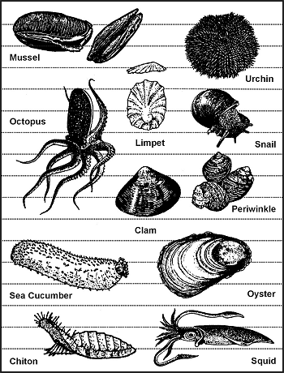

**Figure 8-1\. Edible Mollusks**

8-10\. River snails or freshwater periwinkles are plentiful in rivers, streams, and lakes of northern coniferous forests. These snails may be pencil point or globular in shape.

8-11\. In fresh water, look for mollusks in the shallows, especially in water with a sandy or muddy bottom. Look for the narrow trails they leave in the mud or for the dark elliptical slit of their open valves.

8-12\. Near the sea, look in the tidal pools and the wet sand. Rocks along beaches or extending as reefs into deeper water often bear clinging shellfish. Snails and limpets cling to rocks and seaweed from the low water mark upward. Large snails, called chitons, adhere tightly to rocks above the surf line.

8-13\. Mussels usually form dense colonies in rock pools, on logs, or at the base of boulders.

> **CAUTION**
> 
> Mussels may be poisonous in tropical zones during the summer! If a noticeable red tide has occurred within 72 hours, do not eat any fish or shellfish from that water source.

8-14\. Steam, boil, or bake mollusks in the shell. They make excellent stews in combination with greens and tubers.

> **CAUTION**
> 
> Do not eat shellfish that are not covered by water at high tide!

**FISH**

8-15\. Fish represent a good source of protein and fat. They offer some distinct advantages to the survivor or evader. They are usually more abundant than mammal wildlife, and the ways to get them are silent. To be successful at catching fish, you must know their habits. For instance, fish tend to feed heavily before a storm. Fish are not likely to feed after a storm when the water is muddy and swollen. Light often attracts fish at night. When there is a heavy current, fish will rest in places where there is an eddy, such as near rocks. Fish will also gather where there are deep pools, under overhanging brush, and in and around submerged foliage, logs, or other objects that offer them shelter.

8-16\. There are no poisonous freshwater fish. However, the catfish species has sharp, needlelike protrusions on its dorsal fins and barbels. These can inflict painful puncture wounds that quickly become infected.

8-17\. Cook all freshwater fish to kill parasites. As a precaution, also cook saltwater fish caught within a reef or within the influence of a freshwater source. Any marine life obtained farther out in the sea will not contain parasites because of the saltwater environment. You can eat these raw.

8-18\. Most fish encountered are edible. The organs of some species are always poisonous to man; other fish can become toxic because of elements in their diets. Ciguatera is a form of human poisoning caused by the consumption of subtropical and tropical marine fish which have accumulated naturally occurring toxins through their diet. These toxins build up in the fish's tissues. The toxins are known to originate from several algae species that are common to ciguatera endemic regions in the lower latitudes. Cooking does not eliminate the toxins; neither does drying, smoking, or marinating. Marine fish most commonly implicated in ciguatera poisoning include the barracudas, jacks, mackerel, triggerfish, snappers, and groupers. Many other species of warm water fishes harbor ciguatera toxins. The occurrence of toxic fish is sporadic, and not all fish of a given species or from a given locality will be toxic. This explains why red snapper and grouper are a coveted fish off the shores of Florida and the East Coast. While they are a restaurant and fisherman's favorite, and a common fish market choice, they can also be associated with 100 cases of food poisonings in May 1988, Palm Beach County, Florida. The poisonings resulted in a statewide warning against eating hogfish, grouper, red snapper, amberjack, and barracuda caught at the Dry Tortuga Bank. A major outbreak of ciguatera occurred in Puerto Rico between April and June 1981 prompting a ban on the sale of barracuda, amberjack, and blackjack. Other examples of poisonous saltwater fish are the porcupine fish, cowfish, thorn fish, oilfish, and puffer ([Figure 8-2](#fig8-2)).

**Figure 8-2\. Fish With Poisonous Flesh**

**AMPHIBIANS**

8-19\. Frogs are easily found around bodies of fresh water. Frogs seldom move from the safety of the water's edge. At the first sign of danger, they plunge into the water and bury themselves in the mud and debris. Frogs are characterized by smooth, moist skin. There are few poisonous species of frogs. Avoid any brightly colored frog or one that has a distinct "X" mark on its back as well as all tree frogs. Do not confuse toads with frogs. Toads may be recognized by their dry, "warty" or bumpy skin. They are usually found on land in drier environments. Several species of toads secrete a poisonous substance through their skin as a defense against attack. Therefore, to avoid poisoning, do not handle or eat toads.

8-20\. Do not eat salamanders; only about 25 percent of all salamanders are edible, so it is not worth the risk of selecting a poisonous variety. Salamanders are found around the water. They are characterized by smooth, moist skin and have only four toes on each foot.

**REPTILES**

8-21\. Reptiles are a good protein source and relatively easy to catch. Thorough cooking and hand washing is imperative with reptiles. All reptiles are considered to be carriers of salmonella, which exists naturally on their skin. Turtles and snakes are especially known to infect man. If you are in an undernourished state and your immune system is weak, salmonella can be deadly. Cook food thoroughly and be especially fastidious washing your hands after handling any reptile. Lizards are plentiful in most parts of the world. They may be recognized by their dry, scaly skin. They have five toes on each foot. The only poisonous ones are the Gila monster and the Mexican beaded lizard. Care must be taken when handling and preparing the iguana and the monitor lizard, as they commonly harbor the salmonellal virus in their mouth and teeth. The tail meat is the best tasting and easiest to prepare.

8-22\. Turtles are a very good source of meat. There are actually seven different flavors of meat in each snapping turtle. Most of the meat will come from the front and rear shoulder area, although a large turtle may have some on its neck. The box turtle ([Figure 8-3](#fig8-3)) is a commonly encountered turtle that you should not eat. It feeds on poisonous mushrooms and may build up a highly toxic poison in its flesh. Cooking does not destroy this toxin. Also avoid the hawksbill turtle ([Figure 8-3](#fig8-3)), found in the Atlantic Ocean, because of its poisonous thorax gland. Poisonous snakes, alligators, crocodiles, and large sea turtles present obvious hazards to the survivor.

**Figure 8-3\. Turtles With Poisonous Flesh**

**BIRDS**

8-23\. All species of birds are edible, although the flavor will vary considerably. The only poisonous bird is the Pitohui, native only to New Guinea. You may skin fish-eating birds to improve their taste. As with any wild animal, you must understand birds' common habits to have a realistic chance of capturing them. You can take pigeons, as well as some other species, from their roost at night by hand. During the nesting season, some species will not leave the nest even when approached. Knowing where and when the birds nest makes catching them easier ([Figure 8-4](#fig8-4)). Birds tend to have regular flyways going from the roost to a feeding area, to water, and so forth. Careful observation should reveal where these flyways are and indicate good areas for catching birds in nets stretched across the flyways ([Figure 8-5](#fig8-5)). Roosting sites and waterholes are some of the most promising areas for trapping or snaring.

**Figure 8-4\. Birds' Nesting Places**

**Figure 8-5\. Catching Birds in a Net**

8-24\. Nesting birds present another food source—eggs. Remove all but two or three eggs from the clutch, marking the ones that you leave. The bird will continue to lay more eggs to fill the clutch. Continue removing the fresh eggs, leaving the ones you marked.

**MAMMALS**

8-25\. Mammals are excellent protein sources and, for Americans, the tastiest food source. There are some drawbacks to obtaining mammals. In a hostile environment, the enemy may detect any traps or snares placed on land. The amount of injury an animal can inflict is in direct proportion to its size. All mammals have teeth and nearly all will bite in self-defense. Even a squirrel can inflict a serious wound and any bite presents a serious risk of infection. Also, any mother can be extremely aggressive in defense of her young. Any animal with no route of escape will fight when cornered.

8-26\. All mammals are edible; however, the polar bear and bearded seal have toxic levels of vitamin A in their livers. The platypus, native to Australia and Tasmania, is an egg-laying, semiaquatic mammal that has poisonous claws on its hind legs. Scavenging mammals, such as the opossum, may carry diseases.

### TRAPS AND SNARES

8-27\. For an unarmed survivor or evader, or when the sound of a rifle shot could be a problem, trapping or snaring wild game is a good alternative. Several well-placed traps have the potential to catch much more game than a man with a rifle is likely to shoot. To be effective with any type of trap or snare, you must—

*   Be familiar with the species of animal you intend to catch.

*   Be capable of constructing a proper trap and properly masking your scent.

*   Not alarm the prey by leaving signs of your presence.

8-28\. There are no catchall traps you can set for all animals. You must determine what species are in the area and set your traps specifically with those animals in mind. Look for the following:

*   Runs and trails.

*   Tracks.

*   Droppings.

*   Chewed or rubbed vegetation.

*   Nesting or roosting sites.

*   Feeding and watering areas.

8-29\. Position your traps and snares where there is proof that animals pass through. You must determine if it is a "run" or a "trail." A trail will show signs of use by several species and will be rather distinct. A run is usually smaller and less distinct and will only contain signs of one species. You may construct a perfect snare, but it will not catch anything if haphazardly placed in the woods. Animals have bedding areas, water holes, and feeding areas with trails leading from one to another. You must place snares and traps around these areas to be effective.

8-30\. If you are in a hostile environment, trap and snare concealment is important. However, it is equally important not to create a disturbance that will alarm the animal and cause it to avoid the trap. Therefore, if you must dig, remove all fresh dirt from the area. Most animals will instinctively avoid a pitfall-type trap. Prepare the various parts of a trap or snare away from the site, carry them in, and set them up. Such actions make it easier to avoid disturbing the local vegetation, thereby alerting the prey. Do not use freshly cut, live vegetation to construct a trap or snare. Freshly cut vegetation will "bleed" sap that has an odor the prey will be able to smell. It is an alarm signal to the animal.

8-31\. You must remove or mask the human scent on and around the trap you set. Although birds do not have a developed sense of smell, nearly all mammals depend on smell even more than on sight. Even the slightest human scent on a trap will alarm the prey and cause it to avoid the area. Actually removing the scent from a trap is difficult but masking it is relatively easy. Use the fluid from the gall and urine bladders of previous kills. Do not use human urine. Mud, particularly from an area with plenty of rotting vegetation, is also good. Use it to coat your hands when handling the trap and to coat the trap when setting it. In nearly all parts of the world, animals know the smell of burned vegetation and smoke. It is only when a fire is actually burning that they become alarmed. Therefore, smoking the trap parts is an effective means to mask your scent. If one of the above techniques is not practical, and if time permits, allow a trap to weather for a few days and then set it. Do not handle a trap while it is weathering. When you position the trap, camouflage it as naturally as possible to prevent detection by the enemy and to avoid alarming the prey.

8-32\. Traps or snares placed on a trail or run should use funneling or channelization. To build a channel, construct a funnel-shaped barrier extending from the sides of the trail toward the trap, with the narrowest part nearest the trap. Channelization should be inconspicuous to avoid alerting the prey. As the animal gets to the trap, it cannot turn left or right and continues into the trap. Few wild animals will back up, preferring to face the direction of travel. Channelization does not have to be an impassable barrier. You only have to make it inconvenient for the animal to go over or through the barrier. For best effect, the channelization should reduce the trail's width to just slightly wider than the targeted animal's body. Maintain this constriction at least as far back from the trap as the animal's body length, then begin the widening toward the mouth of the funnel.

**USE OF BAIT**

8-33\. Baiting a trap or snare increases your chances of catching an animal. When catching fish, you must bait nearly all the devices. Success with an unbaited trap depends on its placement in a good location. A baited trap can actually draw animals to it. The bait should be something the animal knows. However, this bait should not be so readily available in the immediate area that the animal can get it close by. For example, baiting a trap with corn in the middle of a cornfield would not be likely to work. Likewise, if corn is not grown in the region, a corn-baited trap may arouse an animal's curiosity and keep it alerted while it ponders the strange food. Under such circumstances it may not go for the bait. One bait that works well on small mammals is the peanut butter from a meal, ready-to-eat (MRE) ration. Salt is also a good bait. When using such baits, scatter bits of it around the trap to give the prey a chance to sample it and develop a craving for it. The animal will then overcome some of its caution before it gets to the trap.

8-34\. If you set and bait a trap for one species but another species takes the bait without being caught, try to determine what the animal was. Then set a proper trap for that animal, using the same bait.

**NOTE:** Once you have successfully trapped an animal, you will not only gain confidence in your ability, you will also have resupplied yourself with bait for several more traps.

**CONSTRUCTION**

8-35\. Traps and snares _crush, choke, hang,_ or _entangle_ the prey. A single trap or snare will commonly incorporate two or more of these principles. The mechanisms that provide power to the trap are usually very simple. The struggling victim, the force of gravity, or a bent sapling's tension provides the power.

8-36\. The heart of any trap or snare is the trigger. When planning a trap or snare, ask yourself how it should affect the prey, what is the source of power, and what will be the most efficient trigger. Your answers will help you devise a specific trap for a specific species. Traps are designed to catch and hold or to catch and kill. Snares are traps that incorporate a noose to accomplish either function.

**Simple Snare**

8-37\. A simple snare ([Figure 8-6](#fig8-6)) consists of a noose placed over a trail or den hole and attached to a firmly planted stake. If the noose is some type of cordage placed upright on a game trail, use small twigs or blades of grass to hold it up. Filaments from spider webs are excellent for holding nooses open. Make sure the noose is large enough to pass freely over the animal's head. As the animal continues to move, the noose tightens around its neck. The more the animal struggles, the tighter the noose gets. This type of snare usually does not kill the animal. If you use cordage, it may loosen enough to slip off the animal's neck. Wire is therefore the best choice for a simple snare.

**Figure 8-6\. Simple Snare**

**Drag Noose**

8-38\. Use a drag noose on an animal run ([Figure 8-7](#fig8-7)). Place forked sticks on either side of the run and lay a sturdy crossmember across them. Tie the noose to the crossmember and hang it at a height above the animal's head. (Nooses designed to catch by the head should never be low enough for the prey to step into with a foot.) As the noose tightens around the animal's neck, the animal pulls the crossmember from the forked sticks and drags it along. The surrounding vegetation quickly catches the crossmember and the animal becomes entangled.

**Figure 8-7\. Drag Noose**

**Twitch-Up**

8-39\. A twitch-up is a supple sapling that, when bent over and secured with a triggering device, will provide power to a variety of snares. Select a hickory or other hardwood sapling along the trail. A twitch-up will work much faster and with more force if you remove all the branches and foliage.

**Twitch-Up Snare**

8-40\. A simple twitch-up snare uses two forked sticks, each with a long and short leg ([Figure 8-8](#fig8-8)). Bend the twitch-up and mark the trail below it. Drive the long leg of one forked stick firmly into the ground at that point. Ensure the cut on the short leg of this stick is parallel to the ground. Tie the long leg of the remaining forked stick to a piece of cordage secured to the twitch-up. Cut the short leg so that it catches on the short leg of the other forked stick. Extend a noose over the trail. Set the trap by bending the twitch-up and engaging the short legs of the forked sticks. When an animal catches its head in the noose, it pulls the forked sticks apart, allowing the twitch-up to spring up and hang the prey.

**NOTE:** Do not use green sticks for the trigger. The sap that oozes out could glue them together.

**Figure 8-8\. Twitch-Up Snare**

**Squirrel Pole**

8-41\. A squirrel pole is a long pole placed against a tree in an area showing a lot of squirrel activity ([Figure 8-9](#fig8-9)). Place several wire nooses along the top and sides of the pole so that a squirrel trying to go up or down the pole will have to pass through one or more of them. Position the nooses (5 to 6 centimeters [2 to 2 1/4-inches] in diameter) about 2.5 centimeters (1 inch) off the pole. Place the top and bottom wire nooses 45 centimeters (18 inches) from the top and bottom of the pole to prevent the squirrel from getting its feet on a solid surface. If this happens, the squirrel will chew through the wire. Squirrels are naturally curious. After an initial period of caution, they will try to go up or down the pole and will be caught in the noose. The struggling animal will soon fall from the pole and strangle. Other squirrels will soon be drawn to the commotion. In this way, you can catch several squirrels. You can emplace multiple poles to increase the catch.

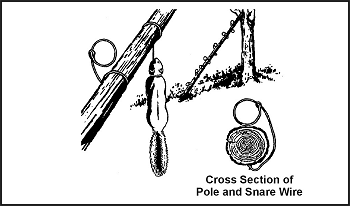

**Figure. 8-9\. Squirrel Pole**

**Ojibwa Bird Pole**

8-42\. An Ojibwa bird pole is a snare that has been used by Native Americans for centuries ([Figure 8-10](#fig8-10)). To be effective, it should be placed in a relatively open area away from tall trees. For best results, pick a spot near feeding areas, dusting areas, or watering holes. Cut a pole 1.8 to 2.1 meters (6 to 7 feet) long and trim away all limbs and foliage. Do not use resinous wood such as pine. Sharpen the upper end to a point, then drill a small-diameter hole 5 to 7.5 centimeters (2 to 3 inches) down from the top. Cut a small stick 10 to 15 centimeters (4 to 6 inches) long and shape one end so that it will almost fit into the hole. This is the perch. Plant the long pole in the ground with the pointed end up. Tie a small weight, about equal to the weight of the targeted species, to a length of cordage. Pass the free end of the cordage through the hole, and tie a slip noose that covers the perch. Tie a single overhand knot in the cordage and place the perch against the hole. Allow the cordage to slip through the hole until the overhand knot rests against the pole and the top of the perch. The tension of the overhand knot against the pole and perch will hold the perch in position. Spread the noose over the perch, ensuring it covers the perch and drapes over on both sides. Most birds prefer to rest on something above ground and will land on the perch. As soon as the bird lands, the perch will fall, releasing the overhand knot and allowing the weight to drop. The noose will tighten around the bird's feet, capturing it. If the weight is too heavy, it will cut off the bird's feet, allowing it to escape. Another variation would be to use spring tension such as a tree branch in place of the weight.

**Figure 8-10\. Ojibwa Bird Pole**

**Noosing Wand**

8-43\. A noose stick or "noosing wand" is useful for capturing roosting birds or small mammals ([Figure 8-11](#fig8-11)). It requires a patient operator. This wand is more a weapon than a trap. It consists of a pole (as long as you can effectively handle) with a slip noose of wire or stiff cordage at the small end. To catch an animal, you slip the noose over the neck of a roosting bird and pull it tight. You can also place it over a den hole and hide in a nearby blind. When the animal emerges from the den, you jerk the pole to tighten the noose and thus capture the animal. Carry a stout club to kill the prey.

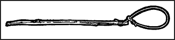

**Figure 8-11\. Noosing Wand**

**Treadle Spring Snare**

8-44\. Use a treadle snare against small game on a trail ([Figure 8-12](#fig8-12)). Dig a shallow hole in the trail. Then drive a forked stick (fork down) into the ground on each side of the hole on the same side of the trail. Select two fairly straight sticks that span the two forks. Position these two sticks so that their ends engage the forks. Place several sticks over the hole in the trail by positioning one end over the lower horizontal stick and the other on the ground on the other side of the hole. Cover the hole with enough sticks so that the prey must step on at least one of them to set off the snare. Tie one end of a piece of cordage to a twitch-up or to a weight suspended over a tree limb. Bend the twitch-up or raise the suspended weight to determine where you will tie the trigger. The trigger should be about 5 centimeters (2 inches) long. Form a noose with the other end of the cordage. Route and spread the noose over the top of the sticks over the hole. Place the trigger stick against the horizontal sticks and route the cordage behind the sticks so that the tension of the power source will hold it in place. Adjust the bottom horizontal stick so that it will barely hold against the trigger. As the animal places its foot on a stick across the hole, the bottom horizontal stick moves down, releasing the trigger and allowing the noose to catch the animal by the foot. Because of the disturbance on the trail, an animal will be wary. You must therefore use channelization. To increase the effectiveness of this trap, a small bait well may be dug into the bottom of the hole. Place some bait in the bottom of the hole to lure the animal to the snare.

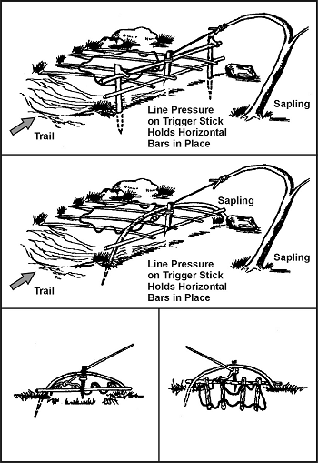

**Figure 8-12\. Treadle Spring Snare**

**Figure 4 Deadfall**

8-45\. The figure 4 deadfall is a trigger used to drop a weight onto a prey and crush it ([Figure 8-13](#fig8-13)). The type of weight used may vary, but it should be heavy enough to kill or incapacitate the prey immediately. Construct the figure 4 using three notched sticks. These notches hold the sticks together in a figure 4 pattern when under tension. Practice making this trigger beforehand; it requires close tolerances and precise angles in its construction.

**Figure 8-13\. Figure 4 Deadfall**

**Paiute Deadfall**

8-46\. The Paiute deadfall is similar to the figure 4 but uses a piece of cordage and a catch stick ([Figure 8-14](#fig8-14)). It has the advantage of being easier to set than the figure 4\. Tie one end of a piece of cordage to the lower end of the diagonal stick. Tie the other end of the cordage to another stick about 5 centimeters (2 inches) long. This stick is the catch stick. Bring the cord halfway around the vertical stick with the catch stick at a 90-degree angle. Place the bait stick with one end against the drop weight, or a peg driven into the ground, and the other against the catch stick. When a prey disturbs the bait stick, it falls free, releasing the catch stick. As the diagonal stick flies up, the weight falls, crushing the prey. To increase the effectiveness of this trap, a small bait well may be dug into the bottom of the hole. Place some bait in the bottom of the hole to lure the animals to the snare.

**Figure 8-14\. Paiute Deadfall**

**Bow Trap**

8-47\. A bow trap is one of the deadliest traps ([Figure 8-15](#fig8-15)). It is dangerous to man as well as animals. To construct this trap, build a bow and anchor it to the ground with pegs. Adjust the aiming point as you anchor the bow. Lash a toggle stick to the trigger stick. Two upright sticks driven into the ground hold the trigger stick in place at a point where the toggle stick will engage the pulled bowstring. Place a catch stick between the toggle stick and a stake driven into the ground. Tie a trip wire or cordage to the catch stick and route it around stakes and across the game trail where you tie it off (as in [Figure 8-15](#fig8-15)). When the prey trips the trip wire, the bow looses an arrow into it. A notch in the bow serves to help aim the arrow.

**Figure 8-15\. Bow Trap**

> **WARNING**
> 
> This is a lethal trap. Approach it with caution and from the rear only!

**Pig Spear Shaft**

8-48\. To construct the pig spear shaft, select a stout pole about 2.5 meters (8 feet) long ([Figure 8-16](#fig8-16)). At the smaller end, firmly lash several small stakes. Lash the large end tightly to a tree along the game trail. Tie a length of cordage to another tree across the trail. Tie a sturdy, smooth stick to the other end of the cord. From the first tree, tie a trip wire or cord low to the ground, stretch it across the trail, and tie it to a catch stick. Make a slip ring from vines or other suitable material. Encircle the trip wire and the smooth stick with the slip ring. Emplace one end of another smooth stick within the slip ring and its other end against the second tree. Pull the smaller end of the spear shaft across the trail and position it between the short cord and the smooth stick. As the animal trips the trip wire, the catch stick pulls the slip ring off the smooth sticks, releasing the spear shaft that springs across the trail and impales the prey against the tree.

**Figure 8-16\. Pig Spear Shaft**

> **WARNING**
> 
> This is a lethal trap. Approach it with caution and from the rear only!

**Bottle Trap**

8-49\. A bottle trap is a simple trap for mice and voles ([Figure 8-17](#fig8-17)). Dig a hole 30 to 45 centimeters (12 to 18 inches) deep that is wider at the bottom than at the top. Make the top of the hole as small as possible. Place a piece of bark or wood over the hole with small stones under it to hold it up 2.5 to 5 centimeters (1 to 2 inches) off the ground. Mice or voles will hide under the cover to escape danger and fall into the hole. They cannot climb out because of the wall's backward slope. Use caution when checking this trap; it is an excellent hiding place for snakes.

**Figure 8-17\. Bottle Trap**

### KILLING DEVICES

8-50\. There are several killing devices that you can construct to help you obtain small game to help you survive. The rabbit stick, the spear, the bow and arrow, and the sling are such devices.

**RABBIT STICK**

8-51\. One of the simplest and most effective killing devices is a stout stick as long as your arm, from fingertip to shoulder, called a "rabbit stick." You can throw it either overhand or sidearm and with considerable force. It is best thrown so that it flies sideways, increasing the chance of hitting the target. It is very effective against small game that stops and freezes as a defense.

**SPEAR**

8-52\. You can make a spear to kill small game and to fish. Jab with the spear—do not throw it. [Paragraph 8-67](#para8-67) explains spearfishing.

**BOW AND ARROW**

8-53\. A good bow is the result of many hours of work. You can construct a suitable short-term bow fairly easily. When it loses its spring or breaks, you can replace it. Select a hardwood stick about 1 meter (3 feet) long that is free of knots or limbs. Carefully scrape the large end down until it has the same pull as the small end. Careful examination will show the natural curve of the stick. Always scrape from the side that faces you, or the bow will break the first time you pull it. Dead, dry wood is preferable to green wood. To increase the pull, lash a second bow to the first, front to front, forming an "X" when viewed from the side. Attach the tips of the bows with cordage and only use a bowstring on one bow.

8-54\. Select arrows from the straightest dry sticks available. The arrows should be about half as long as the bow. Scrape each shaft smooth all around. You will probably have to straighten the shaft. You can bend an arrow straight by heating the shaft over hot coals. Do not allow the shaft to scorch or burn. Hold the shaft straight until it cools.

8-55\. You can make arrowheads from bone, glass, metal, or pieces of rock. You can also sharpen and fire-harden the end of the shaft. Fire hardening is actually a misnomer. To fire-harden wood, hold it over hot coals or plunge it deep under the coals in the ashes, being careful not to burn or scorch the wood. The purpose of fire hardening is to harden the wood by drying the moisture out of it.

8-56\. You must notch the ends of the arrows for the bowstring. Cut or file the notch; do not split it. Fletching (adding feathers to the notched end of an arrow) improves the arrow's flight characteristics. Fletching is recommended but not necessary on a field-expedient arrow.

**SLING**

8-57\. You can make a sling by tying two pieces of cordage, each about 60 centimeters (24 inches) long, at opposite ends of a palm-sized piece of leather or cloth. Place a rock in the cloth and wrap one cord around your middle finger and hold in your palm. Hold the other cord between your forefinger and thumb. To throw the rock, spin the sling several times in a circle and release the cord between your thumb and forefinger. Practice to gain proficiency. The sling is very effective against small game.

### FISHING DEVICES

8-58\. You can make your own fishhooks, nets, and traps. The paragraphs below discuss several methods to obtain fish.

**IMPROVISED FISHHOOKS**

8-59\. You can make field-expedient fishhooks from pins, needles, wire, small nails, or any piece of metal. You can also use wood, bone, coconut shell, thorns, flint, seashell, or tortoise shell. You can also make fishhooks from any combination of these items ([Figure 8-18](#fig8-18)).

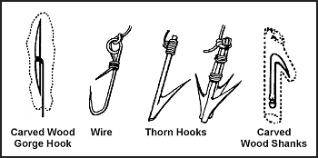

**Figure 8-18\. Improvised Fishhooks**

8-60\. To make a wooden hook, cut a piece of hardwood about 2.5 centimeters (1 inch) long and about 6 millimeters (1/4 inch) in diameter to form the shank. Cut a notch in one end in which to place the point. Place the point (piece of bone, wire, nail) in the notch. Hold the point in the notch and tie securely so that it does not move out of position. This is a fairly large hook. To make smaller hooks, use smaller material.

8-61\. A gorge or skewer is a small shaft of wood, bone, metal, or other material. It is sharp on both ends and notched in the middle where you tie cordage. Bait the gorge by placing a piece of bait on it lengthwise. When the fish swallows the bait, it also swallows the gorge. If you are tending the fishing line when the fish bites, do not attempt to pull on the line to set the hook as you would with a conventional hook. Allow the fish to swallow the bait to get the gorge as far down its throat before the gorge sets itself.

**STAKEOUT**

8-62\. A stakeout is a fishing device you can use in a hostile environment ([Figure 8-19](#fig8-19)). To construct a stakeout, drive two supple saplings into the bottom of the lake, pond, or stream with their tops just below the water surface. Tie a cord between them just slightly below the surface. Tie two short cords with hooks or gorges to this cord, ensuring that they cannot wrap around the poles or each other. They should also not slip along the long cord. Bait the hooks or gorges.

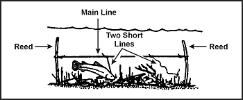

**Figure 8-19\. Stakeout**

**GILL NET**

8-63\. If a gill net is not available, you can make one using parachute suspension line or similar material ([Figure 8-20](#fig8-20)). Remove the core lines from the suspension line and tie the casing between two trees. Attach several core lines to the casing by doubling them over and tying them with prusik knots or girth hitches. These lines should be six times the desired depth of the net (for example, a 6-foot [180-centimeter] piece of string girth-hitched over the casing will give you two 3-foot [90-centimeter] pieces, which after completing the net, will provide a 1-foot [30-centimeter] deep net). The length of the desired net and the size of the mesh determine the number of core lines used and the space between them. The recommended size of the spaces in the net mesh is about 1 inch (2.5 centimeters) square. Starting at one end of the casing, tie the second and the third core lines together using an overhand knot. Then tie the fourth and fifth, sixth and seventh, and so on, until you reach the last core line. You should now have all core lines tied in pairs with a single core line hanging at each end. Start the second row with the first core line, tie it to the second, the third to the fourth, and so on.

**Figure 8-20\. Making a Gill Net**

8-64\. To keep the rows even and to regulate the size of the mesh, tie a guideline to the trees. Position the guideline on the opposite side of the net you are working on. Move the guideline down after completing each row. The lines will always hang in pairs and you always tie a cord from one pair to a cord from an adjoining pair. Continue tying rows until the net is the desired width. Thread a suspension line casing along the bottom of the net to strengthen it. Use the gill net as shown in [Figure 8-21](#fig8-21). Angling the gill net will help to reduce the amount of debris that may accumulate in the net. Be sure to check it frequently.

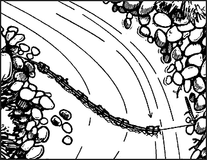

**Figure 8-21\. Setting a Gill Net in the Stream**

**FISH TRAPS**

8-65\. You may trap fish using several methods ([Figure 8-22](#fig8-22)). Fish baskets are one method. You construct them by lashing several sticks together with vines into a funnel shape. You close the top, leaving a hole large enough for the fish to swim through.

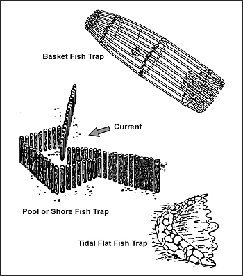

**Figure 8-22\. Various Types of Fish Traps**

8-66\. You can also use traps to catch saltwater fish, as schools regularly approach the shore with the incoming tide and often move parallel to the shore. Pick a location at high tide and build the trap at low tide. On rocky shores, use natural rock pools. On coral islands, use natural pools on the surface of reefs by blocking the openings as the tide recedes. On sandy shores, use sandbars and the ditches they enclose. Build the trap as a low stone wall extending outward into the water and forming an angle with the shore.

**SPEARFISHING**

8-67\. If you are near shallow water (about waist deep) where the fish are large and plentiful, you can spear them. To make a spear, cut a long, straight sapling ([Figure 8-23](#fig8-23)). Sharpen the end to a point or attach a knife, jagged piece of bone, or sharpened metal. You can also make a spear by splitting the shaft a few inches down from the end and inserting a piece of wood to act as a spreader. You then sharpen the two separated halves to points. To spear fish, find an area where fish either gather or where there is a fish run. Place the spear point into the water and slowly move it toward the fish. Then, with a sudden push, impale the fish on the stream bottom. Do not try to lift the fish with the spear, as it with probably slip off and you will lose it; hold the spear with one hand and grab and hold the fish with the other. Do not throw the spear, especially if the point is a knife. You cannot afford to lose a knife in a survival situation. Be alert to the problems caused by light refraction when looking at objects in the water. You must aim lower than the object, usually at the bottom of the fish, to hit your mark.

**Figure 8-23\. Types of Spear Points**

**CHOP FISHING**

8-68\. At night, in an area with high fish density, you can use a light to attract fish. Then, armed with a machete or similar weapon, you can gather fish using the back side of the blade to strike them. Do not use the sharp side as you will cut them in two pieces and end up losing some of the fish.

**FISH POISON**

8-69\. Another way to catch fish is by using poison. Poison works quickly. It allows you to remain concealed while it takes effect. It also enables you to catch several fish at one time. When using fish poison, be sure to gather all of the affected fish, because many dead fish floating downstream could arouse suspicion. Some plants that grow in warm regions of the world contain rotenone, a substance that stuns or kills cold-blooded animals but does not harm persons who eat the animals. The best place to use rotenone, or rotenone-producing plants, is in ponds or the headwaters of small streams containing fish. Rotenone works quickly on fish in water 21 degrees C (70 degrees F) or above. The fish rise helplessly to the surface. It works slowly in water 10 to 21 degrees C (50 to 70 degrees F) and is ineffective in water below 10 degrees C (50 degrees F). The following plants, used as indicated, will stun or kill fish:

*   _Anamirta cocculus_ ([Figure 8-24](#fig8-24)). This woody vine grows in southern Asia and on islands of the South Pacific. Crush the bean-shaped seeds and throw them in the water.

*   _Croton tiglium_ ([Figure 8-24](#fig8-24)). This shrub or small tree grows in waste areas on islands of the South Pacific. It bears seeds in three angled capsules. Crush the seeds and throw them into the water.

*   _Barringtonia_ ([Figure 8-24](#fig8-24)). These large trees grow near the sea in Malaya and parts of Polynesia. They bear a fleshy one-seeded fruit. Crush the seeds and bark and throw into the water.

*   _Derris eliptica_ ([Figure 8-24](#fig8-24)). This large genus of tropical shrubs and woody vines is the main source of commercially produced rotenone. Grind the roots into a powder and mix with water. Throw a large quantity of the mixture into the water.

*   _Duboisia_ ([Figure 8-24](#fig8-24)). This shrub grows in Australia and bears white clusters of flowers and berrylike fruit. Crush the plants and throw them into the water.

*   _Tephrosia_ ([Figure 8-24](#fig8-24)). This species of small shrubs, which bears beanlike pods, grows throughout the tropics. Crush or bruise bundles of leaves and stems and throw them into the water.

**Figure 8-24\. Fish-Poisoning Plants**

*   _Lime._ You can get lime from commercial sources and in agricultural areas that use large quantities of it. You may produce your own by burning coral or seashells. Throw the lime into the water.

*   _Nut husks._ Crush green husks from butternuts or black walnuts. Throw the husks into the water.

### COOKING AND STORAGE OF FISH AND GAME

8-70\. You must know how to prepare fish and game for cooking and storage in a survival situation. Improper cleaning or storage can result in inedible fish or game.

**FISH**

8-71\. Do not eat fish that appears spoiled. Cooking does not ensure that spoiled fish will be edible. Signs of spoilage are—

*   Sunken eyes.

*   Peculiar odor.

*   Suspicious color. (Gills should be red to pink. Scales should be a pronounced shade of gray, not faded.)

*   Dents that stay in the fish's flesh after pressed with your thumb.

*   Slimy, rather than moist or wet, body.

*   Sharp or peppery taste.

8-72\. Eating spoiled or rotten fish may cause diarrhea, nausea, cramps, vomiting, itching, paralysis, or a metallic taste in the mouth. These symptoms appear suddenly, 1 to 6 hours after eating. Induce vomiting if symptoms appear.

8-73\. Fish spoils quickly after death, especially on a hot day. Prepare fish for eating as soon as possible after catching it. Cut out the gills and the large blood vessels that lie near the spine. Gut fish that are more than 10 centimeters (4 inches) long. Scale or skin the fish.

8-74\. You can impale a whole fish on a stick and cook it over an open fire. However, boiling the fish with the skin on is the best way to get the most food value. The fats and oil are under the skin and, by boiling, you can save the juices for broth. You can use any of the methods used to cook plant food to cook fish. Pack fish into a ball of clay and bury it in the coals of a fire until the clay hardens. Break open the clay ball to get to the cooked fish. Fish is done when the meat flakes off. If you plan to keep the fish for later, smoke or fry it. To prepare fish for smoking, cut off the head and remove the backbone.

**SNAKES**

8-75\. To skin a snake, first cut off its head, to include 10 to 15 centimeters (4 to 6 inches) behind the head. This will ensure you remove the venom sac, which is located at the base of the head. Bury the sac to prevent further contact. Then cut the skin down the body 2 to 4 centimeters (1 to 1 1/2 inches). Peel the skin back, then grasp the skin in one hand and the body in the other and pull apart ([Figure 8-25](#fig8-25)). On large, bulky snakes it may be necessary to slit the belly skin. Cook snakes in the same manner as small game. Remove the entrails and discard. Cut the snake into small sections and boil or roast it.

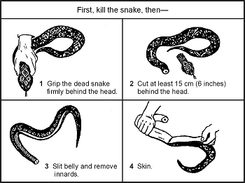

**Figure 8-25\. Cleaning a Snake**

**BIRDS**

8-76\. After killing the bird, remove its feathers by either plucking or skinning. Remember, skinning removes some of the food value. Open up the body cavity and remove the entrails, saving the craw (in seed-eating birds), heart, and liver. Cut off the feet. Cook by boiling or roasting over a spit. Before cooking scavenger birds, boil them at least 20 minutes to kill parasites.

**SKINNING AND BUTCHERING GAME**

8-77\. Bleed the animal by cutting its throat. If possible, clean the carcass near a stream. Place the carcass belly up and split the hide from throat to tail, cutting around all sexual organs ([Figure 8-26](#fig8-26)). Remove the musk glands at points A and B to avoid tainting the meat. For smaller mammals, cut the hide around the body and insert two fingers under the hide on both sides of the cut and pull both pieces off ([Figure 8-27](#fig8-27)).

**NOTE:** When cutting the hide, insert the knife blade under the skin and turn the blade up so that only the hide gets cut. This will also prevent cutting hair and getting it on the meat.

**Figure 8-26\. Skinning and Butchering Large Game**

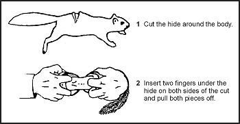

**Figure 8-27\. Skinning Small Game**

8-78\. Remove the entrails from smaller game by splitting the body open and pulling them out with the fingers. Do not forget the chest cavity. For larger game, cut the gullet away from the diaphragm. Roll the entrails out of the body. Cut around the anus, then reach into the lower abdominal cavity, grasp the lower intestine, and pull to remove. Remove the urine bladder by pinching it off and cutting it below the fingers. If you spill urine on the meat, wash it to avoid tainting the meat. Save the heart and liver. Cut these open and inspect for signs of worms or other parasites. Also inspect the liver's color; it could indicate a diseased animal. The liver's surface should be smooth and wet and its color deep red or purple. If the liver appears diseased, discard it. However, a diseased liver does not indicate you cannot eat the muscle tissue.

8-79\. Cut along each leg from above the foot to the previously made body cut. Remove the hide by pulling it away from the carcass, cutting the connective tissue where necessary. Cut off the head and feet.

8-80\. Cut larger game into manageable pieces. First, slice the muscle tissue connecting the front legs to the body. There are no bones or joints connecting the front legs to the body on four-legged animals. Cut the hindquarters off where they join the body. You must cut around a large bone at the top of the leg and cut to the ball-and-socket hip joint. Cut the ligaments around the joint and bend it back to separate it. Remove the large muscles (the tenderloin or "backstrap") that lie on either side of the spine. Separate the ribs from the backbone. There is less work and less wear on your knife if you break the ribs first, then cut through the breaks.

8-81\. Boil large meat pieces or cook them over a spit. You can stew or boil smaller pieces, particularly those that remain attached to bone after the initial butchering, as soup or broth. You can cook body organs such as the heart, liver, pancreas, spleen, and kidneys using the same methods as for muscle meat. You can also cook and eat the brain. Cut the tongue out, skin it, boil it until tender, and eat it.

**SMOKING MEAT**

8-82\. To smoke meat, prepare an enclosure around a fire [Figure 8-28](#fig8-28)). Two ponchos snapped together will work. The fire does not need to be big or hot. The intent is to produce smoke and heat, not flame. Do not use resinous wood because its smoke will ruin the meat. Use hardwoods to produce good smoke. The wood should be somewhat green. If it is too dry, soak it. Cut the meat into thin slices, no more than 6 millimeters (about 1/4 inch) thick, and drape them over a framework. Make sure none of the meat touches another piece. Keep the poncho enclosure around the meat to hold the smoke and keep a close watch on the fire. Do not let the fire get too hot. Meat smoked overnight in this manner will last about 1 week. Two days of continuous smoking will preserve the meat for 2 to 4 weeks. Properly smoked meat will look like a dark, curled, brittle stick and you can eat it without further cooking. You can also use a pit to smoke meat ([Figure 8-29](#fig8-29)).

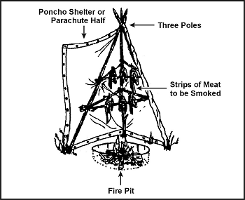

**Figure 8-28\. Tepee Smoker**

**Figure 8-29\. Smoking Meat Over a Pit**

**DRYING MEAT**

8-83\. To preserve meat by drying, cut it into 6-millimeter (1/4-inch) strips with the grain. Hang the meat strips on a rack in a sunny location with good airflow. Keep the strips out of the reach of animals. Cover the strips to keep off blowflies. Allow the meat to dry thoroughly before eating. Properly dried meat will have a dry, crisp texture and will not feel cool to the touch.

**OTHER PRESERVATION METHODS**

8-84\. You can also preserve meats using the freezing or brine and salt methods. In cold climates, you can freeze and keep meat indefinitely. Freezing is not a means of preparing meat. You must still cook it before eating. You can also preserve meat by soaking it thoroughly in a saltwater solution. The solution must cover the meat. You can use salt by itself but make sure you wash off the salt before cooking.

* * *
