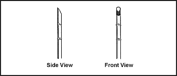
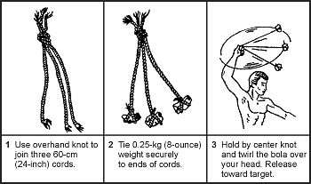
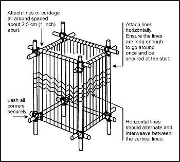

> As a soldier, you know the importance of proper care and use of your weapons, tools, and equipment. This is especially true of your knife. You must always keep it sharp and ready to use. A knife is your most valuable tool in a survival situation. Imagine being in a survival situation without any weapons, tools, or equipment except your knife. It could happen! You might even be without a knife. You would probably feel helpless, but with the proper knowledge and skills, you can easily improvise needed items.
> 
> In survival situations, you may have to fashion any number and type of field-expedient tools and equipment to survive. The need for an item must outweigh the work involved in making it. You should ask, "Is it necessary or just nice to have?" Remember that undue haste makes waste. Examples of tools and equipment that could make your life much easier are ropes ([Appendix G](g)), rucksacks, clothes, and nets.
> 
> Weapons serve a dual purpose. You use them to obtain and prepare food and to provide self-defense. A weapon can also give you a feeling of security and provide you with the ability to hunt on the move.

### STAFFS

12-1\. A staff should be one of the first tools you obtain. For walking, it provides support and helps in ascending and descending steep slopes. It provides some weapon's capabilities if used properly, especially against snakes and dogs. It should be approximately the same height as you or at least eyebrow height. The staff should be no larger than you can effectively wield when tired and undernourished. It provides invaluable eye protection when you are moving through heavy brush and thorns in darkness.

### CLUBS

12-2\. You hold clubs; you do not throw them. However, the club can extend your area of defense beyond your fingertips. It also serves to increase the force of a blow without injuring yourself. The three basic types of clubs are explained below.

**SIMPLE CLUB**

12-3\. A simple club is a staff or branch. It must be short enough for you to swing easily, but long enough and strong enough for you to damage whatever you hit. Its diameter should fit comfortably in your palm, but it should not be so thin as to allow the club to break easily upon impact. A straight-grained hardwood is best if you can find it.

**WEIGHTED CLUB**

12-4\. A weighted club is any simple club with a weight on one end. The weight may be a natural weight, such as a knot on the wood, or something added, such as a stone lashed to the club.

12-5\. To make a weighted club, first find a stone that has a shape that will allow you to lash it securely to the club. A stone with a slight hourglass shape works well. If you cannot find a suitably shaped stone, then fashion a groove or channel into the stone by "pecking," repeatedly rapping the club stone with a smaller hard stone.

12-6\. Next, find a piece of wood that is the right length for you. A straight-grained hardwood is best. The length of the wood should feel comfortable in relation to the weight of the stone. Finally, lash the stone to the handle using a technique shown in [Figure 12-1](#fig12-1). The technique you use will depend on the type of handle you choose.

**Figure 12-1\. Lashing Clubs**

**SLING CLUB**

12-7\. A sling club is another type of weighted club. A weight hangs 8 to 10 centimeters (3 to 4 inches) from the handle by a strong, flexible lashing ([Figure 12-2](#fig12-2)). This type of club both extends the user's reach and multiplies the force of the blow.

**Figure 12-2\. Sling Club**

### EDGED WEAPONS

12-8\. Knives, spear blades, and arrow points fall under the category of edged weapons. The following paragraphs explain how to make such weapons.

**KNIVES**

12-9\. A knife has three basic functions. It can puncture, slash or chop, and cut. A knife is also an invaluable tool used to construct other survival items. You may find yourself without a knife or you may need another type knife or a spear. To improvise you can use stone, bone, wood, or metal to make a knife or spear blade.

**Stone**

12-10\. To make a stone knife, you will need a sharp-edged piece of stone, a chipping tool, and a flaking tool. A chipping tool is a light, blunt-edged tool used to break off small pieces of stone. A flaking tool is a pointed tool used to break off thin, flattened pieces of stone. You can make a chipping tool from wood, bone, or metal, and a flaking tool from bone, antler tines, or soft iron ([Figure 12-3](#fig12-3)).

**Figure 12-3\. Making a Stone Knife**

12-11\. Start making the knife by roughing out the desired shape on your sharp piece of stone, using the chipping tool. Try to make the knife fairly thin. Then, press the flaking tool against the edges. This action will cause flakes to come off the opposite side of the edge, leaving a razor-sharp edge. Use the flaking tool along the entire length of the edge you need to sharpen. Eventually, you will have a very, sharp cutting edge that you can use as a knife.

12-12\. Lash the blade to some type of hilt ([Figure 12-3](#fig12-3)).

**NOTE:** Stone will make an excellent puncturing tool and a good chopping tool but will not hold a fine edge. Some stones such as chert or flint can have very fine edges.

**Bone**

12-13\. You can also use bone as an effective field-expedient edged weapon. First, you will need to select a suitable bone. The larger bones, such as the leg bone of a deer or another medium-sized animal, are best. Lay the bone upon another hard object. Shatter the bone by hitting it with a heavy object, such as a rock. From the pieces, select a suitable pointed splinter. You can further shape and sharpen this splinter by rubbing it on a rough-surfaced rock. If the piece is too small to handle, you can still use it by adding a handle to it. Select a suitable piece of hardwood for a handle and lash the bone splinter securely to it.

**NOTE:** Use the bone knife only to puncture. It will not hold an edge and it may flake or break if used differently.

**Wood**

12-14\. You can make field-expedient edged weapons from wood. Use these only to puncture. Bamboo is the only wood that will hold a suitable edge. To make a knife from wood, first select a straight-grained piece of hardwood that is about 30 centimeters (12 inches) long and 2.5 centimeters (1 inch) in diameter. Fashion the blade about 15 centimeters (6 inches) long. Shave it down to a point. Use only the straight-grained portions of the wood. Do not use the core or pith, as it would make a weak point.

12-15\. Harden the point by a process known as fire hardening. If a fire is possible, dry the blade portion over the fire slowly until lightly charred. The drier the wood, the harder the point. After lightly charring the blade portion, sharpen it on a coarse stone. If using bamboo and after fashioning the blade, remove any other wood to make the blade thinner from the inside portion of the bamboo. Removal is done this way because bamboo's hardest part is its outer layer. Keep as much of this layer as possible to ensure the hardest blade possible. When charring bamboo over a fire, char only the inside wood; do not char the outside.

**Metal**

12-16\. Metal is the best material to make field-expedient edged weapons. Metal, when properly designed, can fulfill a knife's three uses—puncture, slice or chop, and cut. First, select a suitable piece of metal, one that most resembles the desired end product. Depending on the size and original shape, you can obtain a point and cutting edge by rubbing the metal on a rough-surfaced stone. If the metal is soft enough, you can hammer out one edge while the metal is cold. Use a suitable flat, hard surface as an anvil and a smaller, harder object of stone or metal as a hammer to hammer out the edge. Make a knife handle from wood, bone, or other material that will protect your hand.

**Other Materials**

12-17\. You can use other materials to produce edged weapons. Glass is a good alternative to an edged weapon or tool, if no other material is available. Obtain a suitable piece in the same manner as described for bone. Glass has a natural edge but is less durable for heavy work. You can also sharpen plastic—if it is thick enough or hard enough—into a durable point for puncturing.

**SPEAR BLADES**

12-18\. To make spears, use the same procedures to make the blade that you used to make a knife blade. Then select a shaft (a straight sapling) 1.2 to 1.5 meters (4 to 5 feet) long. The length should allow you to handle the spear easily and effectively. Attach the spear blade to the shaft using lashing. The preferred method is to split the handle, insert the blade, then wrap or lash it tightly. You can use other materials without adding a blade. Select a 1.2- to 1.5-meter (4- to 5-foot) long straight hardwood shaft and shave one end to a point. If possible, fire-harden the point. Bamboo also makes an excellent spear. Select a piece 1.2 to 1.5 meters (4 to 5 feet) long. Starting 8 to 10 centimeters (3 to 4 inches) back from the end used as the point, shave down the end at a 45-degree angle ([Figure 12-4](#fig12-4)). Remember, to sharpen the edges, shave only the inner portion.

**Figure 12-4\. Bamboo Spear**

**ARROW POINTS**

12-19\. To make an arrow point, use the same procedures for making a stone knife blade. Chert, flint, and shell-type stones are best for arrow points. You can fashion bone like stone—by flaking. You can make an efficient arrow point using broken glass.

### OTHER EXPEDIENT WEAPONS

12-20\. You can make other field-expedient weapons such as the throwing stick, archery equipment, and the bola. The following paragraphs explain how to make these.

**THROWING STICK**

12-21\. The throwing stick, commonly known as the rabbit stick, is very effective against small game (squirrels, chipmunks, and rabbits). The rabbit stick itself is a blunt stick, naturally curved at about a 45-degree angle. Select a stick with the desired angle from heavy hardwood such as oak. Shave off two opposite sides so that the stick is flat like a boomerang ([Figure 12-5](#fig12-5)). You must practice the throwing technique for accuracy and speed. First, align the target by extending the nonthrowing arm in line with the mid- to lower-section of the target. Slowly and repeatedly raise the throwing arm up and back until the throwing stick crosses the back at about a 45-degree angle or is in line with the nonthrowing hip. Bring the throwing arm forward until it is just slightly above and parallel to the nonthrowing arm. This will be the throwing stick's release point. Practice slowly and repeatedly to attain accuracy.

**Figure 12-5\. Rabbit Stick**

**ARCHERY EQUIPMENT**

12-22\. You can make a bow and arrow ([Figure 12-6](#fig12-6)) from materials available in your survival area. To make a bow, use the procedure described in [paragraphs 8-53 through 8-56](08) in Chapter 8.

**Figure 12-6\. Archery Equipment**

12-23\. While it may be relatively simple to make a bow and arrow, it is not easy to use one. You must practice using it a long time to be reasonably sure that you will hit your target. Also, a field-expedient bow will not last very long before you have to make a new one. For the time and effort involved, you may well decide to use another type of field-expedient weapon.

**BOLA**

12-24\. The bola is another field-expedient weapon that is easy to make ([Figure 12-7](#fig12-7)). It is especially effective for capturing running game or low-flying fowl in a flock. To use the bola, hold it by the center knot and twirl it above your head. Release the knot so that the bola flies toward your target. When you release the bola, the weighted cords will separate. These cords will wrap around and immobilize the fowl or animal that you hit.

**Figure 12-7\. Bola**

### CORDAGE AND LASHING

12-25\. Many materials are strong enough for use as cordage and lashing. A number of natural and man-made materials are available in a survival situation. For example, you can make a cotton web belt much more useful by unraveling it. You can then use the string for other purposes (fishing line, thread for sewing, and lashing).

**NATURAL CORDAGE SELECTION**

12-26\. Before making cordage, there are a few simple tests you can do to determine you material's suitability. First, pull on a length of the material to test for strength. Next, twist it between your fingers and roll the fibers together. If it withstands this handling and does not snap apart, tie an overhand knot with the fibers and gently tighten. If the knot does not break, the material is usable. [Figure 12-8](#fig12-8) shows various methods of making cordage.

**Figure 12-8\. Making Lines From Plant Fibers**

**LASHING MATERIAL**

12-27\. The best natural material for lashing small objects is sinew. You can make sinew from the tendons of large game, such as deer. Remove the tendons from the game and dry them completely. Smash the dried tendons so that they separate into fibers. Moisten the fibers and twist them into a continuous strand. If you need stronger lashing material, you can braid the strands. When you use sinew for small lashings, you do not need knots as the moistened sinew is sticky and it hardens when dry.

12-28\. You can shred and braid plant fibers from the inner bark of some trees to make cord. You can use the linden, elm, hickory, white oak, mulberry, chestnut, and red and white cedar trees. After you make the cord, test it to be sure it is strong enough for your purpose. You can make these materials stronger by braiding several strands together.

12-29\. You can use rawhide for larger lashing jobs. Make rawhide from the skins of medium or large game. After skinning the animal, remove any excess fat and any pieces of meat from the skin. Dry the skin completely. You do not need to stretch it as long as there are no folds to trap moisture. You do not have to remove the hair from the skin. Cut the skin while it is dry. Make cuts about 6 millimeters (1/4 inch) wide. Start from the center of the hide and make one continuous circular cut, working clockwise to the hide's outer edge. Soak the rawhide for 2 to 4 hours or until it is soft. Use it wet, stretching it as much as possible while applying it. It will be strong and durable when it dries.

### RUCKSACK CONSTRUCTION

12-30\. The materials for constructing a rucksack or pack are almost limitless. You can use wood, bamboo, rope, plant fiber, clothing, animal skins, canvas, and many other materials to make a pack.

12-31\. There are several construction techniques for rucksacks. Many are very elaborate, but those that are simple and easy are often the most readily made in a survival situation.

**HORSESHOE PACK**

12-32\. This pack is simple to make and use and relatively comfortable to carry over one shoulder. Lay available square-shaped material, such as poncho, blanket, or canvas, flat on the ground. Lay items on one edge of the material. Pad the hard items. Roll the material (with the items) toward the opposite edge and tie both ends securely. Add extra ties along the length of the bundle. You can drape the pack over one shoulder with a line connecting the two ends ([Figure 12-9](#fig12-9)).

**Figure 12-9\. Horseshoe Pack**

**SQUARE PACK**

12-33\. This pack is easy to construct if rope or cordage is available. Otherwise, you must first make cordage. To make this pack, construct a square frame from bamboo, limbs, or sticks. Size will vary for each person and the amount of equipment carried ([Figure 12-10](#fig12-10)).

**Figure 12-10\. Square Pack**

### CLOTHING AND INSULATION

12-34\. You can use many materials for clothing and insulation. Both man-made materials, such as parachutes, and natural materials, such as skins and plant materials, are available and offer significant protection.

**PARACHUTE ASSEMBLY**

12-35\. Consider the entire parachute assembly as a resource. Use every piece of material and hardware, to include the canopy, suspension lines, connector snaps, and parachute harness. Before disassembling the parachute, consider all of your survival requirements and plan to use different portions of the parachute accordingly. For example, consider shelter requirements, need for a rucksack, and any additional clothing or insulation needs.

**ANIMAL SKINS**

12-36\. The selection of animal skins in a survival situation will most often be limited to what you manage to trap or hunt. However, if there is an abundance of wildlife, select the hides of larger animals with heavier coats and large fat content. Do not use the skins of infected or diseased animals if possible. Since they live in the wild, animals are carriers of pests such as ticks, lice, and fleas. Because of these pests, use water to thoroughly clean any skin obtained from any animal. If water is not available, at least shake out the skin thoroughly. As with rawhide, lay out the skin and remove all fat and meat. Dry the skin completely. Use the hindquarter joint areas to make shoes, mittens, or socks. Wear the hide with the fur to the inside for its insulating factor.

**PLANT FIBERS**

12-37\. Several plants are sources of insulation from cold. Cattail is a marshland plant found along lakes, ponds, and the backwaters of rivers. The fuzz on the tops of the stalks forms dead air spaces and makes a good down-like insulation when placed between two pieces of material. Milkweed has pollenlike seeds that act as good insulation. The husk fibers from coconuts are very good for weaving ropes and, when dried, make excellent tinder and insulation.

### COOKING AND EATING UTENSILS

12-38\. You can use many materials to make equipment for the cooking, eating, and storing of food. Usually all materials can serve some type of purpose when in a survival situation.

**Bowls**

12-39\. Use wood, bone, horn, bark, or other similar material to make bowls. To make wooden bowls, use a hollowed out piece of wood that will hold your food and enough water to cook it in. Hang the wooden container over the fire and add hot rocks to the water and food. Remove the rocks as they cool and add more hot rocks until your food is cooked.

> **CAUTION**
> 
> Do not use rocks with air pockets, such as limestone and sandstone. They may explode while heating in the fire.

12-40\. You can also use this method with containers made of bark or leaves. However, these containers will burn above the waterline unless you keep them moist or keep the fire low.

12-41\. A section of bamboo also works very well for cooking. Be sure you cut out a section between two sealed joints ([Figure 12-11](#fig12-11)).

**Figure 12-11\. Containers for Boiling Food**

> **CAUTION**
> 
> A sealed section of bamboo will explode if heated because of trapped air and water in the section.

**FORKS, KNIVES, AND SPOONS**

12-42\. Carve forks, knives, and spoons from nonresinous woods so that you do not get a wood resin aftertaste or do not taint the food. Nonresinous woods include oak, birch, and other hardwood trees.

**NOTE:** Do not use those trees that secrete a syrup or resinlike liquid on the bark or when cut.

**POTS**

12-43\. You can make pots from turtle shells or wood. As described with bowls, using hot rocks in a hollowed out piece of wood is very effective. Bamboo is the best wood for making cooking containers.

12-44\. To use turtle shells, first thoroughly boil the upper portion of the shell. Then use it to heat food and water over a flame ([Figure 12-11](#fig12-11)).

**WATER BOTTLES**

12-45\. Make water bottles from the stomachs of larger animals. Thoroughly flush the stomach out with water, then tie off the bottom. Leave the top open, with some means of fastening it closed.
