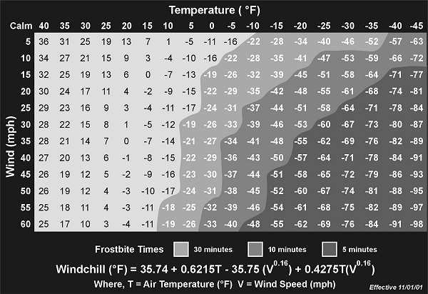
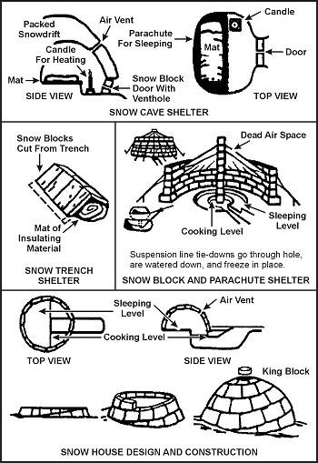

> One of the most difficult survival situations is a cold weather scenario. Remember, cold weather is an adversary that can be as dangerous as an enemy soldier. Every time you venture into the cold, you are pitting yourself against the elements. With a little knowledge of the environment, proper plans, and appropriate equipment, you can overcome the elements. As you remove one or more of these factors, survival becomes increasingly difficult. Remember, winter weather is highly variable. Prepare yourself to adapt to blizzard conditions even during sunny and clear weather.
> 
> Cold is a far greater threat to survival than it appears. It decreases your ability to think and weakens your will to do anything except to get warm. Cold is an insidious enemy; as it numbs the mind and body, it subdues the will to survive.
> 
> Cold makes it very easy to forget your ultimate goal—to survive.

### COLD REGIONS AND LOCATIONS

15-1\. Cold regions include arctic and subarctic areas and areas immediately adjoining them. You can classify about 48 percent of the Northern Hemisphere's total landmass as a cold region due to the influence and extent of air temperatures. Ocean currents affect cold weather and cause large areas normally included in the temperate zone to fall within the cold regions during winter periods. Elevation also has a marked effect on defining cold regions.

15-2\. Within the cold weather regions, you may face two types of cold weather environments—wet or dry. Knowing in which environment your area of operations falls will affect planning and execution of a cold weather operation.

**WET COLD WEATHER ENVIRONMENTS**

15-3\. Wet cold weather conditions exist when the average temperature in a 24-hour period is -10 degrees C (14 degrees F) or above. Characteristics of this condition are freezing during the colder night hours and thawing during the day. Although the temperatures are warmer during this condition, the terrain is usually very sloppy due to slush and mud. You must concentrate on protecting yourself from the wet ground and from freezing rain or wet snow.

**DRY COLD WEATHER ENVIRONMENTS**

15-4\. Dry cold weather conditions exist when the average temperature in a 24-hour period remains below -10 degrees C (14 degrees F). Even though the temperatures in this condition are much lower than normal, you do not have to contend with the freezing and thawing. In these conditions, you need more layers of inner clothing to protect you from temperatures as low as -60 degrees C (-76 degrees F). Extremely hazardous conditions exist when wind and low temperature combine.

### WINDCHILL

15-5\. Windchill increases the hazards in cold regions. Windchill is the effect of moving air on exposed flesh. For instance, with a 27.8-kph (15-knot) wind and a temperature of -10 degrees C (14 degrees F), the equivalent windchill temperature is -23 degrees C (-9 degrees F). [Figure 15-1](#fig15-1) gives the windchill factors for various temperatures and wind speeds.

**Figure 15-1\. Windchill Table**

15-6\. Remember, even when there is no wind, you will create the equivalent wind by skiing, running, being towed on skis behind a vehicle, or working around aircraft that produce windblasts.

### BASIC PRINCIPLES OF COLD WEATHER SURVIVAL

15-7\. It is more difficult for you to satisfy your basic water, food, and shelter needs in a cold environment than in a warm environment. Even if you have the basic requirements, you must also have adequate protective clothing and the will to survive. The will to survive is as important as the basic needs. There have been incidents when trained and well-equipped individuals have not survived cold weather situations because they lacked the will to live. Conversely, this will has sustained individuals less well-trained and equipped.

15-8\. There are many different items of cold weather equipment and clothing issued by the U.S. Army today. Specialized units may have access to newer, lightweight gear such as polypropylene underwear, Gore-Tex outerwear and boots, and other special equipment. However, the older gear will keep you warm as long as you apply a few cold weather principles. If the newer types of clothing are available, use them. If not, then your clothing should be entirely wool, with the possible exception of a windbreaker.

15-9\. You must not only have enough clothing to protect you from the cold, you must also know how to maximize the warmth you get from it. For example, always keep your head covered. You can lose 40 to 45 percent of body heat from an unprotected head and even more from the unprotected neck, wrist, and ankles. These areas of the body are good radiators of heat and have very little insulating fat. The brain is very susceptible to cold and can stand the least amount of cooling. Because there is much blood circulation in the head, most of which is on the surface, you can lose heat quickly if you do not cover your head.

15-10\. There are four basic principles to follow to keep warm. An easy way to remember these basic principles is to use the word COLDER as follows:

*   C-Keep clothing clean_._ This principle is always important for sanitation and comfort. In winter, it is also important from the standpoint of warmth. Clothes matted with dirt and grease lose much of their insulation value. Heat can escape more easily from the body through the clothing's crushed or filled up air pockets.

*   O-Avoid overheating_._ When you get too hot, you sweat and your clothing absorbs the moisture. This affects your warmth in two ways: dampness decreases the insulation quality of clothing, and as sweat evaporates, your body cools. Adjust your clothing so that you do not sweat. Do this by partially opening your parka or jacket, by removing an inner layer of clothing, by removing heavy outer mittens, or by throwing back your parka hood or changing to lighter headgear. The head and hands act as efficient heat dissipaters when overheated.

*   L-Wear your clothing loose and in layers. Wearing tight clothing and footgear restricts blood circulation and invites cold injury. It also decreases the volume of air trapped between the layers, reducing its insulating value. Several layers of lightweight clothing are better than one equally thick layer of clothing, because the layers have dead airspace between them. The dead airspace provides extra insulation. Also, layers of clothing allow you to take off or add clothing layers to prevent excessive sweating or to increase warmth.

*   D-Keep clothing dry_._ In cold temperatures, your inner layers of clothing can become wet from sweat and your outer layer, if not water repellent, can become wet from snow and frost melted by body heat. Wear water repellent outer clothing, if available. It will shed most of the water collected from melting snow and frost. Before entering a heated shelter, brush off the snow and frost. Despite the precautions you take, there will be times when you cannot keep from getting wet. At such times, drying your clothing may become a major problem. On the march, hang your damp mittens and socks on your rucksack. Sometimes in freezing temperatures, the wind and sun will dry this clothing. You can also place damp socks or mittens, unfolded, near your body so that your body heat can dry them. In a campsite, hang damp clothing inside the shelter near the top, using drying lines or improvised racks. You may even be able to dry each item by holding it before an open fire. Dry leather items slowly. If no other means are available for drying your boots, put them between your sleeping bag shell and liner. Your body heat will help to dry the leather.

*   E-Examine your uniform for worn areas, tears, and cleanliness.

*   R-Repair your uniform early before tears and holes become too large to patch. Improvised sewing kits can be made from bones, plant fibers, 550 cord, and large thorns.

15-11\. A heavy, down-lined sleeping bag is a valuable piece of survival gear in cold weather. Ensure the down remains dry. If wet, it loses a lot of its insulation value. If you do not have a sleeping bag, you can make one out of parachute cloth or similar material and natural dry material, such as leaves, pine needles, or moss. Place the dry material between two layers of the material.

15-12\. Other important survival items are a knife; waterproof matches in a waterproof container, preferably one with a flint attached; a durable compass; map; watch; waterproof ground cloth and cover; flashlight; binoculars; dark glasses; fatty emergency foods; food gathering gear; and signaling items.

15-13\. Remember, a cold weather environment can be very harsh. Give a good deal of thought to selecting the right equipment for survival in the cold. If unsure of an item you have never used, test it in an "overnight backyard" environment before venturing further. Once you have selected items that are essential for your survival, do not lose them after you enter a cold weather environment.

### HYGIENE

15-14\. Although washing yourself may be impractical and uncomfortable in a cold environment, you must do so. Washing helps prevent skin rashes that can develop into more serious problems.

15-15\. In some situations, you may be able to take a snow bath. Take a handful of snow and wash your body where sweat and moisture accumulate, such as under the arms and between the legs, and then wipe yourself dry. If possible, wash your feet daily and put on clean, dry socks. Change your underwear at least twice a week. If you are unable to wash your underwear, take it off, shake it, and let it air out for an hour or two.

15-16\. If you are using a previously used shelter, check your body and clothing for lice each night. If your clothing has become infested, use insecticide powder if you have any. Otherwise, hang your clothes in the cold, then beat and brush them. This will help get rid of the lice, but not the eggs.

15-17\. If you shave, try to do so before going to bed. This will give your skin a chance to recover before exposing it to the elements.

### MEDICAL ASPECTS

15-18\. When you are healthy, your inner core temperature (torso temperature) remains almost constant at 37 degrees C (98.6 degrees F). Since your limbs and head have less protective body tissue than your torso, their temperatures vary and may not reach core temperature.

15-19\. Your body has a control system that lets it react to temperature extremes to maintain a temperature balance. There are three main factors that affect this temperature balance—heat production, heat loss, and evaporation. The difference between the body's core temperature and the environment's temperature governs the heat production rate. Your body can get rid of heat better than it can produce it. Sweating helps to control the heat balance. Maximum sweating will get rid of heat about as fast as maximum exertion produces it.

15-20\. Shivering causes the body to produce heat. It also causes fatigue that, in turn, leads to a drop in body temperature. Air movement around your body affects heat loss. It has been noted that a naked man exposed to still air at or about 0 degrees C (32 degrees F) can maintain a heat balance if he shivers as hard as he can. However, he can't shiver forever.

15-21\. It has also been noted that a man at rest wearing the maximum arctic clothing in a cold environment can keep his internal heat balance during temperatures well below freezing. However, to withstand really cold conditions for any length of time, he will have to become active or shiver.

### COLD INJURIES

15-22\. The best way to deal with injuries and sicknesses is to take measures to prevent them from happening in the first place. Treat any injury or sickness that occurs as soon as possible to prevent it from worsening.

15-23\. The knowledge of signs and symptoms and the use of the buddy system are critical in maintaining health. The following paragraphs explain some cold injuries that can occur.

**HYPOTHERMIA**

15-24\. Hypothermia is the lowering of the body temperature at a rate faster than the body can produce heat. Causes of hypothermia may be general exposure or the sudden wetting of the body by falling into a lake or spraying with fuel or other liquids.

15-25\. The initial symptom is shivering. This shivering may progress to the point that it is uncontrollable and interferes with an individual's ability to care for himself. This begins when the body's core temperature falls to about 35.5 degrees C (96 degrees F). When the core temperature reaches 35 to 32 degrees C (95 to 90 degrees F), sluggish thinking, irrational reasoning, and a false feeling of warmth may occur. Core temperatures of 32 to 30 degrees C (90 to 86 degrees F) and below result in muscle rigidity, unconsciousness, and barely detectable signs of life. If the victim's core temperature falls below 25 degrees C (77 degrees F), death is almost certain.

15-26\. To treat hypothermia, rewarm the entire body. If there are means available, rewarm the person by first immersing the trunk area only in warm water of 37.7 to 43.3 degrees C (100 to 110 degrees F).

> **CAUTION**
> 
> Rewarming the total body in a warm water bath should be done only in a hospital environment because of the increased risk of cardiac arrest and rewarming shock.

15-27\. One of the quickest ways to get heat to the inner core is to give warm water enemas. However, such an action may not be possible in a survival situation. Another method is to wrap the victim in a warmed sleeping bag with another person who is already warm; both should be naked.

<table cellspacing="0" cellpadding="7" border="1" width="400">

<tbody>

<tr>

<td valign="top">

**CAUTION**

The individual placed in the sleeping bag with the victim could also become a hypothermia victim if left in the bag too long.

</td>

</tr>

</tbody>

</table>

15-28\. If the person is conscious, give him hot, sweetened fluids. Honey or dextrose are best, but if they are unavailable, sugar, cocoa, or a similar soluble sweetener may be used.

> **CAUTION**
> 
> Do not force an unconscious person to drink.

15-29\. There are two dangers in treating hypothermia—rewarming too rapidly and "after-drop." Rewarming too rapidly can cause the victim to have circulatory problems, resulting in heart failure. After-drop is the sharp body core temperature drop that occurs when taking the victim from the warm water. Its probable cause is the return of previously stagnant limb blood to the core (inner torso) area as recirculation occurs. Concentrating on warming the core area and stimulating peripheral circulation will lessen the effects of after-drop. Immersing the torso in a warm bath, if possible, is the best treatment.

**FROSTBITE**

15-30\. This injury is the result of frozen tissues. Light frostbite involves only the skin that takes on a dull whitish pallor. Deep frostbite extends to a depth below the skin. The tissues become solid and immovable. Your feet, hands, and exposed facial areas are particularly vulnerable to frostbite.

15-31\. The best frostbite prevention, when you are with others, is to use the buddy system. Check your buddy's face often and make sure that he checks yours. If you are alone, periodically cover your nose and lower part of your face with your mittened hand.

15-32\. The following pointers will aid you in keeping warm and preventing frostbite when it is extremely cold or when you have less than adequate clothing:

*   _Face._ Maintain circulation by "making faces." Warm with your hands.

*   _Ears._ Wiggle and move your ears. Warm with your hands.

*   _Hands._ Move your hands inside your gloves. Warm by placing your hands close to your body.

*   _Feet._ Move your feet and wiggle your toes inside your boots.

15-33\. A loss of feeling in your hands and feet is a sign of frostbite. If you have lost feeling for only a short time, the frostbite is probably light. Otherwise, assume the frostbite is deep. To rewarm a light frostbite, use your hands or mittens to warm your face and ears. Place your hands under your armpits. Place your feet next to your buddy's stomach. A deep frostbite injury, if thawed and refrozen, will cause more damage than a nonmedically trained person can handle. [Figure 15-2](#fig15-2), lists some "dos and don'ts" regarding frostbite.

**Figure 15-2\. Frostbite Dos and Don'ts**

**TRENCH FOOT AND IMMERSION FOOT**

15-34\. These conditions result from many hours or days of exposure to wet or damp conditions at a temperature just above freezing. The symptoms are a sensation of pins and needles, tingling, numbness, and then pain. The skin will initially appear wet, soggy, white, and shriveled. As it progresses and damage appears, the skin will take on a red and then a bluish or black discoloration. The feet become cold, swollen, and have a waxy appearance. Walking becomes difficult and the feet feel heavy and numb. The nerves and muscles sustain the main damage, but gangrene can occur. In extreme cases, the flesh dies and it may become necessary to have the foot or leg amputated. The best prevention is to keep your feet dry. Carry extra socks with you in a waterproof packet. You can dry wet socks against your torso (back or chest). Wash your feet and put on dry socks daily.

**DEHYDRATION**

15-35\. When bundled up in many layers of clothing during cold weather, you may be unaware that you are losing body moisture. Your heavy clothing absorbs the moisture that evaporates in the air. You must drink water to replace this loss of fluid. Your need for water is as great in a cold environment as it is in a warm environment ([Chapter 13](13)). One way to tell if you are becoming dehydrated is to check the color of your urine on snow. If your urine makes the snow dark yellow, you are becoming dehydrated and need to replace body fluids. If it makes the snow light yellow to no color, your body fluids have a more normal balance.

**COLD DIURESIS**

15-36\. Exposure to cold increases urine output. It also decreases body fluids that you must replace.

**SUNBURN**

15-37\. Exposed skin can become sunburned even when the air temperature is below freezing. The sun's rays reflect at all angles from snow, ice, and water, hitting sensitive areas of skin—lips, nostrils, and eyelids. Exposure to the sun results in sunburn more quickly at high altitudes than at low altitudes. Apply sunburn cream or lip salve to your face when in the sun.

**SNOW BLINDNESS**

15-38\. The reflection of the sun's ultraviolet rays off a snow-covered area causes this condition. The symptoms of snow blindness are a sensation of grit in the eyes, pain in and over the eyes that increases with eyeball movement, red and teary eyes, and a headache that intensifies with continued exposure to light. Prolonged exposure to these rays can result in permanent eye damage. To treat snow blindness, bandage your eyes until the symptoms disappear.

15-39\. You can prevent snow blindness by wearing sunglasses. If you don't have sunglasses, improvise. Cut slits in a piece of cardboard, thin wood, tree bark, or other available material ([Figure 15-3](#fig15-3)). Putting soot under your eyes will help reduce shine and glare.

**Figure 15-3\. Improvised Sunglasses**

**CONSTIPATION**

15-40\. It is very important to relieve yourself when needed. Do not delay because of the cold condition. Delaying relieving yourself because of the cold, eating dehydrated foods, drinking too little liquid, and irregular eating habits can cause you to become constipated. Although not disabling, constipation can cause some discomfort. Increase your fluid intake to at least 2 liters above your normal 2 to 3 liters daily intake and, if available, eat fruit and other foods that will loosen the stool.

**INSECT BITES**

15-41\. Insect bites can become infected through constant scratching. Flies can carry various disease-producing germs. To prevent insect bites, use insect repellent and netting and wear proper clothing. See [Chapter 11](11) for information on insect bites and [Chapter 4](04) for treatment.

### SHELTERS

15-42\. Your environment and the equipment you carry with you will determine the type of shelter you can build. You can build shelters in wooded areas, open country, and barren areas. Wooded areas usually provide the best location, while barren areas have only snow as building material. Wooded areas provide timber for shelter construction, wood for fire, concealment from observation, and protection from the wind.

**NOTE:** In extreme cold, do not use metal, such as an aircraft fuselage, for shelter. The metal will conduct away from the shelter what little heat you can generate.

15-43\. Shelters made from ice or snow usually require tools such as ice axes or saws. You must also expend much time and energy to build such a shelter. Be sure to ventilate an enclosed shelter, especially if you intend to build a fire in it. Always block a shelter's entrance, if possible, to keep the heat in and the wind out. Use a rucksack or snow block. Construct a shelter no larger than needed. This will reduce the amount of space to heat. A fatal error in cold weather shelter construction is making the shelter so large that it steals body heat rather than helps save it.

15-44\. Never sleep directly on the ground. Lay down some pine boughs, grass, or other insulating material to keep the ground from absorbing your body heat.

15-45\. Never fall asleep without turning out your stove or lamp. Carbon monoxide poisoning can result from a fire burning in an unventilated shelter. Carbon monoxide is a great danger. It is colorless and odorless. Any time you have an open flame, it may generate carbon monoxide. Always check your ventilation. Even in a ventilated shelter, incomplete combustion can cause carbon monoxide poisoning. Usually, there are no symptoms. Unconsciousness and death can occur without warning. Sometimes, however, pressure at the temples, burning of the eyes, headache, pounding pulse, drowsiness, or nausea may occur. The one characteristic, visible sign of carbon monoxide poisoning is a cherry red coloring in the tissues of the lips, mouth, and inside of the eyelids. Get into fresh air at once if you have any of these symptoms.

15-46\. There are several types of field-expedient shelters you can quickly build or employ. Many use snow for insulation.

**SNOW CAVE SHELTER**

15-47\. The snow cave shelter ([Figure 15-4](#fig15-4)) is a most effective dwelling because of the insulating qualities of snow. Remember that it takes time and energy to build and that you will get wet while building it. First, you need to find a drift about 3 meters (10 feet) deep into which you can dig. While building this shelter, keep the roof arched for strength and to allow melted snow to drain down the sides. Build the sleeping platform higher than the entrance. Separate the sleeping platform from the snow cave's walls or dig a small trench between the platform and the wall. This platform will prevent the melting snow from wetting you and your equipment. This construction is especially important if you have a good source of heat in the snow cave. Ensure the roof is high enough so that you can sit up on the sleeping platform. Block the entrance with a snow block or other material and use the lower entrance area for cooking. The walls and ceiling should be at least 30 centimeters (1 foot) thick. Install a ventilation shaft. If you do not have a drift large enough to build a snow cave, you can make a variation of it by piling snow into a mound large enough to dig out.

**Figure 15-4\. Snow Dwellings**

**SNOW TRENCH SHELTER**

15-48\. The idea behind this shelter ([Figure 15-4](#fig15-4)) is to get you below the snow and wind level and use the snow's insulating qualities. If you are in an area of compacted snow, cut snow blocks and use them as overhead cover. If not, you can use a poncho or other material. Build only one entrance and use a snow block or rucksack as a door.

**SNOW BLOCK AND PARACHUTE SHELTER**

15-49\. Use snow blocks for the sides and parachute material for overhead cover ([Figure 15-4](#fig15-4)). If snowfall is heavy, you will have to clear snow from the top at regular intervals to prevent the collapse of the parachute material.

**SNOW HOUSE OR IGLOO**

15-50\. In certain areas, the natives frequently use this type of shelter ([Figure 15-4](#fig15-4)) as hunting and fishing shelters. They are efficient shelters but require some practice to make them properly. Also, you must be in an area that is suitable for cutting snow blocks and have the equipment to cut them (snow saw or knife).

**LEAN-TO SHELTER**

15-51\. Construct this shelter in the same manner as for other environments. However, pile snow around the sides for insulation ([Figure 15-5](#fig15-5)).

**Figure 15-5\. Lean-to Made From Natural Shelter**

**FALLEN TREE SHELTER**

15-52\. To build this shelter, find a fallen tree and dig out the snow underneath it ([Figure 15-6](#fig15-6)). The snow will not be deep under the tree. If you must remove branches from the inside, use them to line the floor.

**Figure 15-6\. Fallen Tree as Shelter**

**TREE-PIT SHELTER**

15-53\. Dig snow out from under a suitable large tree. It will not be as deep near the base of the tree. Use the cut branches to line the shelter. Use a ground sheet as overhead cover to prevent snow from falling off the tree into the shelter. If built properly, you can have 360-degree visibility ([Chapter 5, Figure 5-12](05)).

**20-MAN LIFE RAFT**

15-54\. This raft is the standard overwater raft on U.S. Air Force aircraft. You can use it as a shelter. Do not let large amounts of snow build up on the overhead protection. If placed in an open area, it also serves as a good signal to overhead aircraft.

### FIRE

15-55\. Fire is especially important in cold weather. It not only provides a means to prepare food, but also to get warm and to melt snow or ice for water. It also provides you with a significant psychological boost by making you feel a little more secure in your situation.

15-56\. Use the techniques described in [Chapter 7](07) to build and light your fire. If you are in enemy territory, remember that the smoke, smell, and light from your fire may reveal your location. Light reflects from surrounding trees or rocks, making even indirect light a source of danger. Smoke tends to go straight up in cold, calm weather, making it a beacon during the day, but helping to conceal the smell at night. In warmer weather, especially in a wooded area, smoke tends to hug the ground, making it less visible in the day, but making its odor spread.

15-57\. If you are in enemy territory, cut low tree boughs rather than the entire tree for firewood. Fallen trees are easily seen from the air.

15-58\. All wood will burn, but some types of wood create more smoke than others. For instance, coniferous trees that contain resin and tar create more and darker smoke than deciduous trees.

15-59\. There are few materials to use for fuel in the high mountainous regions of the arctic. You may find some grasses and moss, but very little. The lower the elevation, the more fuel available. You may find some scrub willow and small, stunted spruce trees above the tree line. On sea ice, fuels are seemingly nonexistent. Driftwood or fats may be the only fuels available to a survivor on the barren coastlines in the arctic and subarctic regions.

15-60\. Abundant fuels within the tree line are as follows:

*   Spruce trees are common in the interior regions. As a conifer, spruce makes a lot of smoke when burned in the spring and summer months. However, it burns almost smoke-free in late fall and winter.

*   The tamarack tree is also a conifer. It is the only tree of the pine family that loses its needles in the fall. Without its needles, it looks like a dead spruce, but it has many knobby buds and cones on its bare branches. When burning, tamarack wood makes a lot of smoke and is excellent for signaling purposes.

*   Birch trees are deciduous and the wood burns hot and fast, as if soaked with oil or kerosene. Most birches grow near streams and lakes, but occasionally you will find a few on higher ground and away from water.

*   Willow and alder grow in arctic regions, normally in marsh areas or near lakes and streams. These woods burn hot and fast without much smoke.

15-61\. Dried moss, grass, and scrub willow are other materials you can use for fuel. These are usually plentiful near streams in tundras (open, treeless plains). By bundling or twisting grasses or other scrub vegetation to form a large, solid mass, you will have a slower burning, more productive fuel.

15-62\. If fuel or oil is available from a wrecked vehicle or downed aircraft, use it for fuel. Leave the fuel in the tank for storage, drawing on the supply only as you need it. Oil congeals in extremely cold temperatures, therefore, drain it from the vehicle or aircraft while still warm if there is no danger of explosion or fire. If you have no container, let the oil drain onto the snow or ice. Scoop up the fuel as you need it.

> **CAUTION**
> 
> Do not expose flesh to petroleum, oil, and lubricants in extremely cold temperatures. The liquid state of these products is deceptive in that it can cause frostbite.

15-63\. Some plastic products, such as MRE spoons, helmet visors, visor housings, and foam rubber will ignite quickly from a burning match. They will also burn long enough to help start a fire. For example, a plastic spoon will burn for about 10 minutes.

15-64\. In cold weather regions, there are some hazards in using fires, whether to keep warm or to cook. For example—

*   Fires have been known to burn underground, resurfacing nearby. Therefore, do not build a fire too close to a shelter.

*   In snow shelters, excessive heat will melt the insulating layer of snow that may also be your camouflage.

*   A fire inside a shelter lacking adequate ventilation can result in carbon monoxide poisoning.

*   A person trying to get warm or to dry clothes may become careless and burn or scorch his clothing and equipment.

*   Melting overhead snow may get you wet, bury you and your equipment, and possibly extinguish your fire.

15-65\. In general, a small fire and some type of stove is the best combination for cooking purposes. A hobo stove ([Figure 15-7](#fig15-7)) is particularly suitable to the arctic. It is easy to make out of a tin can, and it conserves fuel. A bed of hot coals provides the best cooking heat. Coals from a crisscross fire will settle uniformly. Make this type of fire by crisscrossing the firewood. A simple crane propped on a forked stick will hold a cooking container over a fire.

**Figure 15-7\. Cooking Fire and Stove**

15-66\. For heating purposes, a single candle provides enough heat to warm an enclosed shelter. A small fire about the size of a man's hand is ideal for use in enemy territory. It requires very little fuel, yet it generates considerable warmth and is hot enough to warm liquids.

### WATER

15-67\. There are many sources of water in the arctic and subarctic. Your location and the season of the year will determine where and how you obtain water.

15-68\. Water sources in arctic and subarctic regions are more sanitary than in other regions due to the climatic and environmental conditions. However, **always purify**the water before drinking it. During the summer months, the best natural sources of water are freshwater lakes, streams, ponds, rivers, and springs. Water from ponds or lakes may be slightly stagnant but still usable. Running water in streams, rivers, and bubbling springs is usually fresh and suitable for drinking.

15-69\. The brownish surface water found in a tundra during the summer is a good source of water. However, you may have to filter the water before purifying it.

15-70\. You can melt freshwater ice and snow for water. Completely melt both before putting them in your mouth. Trying to melt ice or snow in your mouth takes away body heat and may cause internal cold injuries. If on or near pack ice in the sea, you can use old sea ice to melt for water. In time, sea ice loses its salinity. You can identify this ice by its rounded corners and bluish color.

15-71\. You can use body heat to melt snow. Place the snow in a water bag and place the bag between your layers of clothing. This is a slow process, but you can use it on the move or when you have no fire.

**NOTE:** Do not waste fuel to melt ice or snow when drinkable water is available from other sources.

15-72\. When ice is available, melt it rather than snow. One cup of ice yields more water than one cup of snow. Ice also takes less time to melt. You can melt ice or snow in a water bag, MRE ration bag, tin can, or improvised container by placing the container near a fire. Begin with a small amount of ice or snow in the container and, as it turns to water, add more ice or snow.

15-73\. Another way to melt ice or snow is by putting it in a bag made from porous material and suspending the bag near the fire. Place a container under the bag to catch the water.

15-74\. During cold weather, avoid drinking a lot of liquid before going to bed. Crawling out of a warm sleeping bag at night to relieve yourself means less rest and more exposure to the cold.

15-75\. Once you have water, keep it next to you to prevent refreezing. Also, do not fill your canteen completely. Allowing the water to slosh around will help keep it from freezing.

### FOOD

15-76\. There are several sources of food in the arctic and subarctic regions. The type of food—fish, animal, fowl, or plant—and the ease in obtaining it depend on the time of the year and your location.

**FISH**

15-77\. During the summer months, you can easily get fish and other water life from coastal waters, streams, rivers, and lakes. Use the techniques described in [Chapter 8](08) to catch fish.

15-78\. The North Atlantic and North Pacific coastal waters are rich in seafood. You can easily find crawfish, snails, clams, oysters, and king crab. In areas where there is a great difference between the high and low tidewater levels, you can easily find shellfish at low tide. Dig in the sand on the tidal flats. Look in tidal pools and on offshore reefs. In areas where there is a small difference between the high- and low-tide water levels, storm waves often wash shellfish onto the beaches.

15-79\. The eggs of the spiny sea urchin that lives in the waters around the Aleutian Islands and southern Alaska are excellent food. Look for the sea urchins in tidal pools. Break the shell by placing it between two stones. The eggs are bright yellow in color.

15-80\. Most northern fish and fish eggs are edible. Exceptions are the meat of the arctic shark and the eggs of the sculpins.

15-81\. The bivalves, such as clams and mussels, are usually more palatable than spiral-shelled seafood, such as snails.

15-82\. The sea cucumber is another edible sea animal. Inside its body are five long white muscles that taste much like clam meat.

> **WARNING**
> 
> The black mussel, a common mollusk of the far north, may be poisonous in any season. Toxins sometimes found in the mussel's tissue are as dangerous as strychnine.

15-83\. In early summer, smelt spawn in the beach surf. Sometimes you can scoop them up with your hands.

15-84\. You can often find herring eggs on the seaweed in midsummer. Kelp, the long ribbonlike seaweed, and other smaller seaweeds that grow among offshore rocks are also edible.

**SEA ICE ANIMALS**

15-85\. You find polar bears in practically all arctic coastal regions, but rarely inland. Avoid them if possible. They are the most dangerous of all bears. They are tireless, clever hunters with good sight and an extraordinary sense of smell. If you must kill one for food, approach it cautiously. Aim for the brain; a bullet elsewhere will rarely kill one. Always cook polar bear meat before eating it.

> **CAUTION**
> 
> Do not eat polar bear liver as it contains a toxic concentration of vitamin A.

15-86\. Earless seal meat is some of the best meat available. However, you need considerable skill to get close enough to an earless seal to kill it. In spring, seals often bask on the ice beside their breathing holes. They raise their heads about every 30 seconds, however, to look for their enemy, the polar bear.

15-87\. To approach a seal, do as the Eskimos do—stay downwind from it, cautiously moving closer while it sleeps. If it moves, stop and imitate its movements by lying flat on the ice, raising your head up and down, and wriggling your body slightly. Approach the seal with your body sideways to it and your arms close to your body so that you look as much like another seal as possible. The ice at the edge of the breathing hole is usually smooth and at an incline, so the least movement of the seal may cause it to slide into the water. Therefore, try to get within 22 to 45 meters (73 to 148 feet) of the seal and kill it instantly (aim for the brain). Try to reach the seal before it slips into the water. In winter, a dead seal will usually float, but it is difficult to retrieve from the water.

15-88\. Keep the seal blubber and skin from coming into contact with any scratch or broken skin you may have. You could get "spekk-finger," a reaction that causes the hands to become badly swollen.

15-89\. Keep in mind that where there are seals, there are usually polar bears, and polar bears have stalked and killed seal hunters.

15-90\. You can find porcupines in southern subarctic regions where there are trees. Porcupines feed on bark; if you find tree limbs stripped bare, you are likely to find porcupines in the area.

15-91\. Ptarmigans, owls, Canadian jays, grouse, and ravens are the only birds that remain in the arctic during the winter. They are scarce north of the tree line. Ptarmigans and owls are as good for food as any game bird. Ravens are too thin to be worth the effort it takes to catch them. Ptarmigans, which change color to blend with their surroundings, are hard to spot. Rock ptarmigans travel in pairs and you can easily approach them. Willow ptarmigans live among willow clumps in bottomlands. They gather in large flocks and you can easily snare them. During the summer months, all arctic birds have a 2- to 3-week molting period during which they cannot fly and are easy to catch. Use one of the techniques described in [Chapter 8](08) to catch them.

15-92\. Skin and butcher game ([Chapter 8](08)) while it is still warm. If you do not have time to skin the game, at least remove its entrails, musk glands, and genitals before storing. If time allows, cut the meat into usable pieces and freeze each separately so that you can use the pieces as needed. Leave the fat on all animals except seals. During the winter, game freezes quickly if left in the open. During the summer, you can store it in underground ice holes.

**PLANTS**

15-93\. Although tundras support a variety of plants during the warm months, all are small when compared to similar plants in warmer climates. For instance, the arctic willow and birch are shrubs rather than trees. [Appendix B](b) consists of plant foods and descriptions that are found in arctic and subarctic regions.

15-94\. There are some plants growing in arctic and subarctic regions that are poisonous if eaten ([Appendix C](c)). Use the plants that you know are edible. When in doubt, follow the Universal Edibility Test in [Chapter 9, Figure 9-5](09).

### TRAVEL

15-95\. You will face many obstacles if your survival situation is in an arctic or subarctic region. Your location and the time of the year will determine the types of obstacles and the inherent dangers. You should—

*   Avoid traveling during a blizzard.

*   Take care when crossing thin ice. Distribute your weight by lying flat and crawling.

*   Cross streams when the water level is lowest. Normal freezing and thawing action may cause a stream level to vary as much as 2 to 2.5 meters (7 to 8 feet) per day. This variance may occur any time during the day, depending on the distance from a glacier, the temperature, and the terrain. Consider this variation in water level when selecting a campsite near a stream.

*   Consider the clear arctic air. It makes estimating distance difficult. You more frequently underestimate than overestimate distances.

*   Avoid travel in "whiteout" conditions. The lack of contrasting colors makes it impossible to judge the nature of the terrain.

*   Always cross a snow bridge at right angles to the obstacle it crosses. Find the strongest part of the bridge by poking ahead of you with a pole or ice axe. Distribute your weight by crawling or by wearing snowshoes or skis.

*   Make camp early so that you have plenty of time to build a shelter.

*   Consider frozen or unfrozen rivers as avenues of travel. However, some rivers that appear frozen may have soft, open areas that make travel very difficult or may not allow walking, skiing, or sledding.

*   Use snowshoes if you are traveling over snow-covered terrain. Snow 30 or more centimeters (12 inches or more) deep makes traveling difficult. If you do not have snowshoes, make a pair using willow, strips of cloth, leather, or other suitable material.

15-96\. It is almost impossible to travel in deep snow without snowshoes or skis. Traveling by foot leaves a well-marked trail for any pursuers to follow. If you must travel in deep snow, avoid snow-covered streams. The snow, which acts as an insulator, may have prevented ice from forming over the water. In hilly terrain, avoid areas where avalanches appear possible. Travel in the early morning in areas where there is danger of avalanches. On ridges, snow gathers on the lee side in overhanging piles called cornices. These often extend far out from the ridge and may break loose if stepped on.

### WEATHER SIGNS

15-97\. In most situations you can determine the effects that weather can have on basic survival needs. Several good indicators of climatic changes include the following:

**WIND**

15-98\. You can determine wind direction by dropping grass or a few leaves or by watching the treetops. Once you determine the wind direction, you can predict the type of weather that is imminent. Rapidly shifting winds indicate an unsettled atmosphere and a likely change in the weather.

**CLOUDS**

15-99\. Clouds come in a variety of shapes and patterns. A general knowledge of clouds and the atmospheric conditions they indicate can help you predict the weather. [Appendix H](h) explains cloud formations in more detail.

**SMOKE**

15-100\. Smoke rising in a thin vertical column indicates fair weather. Low rising or "flattened out" smoke indicates stormy weather.

**BIRDS AND INSECTS**

15-101\. Birds and insects fly lower to the ground than normal in heavy, moisture-laden air. Such flight indicates that rain is likely. Most insect activity increases before a storm, but bee activity increases before fair weather.

**LOW-PRESSURE FRONT**

15-102\. Slow-moving or imperceptible winds and heavy, humid air often indicate a low-pressure front. Such a front promises bad weather that will probably linger for several days. You can "smell" and "hear" this front. The sluggish, humid air makes wilderness odors more pronounced than during high-pressure conditions. In addition, sounds are sharper and carry farther in low-pressure conditions than high-pressure conditions.
