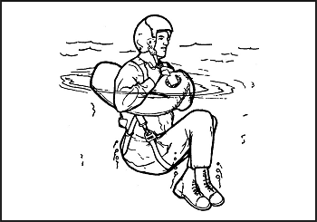
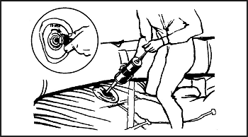
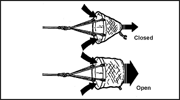

> Sea survival is perhaps the most difficult survival situation. Short- or long-term survival depends upon rations, equipment available, and your ingenuity. You must be resourceful to survive.
> 
> Water covers about 75 percent of the earth's surface, with about 70 percent being oceans and seas. You can assume that you will sometime cross vast expanses of water. There is always the chance that the plane or ship you are on will become crippled by such hazards as storms, collision, fire, or war.

### THE OPEN SEA

16-1\. As a survivor on the open sea, you will face waves and wind. You may also face extreme heat or cold. To keep these environmental hazards from becoming serious problems, take precautionary measures as soon as possible. Use the available resources to protect yourself from the elements and from heat or extreme cold and humidity.

16-2\. Protecting yourself from the elements meets only one of your basic needs. You must also be able to obtain water and food. Satisfying these basic needs will help prevent serious physical and psychological problems. However, you must also know how to treat health problems that may arise.

**PRECAUTIONARY MEASURES**

16-3\. Your survival at sea depends upon your—

*   Knowledge of and ability to use the available survival equipment.

*   Special skills and ability to cope with the hazards you face.

*   Will to live.

16-4\. When you board a ship or aircraft, find out what survival equipment is on board, where it is stowed, and what it contains. For instance, how many life preservers and lifeboats or rafts are on board? Where are they located? What type of survival equipment do they have? How much food, water, and medicine do they contain? How many people can be supported? Also, if you are responsible for other personnel on board, make sure you know where they are and they know where you are.

**DOWN AT SEA**

16-5\. If your aircraft goes down at sea, take the following actions. Whether you are in the water or in a raft, you should—

*   Get clear and upwind of the aircraft as soon as possible, but stay in the vicinity until the aircraft sinks.

*   Get clear of fuel-covered water in case the fuel ignites.

*   Try to find other survivors.

16-6\. A search for survivors usually takes place around the entire area of and near the crash site. Missing personnel may be unconscious and floating low in the water. [Figure 16-1](#fig16-1), illustrates three rescue procedures.

**Figure 16-1\. Rescue From Water**

16-7\. The best technique for rescuing personnel from the water is to throw them a life preserver attached to a line (A). Another is to send a swimmer (rescuer) from the raft with a line attached to a flotation device that will support the rescuer's weight (B). This device will help conserve a rescuer's energy while recovering the survivor. The least acceptable technique is to send an attached swimmer without flotation devices to retrieve a survivor (C). In all cases, the rescuer wears a life preserver. A rescuer should not underestimate the strength of a panic-stricken person in the water. A careful approach can prevent injury to the rescuer.

16-8\. When the rescuer approaches a survivor in trouble from behind, there is little danger the survivor will kick, scratch, or grab him. The rescuer swims to a point directly behind the survivor and grasps the life preserver's backstrap. The rescuer uses the sidestroke to drag the survivor to the raft.

16-9\. If you are in the water, make your way to a raft. If no rafts are available, try to find a large piece of floating debris to cling to. Relax; a person who knows how to relax in ocean water is in very little danger of drowning. The body's natural buoyancy will keep at least the top of the head above water, but some movement is needed to keep the face above water.

16-10\. Floating on your back takes the least energy. Lie on your back in the water, spread your arms and legs, and arch your back. By controlling your breathing in and out, your face will always be out of the water and you may even sleep in this position for short periods. Your head will be partially submerged, but your face will be above water. If you cannot float on your back or if the sea is too rough, float facedown in the water as shown in [Figure 16-2](#fig16-2).

**Figure 16-2\. Floating Position**

16-11\. The following are the best swimming strokes during a survival situation:

*   _Dog paddle._ This stroke is excellent when clothed or wearing a life jacket. Although slow in speed, it requires very little energy.

*   _Breaststroke._ Use this stroke to swim underwater, through oil or debris, or in rough seas. It is probably the best stroke for long-range swimming: it allows you to conserve your energy and maintain a reasonable speed.

*   _Sidestroke._ It is a good relief stroke because you use only one arm to maintain momentum and buoyancy.

*   _Backstroke._ This stroke is also an excellent relief stroke. It relieves the muscles that you use for other strokes. Use it if an underwater explosion is likely.

16-12\. If you are in an area where surface oil is burning—

*   Discard your shoes and buoyant life preserver.

**NOTE:** If you have an uninflated life preserver, keep it.

*   Cover your nose, mouth, and eyes and quickly go underwater.

*   Swim underwater as far as possible before surfacing to breathe.

*   Before surfacing to breathe and while still underwater, use your hands to push burning fluid away from the area where you wish to surface. Once an area is clear of burning liquid, you can surface and take a few breaths. Try to face downwind before inhaling.

*   Submerge feet first and continue as above until clear of the flames.

16-13\. If you are in oil-covered water that is free of fire, hold your head high to keep the oil out of your eyes. Attach your life preserver to your wrist and then use it as a raft.

16-14\. If you have a life preserver, you can stay afloat for an indefinite period. In this case, use the "Heat Escaping Lessening Posture (HELP)" body position ([Figure 16-3](#fig16-3)). Remain still and assume the fetal position to help you retain body heat. You lose about 50 percent of your body heat through your head. Therefore, keep your head out of the water. Other areas of high heat loss are the neck, the sides, and the groin.

**Figure 16-3\. HELP Position**

16-15\. If you are in a raft (also see Raft Procedures)—

*   Check the physical condition of all on board. Give first aid if necessary. Take seasickness pills if available. The best way to take these pills is to place them under the tongue and let them dissolve. There are also suppositories or injections against seasickness. Vomiting, whether from seasickness or other causes, increases the danger of dehydration.

*   Try to salvage all floating equipment—rations; canteens, thermos jugs, and other containers; clothing; seat cushions; parachutes; and anything else that will be useful to you. Secure the salvaged items in or to your raft. Make sure the items have no sharp edges that can puncture the raft.

*   If there are other rafts, lash the rafts together so they are about 7.5 meters (25 feet) apart. Be ready to draw them closer together if you see or hear an aircraft. It is easier for an aircrew to spot rafts that are close together rather than scattered.

*   Remember, rescue at sea is a cooperative effort. Use all available visual or electronic signaling devices to signal and make contact with rescuers. For example, raise a flag or reflecting material on an oar as high as possible to attract attention.

*   Locate the emergency radio and get it into operation. Operating instructions are on it. Use the emergency transceiver only when friendly aircraft are likely to be in the area.

*   Have other signaling devices ready for instant use. If you are in enemy territory, avoid using a signaling device that will alert the enemy. However, if your situation is desperate, you may have to signal the enemy for rescue if you are to survive.

*   Check the raft for inflation, leaks, and points of possible chafing. Make sure the main buoyancy chambers are firm (well rounded) but not overly tight ([Figure 16-4](#fig16-4)). Check inflation regularly. Air expands with heat; therefore, on hot days, release some air and add air when the weather cools.

*   Decontaminate the raft of all fuel. Petroleum will weaken its surfaces and break down its glued joints.

*   Throw out the sea anchor, or improvise a drag from the raft's case, a bailing bucket, or a roll of clothing. A sea anchor helps you stay close to your ditching site, making it easier for searchers to find you if you have relayed your location. Without a sea anchor, your raft may drift over 160 kilometers (96 miles) in a day, making it much harder to find you. You can adjust the sea anchor to act as a drag to slow down the rate of travel with the current, or as a means to travel with the current. You make this adjustment by opening or closing the sea anchor's apex. When open, the sea anchor ([Figure 16-5](#fig16-5)) acts as a drag that keeps you in the general area. When closed, it forms a pocket for the current to strike and propels the raft in the current's direction.

**Figure 16-4\. Inflating the Raft**

**Figure 16-5\. Sea Anchor**

16-16\. Also adjust the sea anchor so that when the raft is on the wave's crest, the sea anchor is in the wave's trough ([Figure 16-6](#fig16-6)).

**Figure 16-6\. Deployment of the Sea Anchor**

*   Wrap the sea anchor rope with cloth to prevent its chafing the raft. The anchor also helps to keep the raft headed into the wind and waves.

*   In stormy water, rig the spray and windshield at once. In a 25-man raft, keep the canopy erected at all times. Keep your raft as dry as possible. Keep it properly balanced. All personnel should stay seated, the heaviest one in the center.

*   Calmly consider all aspects of your situation and determine what you and your companions must do to survive. Inventory all equipment, food, and water. Waterproof items that salt water may affect. These include compasses, watches, sextant, matches, and lighters. Ration food and water.

*   Assign a duty position to each person or assign teams, for example, water collectors, food collectors, lookouts, radio operators, signalers, and water bailers.

**NOTE:** Lookout duty should not exceed 2 hours. Keep in mind and remind others that cooperation is one of the keys to survival.

*   Keep a log. Record the navigator's last fix, the time of ditching, the names and physical condition of personnel, and the ration schedule. Also record the winds, weather, direction of swells, times of sunrise and sunset, and other navigational data.

*   If you are down in unfriendly waters, take special security measures to avoid detection. Do not travel in the daytime. Throw out the sea anchor and wait for nightfall before paddling or hoisting sail. Keep low in the raft; stay covered with the blue side of the camouflage cloth up. Be sure a passing ship or aircraft is friendly or neutral before trying to attract its attention. If the enemy detects you and you are close to capture, destroy the logbook, radio, navigation equipment, maps, signaling equipment, and firearms. Jump overboard and submerge if the enemy starts strafing.

*   Decide whether to stay in position or to travel. Ask yourself, "How much information was signaled before the accident? Is your position known to rescuers? Do you know it yourself? Is the weather favorable for a search? Are other ships or aircraft likely to pass your present position? How many days supply of food and water do you have?"

**COLD WEATHER CONSIDERATIONS**

16-17\. If you are in a cold climate—

*   Put on an antiexposure suit. If unavailable, put on any extra clothing available. Keep clothes loose and comfortable.

*   Take care not to snag the raft with shoes or sharp objects. Keep the repair kit where you can readily reach it.

*   Rig a windbreak, spray shield, and canopy.

*   Try to keep the floor of the raft dry. Cover it with canvas or cloth for insulation.

*   Huddle with others to keep warm, moving enough to keep the blood circulating. Spread an extra tarpaulin, sail, or parachute over the group.

*   Give extra rations, if available, to men suffering from exposure to cold.

16-18\. The greatest threat you face when submerged in cold water is death due to hypothermia. The average ocean temperature around the world is only 11 degrees C (51 degrees F). However, do not be fooled by warm water—hypothermia can even occur in 27-degree C (80-degree F) water. When you are immersed in cold water, hypothermia occurs rapidly due to the decreased insulating quality of wet clothing and the result of water displacing the layer of still air that normally surrounds the body. The rate of heat exchange in water is about 25 times greater than it is in air of the same temperature. [Figure 16-7](#fig16-7) lists life expectancy times for immersion in water.

**Figure 16-7\. Life Expectancy Times for Immersion in Water**

16-19\. Your best protection against the effects of cold water is to get into the life raft, stay dry, and insulate your body from the cold surface of the bottom of the raft. If these actions are not possible, wearing an antiexposure suit will extend your life expectancy considerably. Remember, keep your head and neck out of the water and well insulated from the cold water's effects when the temperature is below 19 degrees C (66 degrees F). Wearing life preservers increases the predicted survival time as body position in the water increases the chance of survival.

**HOT WEATHER CONSIDERATIONS**

16-20\. If you are in a hot climate—

*   Rig a sunshade or canopy. Leave enough space for ventilation.

*   Cover your skin, where possible, to protect it from sunburn. Use sunburn cream, if available, on all exposed skin. Your eyelids, the back of your ears, and the skin under your chin sunburn easily.

**RAFT PROCEDURES**

16-21\. Most of the rafts in the U.S. Army and Air Force inventories can satisfy the needs for personal protection, mode of travel, and evasion and camouflage.

**NOTE:** Before boarding any raft, remove and tether (attach) your life preserver to yourself or the raft. Ensure there are no other metallic or sharp objects on your clothing or equipment that could damage the raft. After boarding the raft, don your life preserver again.

16-22\. For all rafts, remember the five As. These are the first things you should do if you are the first person into the raft:

*   Air-Check that all chambers are inflated and that all inflation valves are closed and equalization tube clamps (found on the 25-, 35-, and 46-man rafts) are clamped off when fully inflated.

*   Assistance-Assist others into the raft. Remove all puncture-producing items from pockets and move flotation devices to the rear of the body. Use proper boarding techniques; for example, the boarding loop on the seven-man raft and the boarding ramps on the 25-, 35-, and 46-man rafts.

*   Anchor-Ensure the sea anchor is properly deployed. It can be found 180 degreesaway from the equalization tube on the 25-, 35-, and 46-man rafts.

*   Accessory bag-Locate the accessory bag. It will be tethered to the raft between the smooth side of the CO2 bottle and the closest boarding ramp.

*   Assessment-Assess the situation and keep a positive mental attitude.

**One-Man Raft**

16-23\. The one-man raft has a main cell inflation. If the CO2 bottle should malfunction or if the raft develops a leak, you can inflate it by mouth.

16-24\. The spray shield acts as a shelter from the cold, wind, and water. In some cases, this shield serves as insulation. The raft's insulated bottom limits the conduction of cold thereby protecting you from hypothermia ([Figure 16-8](#fig16-8)).

**Figure 16-8\. One-Man Raft With Spray Shield**

16-25\. You can travel more effectively by inflating or deflating the raft to take advantage of the wind or current. You can use the spray shield as a sail while the ballast buckets serve to increase drag in the water. You may use the sea anchor to control the raft's speed and direction.

16-26\. There are rafts developed for use in tactical areas that are black. These rafts blend with the sea's background. You can further modify these rafts for evasion by partially deflating them to obtain a lower profile.

16-27\. A lanyard connects the one-man raft to a parachutist (survivor) landing in the water. You (the survivor) inflate it upon landing. You do not swim to the raft, but pull it to you via the lanyard. The raft may hit the water upside down, but you can right it by approaching the side to which the bottle is attached and flipping the raft over. The spray shield must be in the raft to expose the boarding handles. Follow the five As outlined under raft procedures above when boarding the raft ([Figure 16-9](#fig16-9)).

**Figure 16-9\. Boarding the One-Man Raft**

16-28\. If you have an arm injury, the best way to board is by turning your back to the small end of the raft, pushing the raft under your buttocks, and lying back. Another way to board the raft is to push down on its small end until one knee is inside and lie forward ([Figure 16-10](#fig16-10)).

**Figure 16-10\. Other Methods of Boarding the One-Man Raft**

16-29\. In rough seas, it may be easier for you to grasp the small end of the raft and, in a prone position, to kick and pull yourself into the raft. When you are lying face down in the raft, deploy and adjust the sea anchor. To sit upright, you may have to disconnect one side of the seat kit and roll to that side. Then you adjust the spray shield. There are two variations of the one-man raft; the improved model incorporates an inflatable spray shield and floor that provide additional insulation. The spray shield helps keep you dry and warm in cold oceans and protects you from the sun in the hot climates ([Figure 16-11](#fig16-11)).

**Figure 16-11\. One-Man Raft With Spray Shield Inflated**

**Seven-Man Raft**

16-30\. Some multiplace aircraft carry the seven-man raft. It is a component of the survival drop kit ([Figure 16-12](#fig16-12)). This raft may inflate upside down and require you to right the raft before boarding. Always work from the bottle side to prevent injury if the raft turns over. Facing into the wind, the wind provides additional help in righting the raft. Use the handles on the inside bottom of the raft for boarding ([Figure 16-13](#fig16-13)).

**Figure 16-12\. Seven-Man Raft**

**Figure 16-13\. Method of Righting Raft**

16-31\. Use the boarding ramp if someone holds down the raft's opposite side. If you don't have help, again work from the bottle side with the wind at your back to help hold down the raft. Follow the five As outlined in [paragraph 16-22](#para16-22). Then grasp an oarlock and boarding handle, kick your legs to get your body prone on the water, and then kick and pull yourself into the raft. If you are weak or injured, you may partially deflate the raft to make boarding easier ([Figure 16-14](#fig16-14)).

**Figure 16-14\. Method of Boarding Seven-Man Raft**

16-32\. Use the hand pump to keep the buoyancy chambers and cross seat firm. Never overinflate the raft.

**25-, 35-, and 46-Man Rafts**

16-33\. You may find 25-, 35-, or 46-man rafts in multiplace aircraft ([Figure 16-15](#fig16-15)). The 20-man raft has been discontinued. The rafts are stowed in raft compartments on the outside of the fuselage, usually on the wings, alongside the upper half of the port (left) side of the aircraft. There will always be enough raft space to accommodate all personnel on each type of aircraft. If the number of personnel exceeds the maximum number of raft spaces, additional rafts will be centerline-loaded and ratchet-strapped to the cargo bay floor. Some may be automatically deployed from the cockpit or from stations within the cargo area, usually near the crew chief's station, while others may need manual deployment. No matter how the raft lands in the water, it is ready for boarding. A lanyard connects the accessory kit to the raft and you retrieve the kit by hand. You must manually inflate the center chamber with the hand pump. Board the 25-, 35-, or 46-man raft from the aircraft, if possible. If not, board in the following manner:

*   Approach the lower boarding ramp, following the arrows printed on the outside of the raft.

*   Remove your life preserver and tether it to yourself so that it trails behind you.

*   Grasp the boarding handles and kick your legs to get your body into a prone position on the water's surface; then kick and pull until you are inside the raft.

**Figure 16-15\. 25-Man Raft**

16-34\. An incompletely inflated raft will make boarding easier. Approach the intersection of the raft and ramp, grasp the upper boarding handle, and swing one leg onto the center of the ramp, as in mounting a horse.

16-35\. Immediately tighten the equalizer clamp upon entering the raft to prevent deflating the entire raft in case of a puncture ([Figure 16-16](#fig16-16)).

**Figure 16-16\. Immediate Action—Multiplace Raft**

16-36\. Use the pump to keep these rafts' chambers and center ring firm. They should be well rounded but not overly tight. The center rings keep the center of the floor afloat, and give raft occupants something to brace their feet against to prevent all occupants from sliding toward the center.

**SAILING RAFTS**

16-37\. Rafts do not have keels, therefore, you can't sail them into the wind. However, anyone can sail a raft downwind. You can successfully sail the seven-man raft 10 degrees off from the direction of the wind. Do not try to sail the raft unless land is near. If you decide to sail and the wind is blowing toward a desired destination, fully inflate the raft, sit high, take in the sea anchor, rig a sail, and use an oar as a rudder.

16-38\. In the seven-man raft, erect a square sail in the bow using the oars and their extensions as the mast and crossbar ([Figure 16-17](#fig16-17)). You may use a waterproof tarpaulin or parachute material for the sail. If the raft has no regular mast socket and step, erect the mast by tying it securely to the front cross seat using braces. Pad the bottom of the mast to prevent it from chafing or punching a hole through the floor, whether or not there is a socket. The heel of a shoe, with the toe wedged under the seat, makes a good improvised mast step. Do not secure the corners of the lower edge of the sail. Hold the lines attached to the corners with your hands so that a gust of wind will not rip the sail, break the mast, or capsize the raft.

**Figure 16-17\. Sail Construction**

16-39\. Take every precaution to prevent the raft from turning over. In rough weather, keep the sea anchor away from the bow. Have the passengers sit low in the raft, with their weight distributed to hold the upwind side down. To prevent falling out, they should also avoid sitting on the sides of the raft or standing up. Avoid sudden movements without warning the other passengers. When the sea anchor is not in use, tie it to the raft and stow it in such a manner that it will hold immediately if the raft capsizes.

**WATER**

16-40\. Water is your most important need. With it alone, you can live for ten days or longer, depending on your will to live. When drinking water, moisten your lips, tongue, and throat before swallowing.

**Short-Water Rations**

16-41\. When you have a limited water supply and you can't replace it by chemical or mechanical means, use the water efficiently. Protect freshwater supplies from seawater contamination. Keep your body well shaded, both from overhead sun and from reflection off the sea surface. Allow ventilation of air; dampen your clothes during the hottest part of the day. Do not exert yourself. Relax and sleep when possible. Fix your daily water ration after considering the amount of water you have, the output of solar stills and desalting kit, and the number and physical condition of your party.

16-42\. If you don't have water, don't eat. If your water ration is two liters or more per day, eat any part of your ration or any additional food that you may catch, such as birds, fish, shrimp. The life raft's motion and your anxiety may cause nausea. If you eat when nauseated, you may lose your food immediately. If nauseated, rest and relax as much as you can, and take only water.

16-43\. To reduce your loss of water through perspiration, soak your clothes in the sea and wring them out before putting them on again. Don't overdo this during hot days when no canopy or sun shield is available. This is a trade-off between cooling and the saltwater boils, sores, and rashes that will result. Be careful not to get the bottom of the raft wet.

16-44\. Watch the clouds and be ready for any chance of showers. Keep the tarpaulin handy for catching water. If it is encrusted with dried salt, wash it in seawater. Normally, a small amount of seawater mixed with rain will hardly be noticeable and will not cause any physical reaction. In rough seas you cannot get uncontaminated fresh water.

16-45\. At night, secure the tarpaulin like a sunshade, and turn up its edges to collect dew. It is also possible to collect dew along the sides of the raft using a sponge or cloth. When it rains, drink as much as you can hold.

**Manual Reverse Osmosis Desalinator**

16-46\. Most rafts today are equipped with a manual reverse osmosis desalinator (MROD). The MROD is a very highly efficient water purifier designed to remove salt particles from seawater, thereby making seawater potable. The two most common models are the Survivor 35 and the Survivor 06, which make 35 and 6 gallons of potable water in a 24-hour period if used continuously. Water procurement at sea is a 24-hour-a-day job. The MROD's life cycle is up to 50,000 gallons of water. The MROD has a 10-year shelf life before it must be repacked by the manufacturer.

To operate the MROD, place both the intake (larger dual hose) and the potable water supply hose into the water. Begin a 2-second cycle of pumping the handle—one second up, one second down. A pressure indicator will protrude from the pump housing to show that the proper flow is being maintained. An orange band will be visible when the correct rhythm is maintained. Purge the antimicrobial packing agent from the filter medium for 2 minutes. Then begin to collect potable water.

**NOTE:** Ensure that the water is free from any petroleum residue (jet fuel, hydraulic fluid, or oil) before using an MROD. The filter medium is very sensitive to petroleum, oils, and lubricants, and will render the filter useless, destroying your water production capability.

**Solar Still**

16-47\. When solar stills are available, read the instructions and set them up immediately. Use as many stills as possible, depending on the number of men in the raft and the amount of sunlight available. Secure solar stills to the raft with care. Solar stills only work on flat, calm seas.

**Desalting Kits**

16-48\. When desalting kits are available in addition to solar stills, use them only for immediate water needs or during long overcast periods when you cannot use solar stills. In any event, keep desalting kits and emergency water stores for periods when you cannot use solar stills or catch rainwater.

**Water From Fish**

16-49\. Drink the aqueous fluid found along the spine and in the eyes of large fish. Carefully cut the fish in half to get the fluid along the spine and suck the eye. If you are so short of water that you need to do this, then **do not** drink any of the other body fluids. These other fluids are rich in protein and fat and will use up more of your reserve water in digestion than they supply.

**Sea Ice**

16-50\. In arctic waters, use old sea ice for water. This ice is bluish, has rounded corners, and splinters easily. It is nearly free of salt. New ice is gray, milky, hard, and salty. Water from icebergs is fresh, but icebergs are dangerous to approach. Use them as a source of water only in emergencies.

16-51\. As in any survival situation there are dangers when you are substituting or compromising necessities. Even though water is one of your basic needs, keep in mind the following tips.

**DO NOT—**

*   Drink seawater.

*   Drink urine.

*   Drink alcohol.

*   Smoke.

*   Eat, unless water is available.

16-52\. Sleep and rest are the best ways of enduring periods of reduced water and food intake. However, make sure that you have enough shade when napping during the day. If the sea is rough, tie yourself to the raft, close any cover, and ride out the storm as best you can. **Relax** is the key word—at least try to relax.

**FOOD PROCUREMENT**

16-53\. In the open sea, fish will be the main food source. There are some poisonous and dangerous ocean fish, but, in general, when out of sight of land, fish are safe to eat. Nearer the shore there are fish that are both dangerous and poisonous to eat. There are some fish, such as the red snapper and barracuda, that are normally edible but poisonous when taken from the waters of atolls and reefs. Flying fish will even jump into your raft!

**Fish**

16-54\. When fishing, do not handle the fishing line with bare hands and never wrap it around your hands or tie it to a life raft. The salt that adheres to it can make it a sharp cutting edge, an edge dangerous both to the raft and your hands. Wear gloves, if they are available, or use a cloth to handle fish and to avoid injury from sharp fins and gill covers.

16-55\. In warm regions, gut and bleed fish immediately after catching them. Cut fish that you do not eat immediately into thin, narrow strips and hang them to dry. A well-dried fish stays edible for several days. Fish not cleaned and dried may spoil in half a day. Fish with dark meat are very prone to decomposition. If you do not eat them all immediately, do not eat any of the leftovers. Use the leftovers for bait.

16-56\. Never eat fish that have pale, shiny gills, sunken eyes, flabby skin and flesh, or an unpleasant odor. Good fish show the opposite characteristics. Sea fish have a saltwater or clean fishy odor. Do not confuse eels with sea snakes that have an obviously scaly body and strongly compressed, paddle-shaped tail. Both eels and sea snakes are edible, but you must handle the latter with care because of their poisonous bites. The heart, blood, intestinal wall, and liver of most fish are edible. Cook the intestines. Also edible are the partly digested smaller fish that you may find in the stomachs of large fish. In addition, sea turtles are edible.

16-57\. Shark meat is a good source of food whether raw, dried, or cooked. Shark meat spoils very rapidly due to the high concentration of urea in the blood; therefore, bleed it immediately and soak it in several changes of water. People prefer some shark species over others. Consider them all edible except the Greenland shark, whose flesh contains high quantities of vitamin A. Do not eat the livers, due to high vitamin A content.

**Fishing Aids**

16-58\. The accessory kit contains a very good fishing kit that should meet your needs just about anywhere around the world. You can also use different materials to make fishing aids as described in the following paragraphs:

*   _Fishing line._ Use pieces of tarpaulin or canvas. Unravel the threads and tie them together in short lengths in groups of three or more threads. Shoelaces and parachute suspension line also work well.

*   _Fish hooks._ No one at sea should be without fishing equipment, but if you are, improvise hooks as shown in [Chapter 8](08).

*   _Fish lures._ You can fashion lures by attaching a double hook to any shiny piece of metal.

*   _Grapple._ Use grapples to hook seaweed. You may shake crabs, shrimp, or small fish out of the seaweed.

These you may eat or use for bait. You may eat seaweed itself, but only when you have plenty of drinking water. Improvise grapples from wood. Use a heavy piece of wood as the main shaft, and lash three smaller pieces to the shaft as grapples.

*   _Bait._ You can use small fish as bait for larger ones. Scoop the small fish up with a net. If you don't have a net, make one from cloth of some type. Hold the net under the water and scoop upward. Use all the guts from birds and fish for bait. When using bait, try to keep it moving in the water to give it the appearance of being alive.

**Helpful Fishing Hints**

16-59\. Your fishing should be successful if you remember the following important hints:

*   Be extremely careful with fish that have teeth and spines.

*   Cut a large fish loose rather than risk capsizing the raft. Try to catch small rather than large fish.

*   Do not puncture your raft with hooks or other sharp instruments.

*   Do not fish when large sharks are in the area.

*   Watch for schools of fish; try to move close to these schools.

*   Fish at night using a light. The light attracts fish.

*   In the daytime, shade attracts some fish. You may find them under your raft.

*   Improvise a spear by tying a knife to an oar blade. This spear can help you catch larger fish, but you must get them into the raft quickly or they will slip off the blade. Also, tie the knife very securely or you may lose it.

*   Always take care of your fishing equipment. Dry your fishing lines, clean and sharpen the hooks, and do not allow the hooks to stick into the fishing lines.

**Birds**

16-60\. As stated in [Chapter 8](08), all sea birds are edible. Eat any birds you can catch. Sometimes birds may land on your raft, but usually they are cautious. You may be able to attract some birds by towing a bright piece of metal behind the raft. This will bring the bird within shooting range, provided you have a firearm.

16-61\. If a bird lands within your reach, you may be able to catch it. If the birds do not land close enough or land on the other end of the raft, you may be able to catch them with a bird noose. Bait the center of the noose and wait for the bird to land. When the bird's feet are in the center of the noose, pull it tight.

16-62\. Use all parts of the bird. Use the feathers for insulation, the entrails and feet for bait, and so on. Use your imagination.

**MEDICAL PROBLEMS ASSOCIATED WITH SEA SURVIVAL**

16-63\. At sea, you may become seasick, get saltwater sores, or face some of the same medical problems that occur on land, such as dehydration, hypothermia, or sunburn. These problems can become critical if left untreated.

**Seasickness**

16-64\. Seasickness is the nausea and vomiting caused by the motion of the raft. It can result in—

*   Extreme fluid loss and exhaustion.

*   Loss of the will to survive.

*   Others becoming seasick.

*   Attraction of sharks to the raft.

*   Unclean conditions.

16-65\. To treat seasickness—

*   Wash both the patient and the raft to remove the sight and odor of vomit.

*   Keep the patient from eating food until his nausea is gone.

*   Have the patient lie down and rest.

*   Give the patient seasickness pills if available. If the patient is unable to take the pills orally, insert them rectally for absorption by the body. Do not take seasickness pills if you are already seasick. They tend to make the patient even sicker; always take seasickness pills before the symptoms appear.

**NOTE:** Some people at sea have said that erecting a canopy or using the horizon or a cloud as a focal point helped overcome seasickness. Others have said that swimming alongside the raft for short periods helped, but extreme care must be taken if swimming.

**Saltwater Sores**

16-66\. These sores result from a break in skin exposed to saltwater for an extended period. They may also occur at the areas that your clothing binds you—your waist, ankles, or wrist. The sores may form scabs and pus. Do not open or drain the sores. Flush them with freshwater, if available, and allow to dry. Apply an antiseptic, if available.

**Immersion Rot, Frostbite, and Hypothermia**

16-67\. These problems are similar to those encountered in cold weather environments. Symptoms and treatment are the same as covered in [Chapter 15](15).

**Blindness or Headache**

16-68\. If flame, smoke, or other contaminants get in the eyes, flush them immediately with saltwater, then with freshwater, if available. Apply ointment, if available. Bandage both eyes 18 to 24 hours, or longer if damage is severe. If the glare from the sky and water causes your eyes to become bloodshot and inflamed, bandage them lightly. Try to prevent this problem by wearing sunglasses. Improvise sunglasses if necessary.

**Constipation**

16-69\. This condition is a common problem on a raft. Do not take a laxative, as this will cause further dehydration. Exercise as much as possible and drink an adequate amount of water, if available.

**Difficult Urination**

16-70\. This problem is not unusual and is due mainly to dehydration. It is best not to treat it, as it could cause further dehydration.

**Sunburn**

16-71\. Sunburn is a serious problem in sea survival. Try to prevent sunburn by staying in the shade and keeping your head and skin covered. Use cream or lip salve from your first-aid kit. Remember, reflection from the water also causes sunburn in places where the sun usually doesn't burn you—tender skin under the earlobes, eyebrows, nose, chin, and underarms.

**SHARKS**

16-72\. Whether you are in the water or in a boat or raft, you may see many types of sea life around you. Some may be more dangerous than others. Generally, sharks are the greatest danger to you. Other animals, such as whales, porpoises, and stingrays, may look dangerous, but really pose little threat in the open sea.

16-73\. Of the many hundreds of shark species, only about 20 species are known to attack man. The most dangerous are the great white shark, the hammerhead, the mako, and the tiger shark. Other sharks known to attack man include the gray, blue, lemon, sand, nurse, bull, and oceanic white-tip sharks. Consider any shark longer than 1 meter (3 feet) dangerous.

16-74\. There are sharks in all oceans and seas of the world. While many live and feed in the depths of the sea, others hunt near the surface. The sharks living near the surface are the ones you will most likely see. Their dorsal fins frequently project above the water. Sharks in the tropical and subtropical seas are far more aggressive than those in temperate waters.

16-75\. All sharks are basically eating machines. Their normal diet is live animals of any type, and they will strike at injured or helpless animals. Sight, smell, or sound may guide them to their prey. Sharks have an acute sense of smell and the smell of blood in the water excites them. They are also very sensitive to any abnormal vibrations in the water. The struggles of a wounded animal or swimmer, underwater explosions, or even a fish struggling on a fishline will attract a shark.

16-76\. Sharks can bite from almost any position; they do not have to turn on their side to bite. The jaws of some of the larger sharks are so far forward that they can bite floating objects easily without twisting to the side.

16-77\. Sharks may hunt alone, but most reports of attacks cite more than one shark present. The smaller sharks tend to travel in schools and attack in mass. Whenever one of the sharks finds a victim, the other sharks will quickly join it. Sharks will eat a wounded shark as quickly as their prey.

16-78\. Sharks feed at all hours of the day and night. Most reported shark contacts and attacks were during daylight, and many of these have been in the late afternoon. Some of the measures that you can take to protect yourself against sharks when you are in the water are—

*   _Stay with other swimmers._ A group can maintain a 360-degree watch. A group can either frighten or fight off sharks better than one man.

*   _Always watch for sharks._ Keep all your clothing on, to include your shoes. Historically, sharks have attacked the unclothed men in groups first, mainly in the feet. Clothing also protects against abrasions should the shark brush against you.

*   _Avoid urinating._ If you must, only do so in small amounts. Let it dissipate between discharges. If you must defecate, do so in small amounts and throw it as far away from you as possible. Do the same if you must vomit.

16-79\. If a shark attack is imminent while you are in the water, splash and yell just enough to keep the shark at bay. Sometimes yelling underwater or slapping the water repeatedly will scare the shark away. Conserve your strength for fighting in case the shark attacks.

16-80\. If attacked, kick and strike the shark. Hit the shark on the gills or eyes if possible. If you hit the shark on the nose, you may injure your hand if it glances off and hits its teeth.

16-81\. When you are in a raft and see sharks—

*   Do not fish. If you have hooked a fish, let it go. Do not clean fish in the water.

*   Do not throw garbage overboard.

*   Do not let your arms, legs, or equipment hang in the water.

*   Keep quiet and do not move around.

*   Bury all dead as soon as possible. If there are many sharks in the area, conduct the burial at night.

16-82\. When you are in a raft and a shark attack is imminent, hit the shark with anything you have, except your hands. You will do more damage to your hands than the shark. If you strike with an oar, be careful not to lose or break it.

**DETECTING LAND**

16-83\. You should watch carefully for any signs of land. There are many indicators that land is near.

16-84\. A fixed cumulus cloud in a clear sky or in a sky where all other clouds are moving often hovers over or slightly downwind from an island.

16-85\. In the tropics, the reflection of sunlight from shallow lagoons or shelves of coral reefs often causes a greenish tint in the sky.

16-86\. In the arctic, light-colored reflections on clouds often indicate ice fields or snow-covered land. These reflections are quite different from the dark gray ones caused by open water.

16-87\. Deep water is dark green or dark blue. Lighter color indicates shallow water, which may mean land is near.

16-88\. At night, or in fog, mist, or rain, you may detect land by odors and sounds. The musty odor of mangrove swamps and mud flats carry a long way. You hear the roar of surf long before you see the surf. The continued cries of seabirds coming from one direction indicate their roosting place on nearby land.

16-89\. There usually are more birds near land than over the open sea. The direction from which flocks fly at dawn and to which they fly at dusk may indicate the direction of land. During the day, birds are searching for food and the direction of flight has no significance.

16-90\. Mirages occur at any latitude, but they are more likely in the tropics, especially during the middle of the day. Be careful not to mistake a mirage for nearby land. A mirage disappears or its appearance and elevation change when viewed from slightly different heights.

16-91\. You may be able to detect land by the pattern of the waves (refracted) as they approach land ([Figure 16-18](#fig16-18)). By traveling with the waves and parallel to the slightly turbulent area marked "X" on the illustration, you should reach land.

**Figure 16-18\. Wave Patterns About an Island**

**RAFTING OR BEACHING TECHNIQUES**

16-92\. Once you have found land, you must get ashore safely. To raft ashore, you can usually use the one-man raft without danger. However, going ashore in a strong surf is dangerous. Take your time. Select your landing point carefully. Try not to land when the sun is low and straight in front of you. Try to land on the lee side of an island or on a point of land jutting out into the water. Keep your eyes open for gaps in the surf line, and head for them. Avoid coral reefs and rocky cliffs. There are no coral reefs near the mouths of freshwater streams. Avoid rip currents or strong tidal currents that may carry you far out to sea. Either signal ashore for help or sail around and look for a sloping beach where the surf is gentle.

16-93\. If you have to go through the surf to reach shore, take down the mast. Keep your clothes and shoes on to avoid severe cuts. Adjust and inflate your life vest. Trail the sea anchor over the stem using as much line as you have. Use the oars or paddles and constantly adjust the sea anchor to keep a strain on the anchor line. These actions will keep the raft pointed toward shore and prevent the sea from throwing the stern around and capsizing you. Use the oars or paddles to help ride in on the seaward side of a large wave.

16-94\. The surf may be irregular and velocity may vary, so modify your procedure as conditions demand. A good method of getting through the surf is to have half the men sit on one side of the raft, half on the other, facing away from each other. When a heavy sea bears down, half should row (pull) toward the sea until the crest passes; then the other half should row (pull) toward the shore until the next heavy sea comes along.

16-95\. Against a strong wind and heavy surf, the raft must have all possible speed to pass rapidly through the oncoming crest to avoid being turned broadside or thrown end over end. If possible, avoid meeting a large wave at the moment it breaks.

16-96\. If in a medium surf with no wind or offshore wind, keep the raft from passing over a wave so rapidly that it drops suddenly after topping the crest. If the raft turns over in the surf, try to grab hold of it and ride it in.

16-97\. As the raft nears the beach, ride in on the crest of a large wave. Paddle or row hard and ride in to the beach as far as you can. Do not jump out of the raft until it has grounded, then quickly get out and beach it.

16-98\. If you have a choice, do not land at night. If you have reason to believe that people live on the shore, lay away from the beach, signal, and wait for the inhabitants to come out and bring you in.

16-99\. If you encounter sea ice, land only on large, stable floes. Avoid icebergs that may capsize and small floes or those obviously disintegrating. Use oars and hands to keep the raft from rubbing on the edge of the ice. Take the raft out of the water and store it well back from the floe's edge. You may be able to use it for shelter. Keep the raft inflated and ready for use. Any floe may break up without warning.

**SWIMMING ASHORE**

16-100\. If rafting ashore is not possible and you have to swim, wear your shoes and at least one thickness of clothing. Use the sidestroke or breaststroke to conserve strength.

16-101\. If the surf is moderate, ride in on the back of a small wave by swimming forward with it. Dive to a shallow depth to end the ride just before the wave breaks.

16-102\. In high surf, swim toward shore in the trough between waves. When the seaward wave approaches, face it and submerge. After it passes, work toward shore in the next trough. If caught in the undertow of a large wave, push off the bottom or swim to the surface and proceed toward shore as above.

16-103\. If you must land on a rocky shore, look for a place where the waves rush up onto the rocks. Avoid places where the waves explode with a high, white spray. Swim slowly when making your approach. You will need your strength to hold on to the rocks. You should be fully clothed and wear shoes to reduce injury.

16-104\. After selecting your landing point, advance behind a large wave into the breakers. Face toward shore and take a sitting position with your feet in front, 60 to 90 centimeters (2 or 3 feet) lower than your head. This position will let your feet absorb the shock when you land or strike submerged boulders or reefs. If you do not reach shore behind the wave you picked, swim with your hands only. As the next wave approaches, take a sitting position with your feet forward. Repeat the procedure until you land.

16-105\. Water is quieter in the lee of a heavy growth of seaweed. Take advantage of such growth. Do not swim through the seaweed; crawl over the top by grasping the vegetation with overhand movements.

16-106\. Cross a rocky or coral reef as you would land on a rocky shore. Keep your feet close together and your knees slightly bent in a relaxed sitting posture to cushion the blows against the coral.

**PICKUP OR RESCUE**

16-107\. On sighting rescue craft approaching for pickup (boat, ship, conventional aircraft, or helicopter), quickly clear any lines (fishing lines, desalting kit lines) or other gear that could cause entanglement during rescue. Secure all loose items in the raft. Take down canopies and sails to ensure a safer pickup. After securing all items, put on your helmet, if available. Fully inflate your life preserver. Remain in the raft, unless otherwise instructed, and remove all equipment except the preservers. If possible, you will receive help from rescue personnel lowered into the water. Remember, follow all instructions given by the rescue personnel.

16-108\. If the helicopter recovery is unassisted, do the following before pickup:

*   Secure all the loose equipment in the raft, accessory bag, or in pockets.

*   Deploy the sea anchor, stability bags, and accessory bag.

*   Partially deflate the raft and fill it with water.

*   Unsnap the survival kit container from the parachute harness.

*   Grasp the raft handhold and roll out of the raft.

*   Allow the recovery device or the cable to ground out on the water's surface.

*   Maintain the handhold until the recovery device is in your other hand.

*   Mount the recovery device, avoiding entanglement with the raft.

*   Signal the hoist operator for pickup by placing one arm straight out to the side with your thumb up while you hold on with the other. Vigorously splash the water and then raise your arm in the "thumbs up" signal. Once recovered, **DO NOT** reach for the helicopter or crewman to try to assist him. Allow the aircrew personnel to pull you into the aircraft by themselves.

### SEASHORES

16-109\. Search planes or ships do not always spot a drifting raft or swimmer. You may have to land along the coast before being rescued. Surviving along the seashore is different from open sea survival. Food and water are more abundant and shelter is obviously easier to locate and construct.

16-110\. If you are in friendly territory and decide to travel, it is better to move along the coast than to go inland. Do not leave the coast except to avoid obstacles (swamps and cliffs) or unless you find a trail that you know leads to human habitation.

16-111\. In time of war, remember that the enemy patrols most coastlines. These patrols may cause problems for you if you land on a hostile shore. You will have extremely limited travel options in this situation. Avoid all contact with other humans and make every effort to cover all tracks you leave on the shore.

**SPECIAL HEALTH HAZARDS**

16-112\. Surviving on the seashore certainly can provide a greater abundance of your basic needs, but hazards also exist. Coral, poisonous and aggressive fish, crocodiles, sea urchins, sea biscuits, sponges, anemones, tides, and undertow can pose special health hazards that you should be aware of and know how to handle.

**Coral**

16-113\. Coral, dead or alive, can inflict painful cuts. There are hundreds of water hazards that can cause deep puncture wounds, severe bleeding, and the danger of infection. Clean all coral cuts thoroughly. Do not use iodine to disinfect any coral cuts. Some coral polyps feed on iodine and may grow inside your flesh if you use iodine.

**Poisonous Fish**

16-114\. Many reef fish have toxic flesh. For some species, the flesh is always poisonous, for other species, only at certain times of the year. The poisons are present in all parts of the fish, but especially in the liver, intestines, and eggs. This is due to their ingesting of a poisonous bacterial that grows only on coral reefs. This bacteria is toxic to humans.

16-115\. Fish toxins are water soluble; no amount of cooking will neutralize them. They are tasteless, therefore, the standard edibility tests are useless. Birds are least susceptible to the poisons. Therefore, do not think that because a bird can eat a fish, it is a safe species for you to eat.

16-116\. The toxins will produce a numbness of the lips, tongue, toes, and tips of the fingers, severe itching, and a clear reversal of temperature sensations. Cold items appear hot and hot items cold. There will probably also be nausea, vomiting, loss of speech, dizziness, and a paralysis that eventually brings death.

16-117\. In addition to fish with poisonous flesh, there are those that are dangerous to touch. Many stingrays have a poisonous barb in their tail. There are also species that can deliver an electric shock. Some reef fish, such as stonefish and toadfish, have venomous spines that can cause very painful although seldom fatal injuries. The venom from these spines causes a burning sensation or even an agonizing pain that is out of proportion to the apparent severity of the wound. A jellyfish, while not usually fatal, can inflict a very painful sting if it touches you with its tentacles. See [Chapter 11](11) and [Appendix F](f) for details on particularly dangerous fish of the sea and seashore.

**Aggressive Fish**

16-118\. You should also avoid some ferocious fish. The bold and inquisitive barracuda has attacked men wearing shiny objects. It may charge lights or shiny objects at night. The sea bass, which can grow to 1.7 meters (6 feet), is another fish to avoid. The moray eel, which has many sharp teeth and grows to 1.5 meters (5 feet), can also be aggressive if disturbed.

**Sea Snakes**

16-119\. Sea snakes are venomous and sometimes found in mid ocean. They are unlikely to bite unless provoked. **Avoid** them.

**Crocodiles**

16-120\. Crocodiles inhabit tropical saltwater bays and mangrove-bordered estuaries and range up to 65 kilometers (39 miles) into the open sea. Few remain near inhabited areas. You commonly find crocodiles in the remote areas of the East Indies and Southeast Asia. Consider specimens over 1 meter (3 feet) long dangerous, especially females guarding their nests. Crocodile meat is an excellent source of food when available.

**Sea Urchins, Sea Biscuits, Sponges, and Anemones**

16-121\. These animals can cause extreme, though seldom fatal, pain. Usually found in tropical shallow water near coral formations, sea urchins resemble small, round porcupines. If stepped on, they slip fine needles of lime or silica into the skin, where they break off and fester. If possible, remove the spines and treat the injury for infection. The other animals mentioned inflict injury similarly.

**Tides and Undertow**

16-122\. If caught in a large wave's undertow, push off the bottom or swim to the surface and proceed shoreward in a trough between waves. Do not fight against the pull of the undertow. Swim with it or perpendicular to it until it loses strength, then swim for shore.

**FOOD**

16-123\. Obtaining food along a seashore should not present a problem. There are many types of seaweed and other plants you can easily find and eat. See [Chapter 9](09) and [Appendix B](b) for a discussion of these plants. There is also a great variety of animal life that can supply your need for food in this type of survival situation.

**Mollusks**

16-124\. Mussels, limpets, clams, sea snails, octopuses, squids, and sea slugs are all edible. Shellfish will usually supply most of the protein eaten by coastal survivors. Avoid the blue-ringed octopus and cone shells (described in [Chapter 11](11) and [Appendix F](f)). Also, beware of "red tides" that make mollusks poisonous. Apply the edibility test on each species before eating.

**Worms**

16-125\. Coastal worms are generally edible, but it is better to use them for fish bait. Avoid bristle worms that look like fuzzy caterpillars. Also, avoid tubeworms that have sharp-edged tubes. Arrow worms, alias amphioxus, are not true worms. You find them in the sand. They are excellent either fresh or dried.

**Crabs, Lobsters, and Barnacles**

16-126\. These animals are seldom dangerous to man and are an excellent food source. The pincers of larger crabs or lobsters can crush a man's finger. Many species have spines on their shells, making it preferable to wear gloves when catching them. Barnacles can cause scrapes or cuts and are difficult to detach from their anchor, but the larger species are an excellent food source.

**Sea Urchins**

16-127\. These are common and can cause painful injuries when stepped on or touched. They are also a good source of food. Handle them with gloves and remove all spines.

**Sea Cucumbers**

16-128\. This animal is an important food source in the Indo-Pacific regions. Use them whole after evisceration or remove the five muscular strips that run the length of its body. Eat them smoked, pickled, or cooked.
