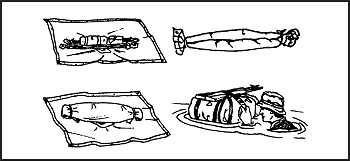

> In a survival situation, you may have to cross a water obstacle. It may be in the form of a river, a stream, a lake, a bog, quicksand, quagmire, or muskeg. Even in the desert, flash floods occur, making streams an obstacle. Whatever the obstacle, you need to know how to cross it safely.

### RIVERS AND STREAMS

17-1\. You can apply almost every description to rivers and streams. They may be shallow or deep, slow or fast moving, narrow or wide. Before you try to cross a river or stream, develop a good plan.

17-2\. Your first step is to look for a high place from which you can get a good view of the river or stream. From this place, you can look for a place to cross. If there is no high place, climb a tree. Good crossing locations include—

*   A level stretch where it breaks into several channels. Two or three narrow channels are usually easier to cross than a wide river.

*   A shallow bank or sandbar. If possible, select a point upstream from the bank or sandbar so that the current will carry you to it if you lose your footing.

*   A course across the river that leads downstream so that you will cross the current at about a 45-degree angle.

17-3\. The following areas possess potential hazards; avoid them, if possible:

*   Obstacles on the opposite side of the river that might hinder your travel. Try to select the spot from which travel will be the safest and easiest.

*   A ledge of rocks that crosses the river. This often indicates dangerous rapids or canyons.

*   A deep or rapid waterfall or a deep channel. Never try to ford a stream directly above or even close to such hazards.

*   Rocky places that could cause you to sustain serious injuries from slipping or falling. Usually, submerged rocks are very slick, making balance extremely difficult. An occasional rock that breaks the current, however, may help you.

*   An estuary of a river because it is normally wide, has strong currents, and is subject to tides. These tides can influence some rivers many kilometers from their mouths. Go back upstream to an easier crossing site.

*   Eddies, which can produce a powerful backward pull downstream of the obstruction causing the eddy and pull you under the surface.

17-4\. The depth of a fordable river or stream is no deterrent if you can keep your footing. In fact, deep water sometimes runs more slowly and is therefore safer than fast-moving shallow water. You can always dry your clothes later, or if necessary, you can make a raft to carry your clothing and equipment across the river.

17-5\. You must not try to swim or wade across a stream or river when the water is at very low temperatures. This swim could be fatal. Try to make a raft of some type. Wade across if you can get only your feet wet. Dry them vigorously as soon as you reach the other bank.

### RAPIDS

17-6\. If necessary, you can safely cross a deep, swift river or rapids. To swim across a deep, swift river, swim with the current, never fight it. Try to keep your body horizontal to the water. This will reduce the danger of being pulled under.

17-7\. In fast, shallow rapids, lie on your back, feet pointing downstream, finning your hands alongside your hips. This action will increase buoyancy and help you steer away from obstacles. Keep your feet up to avoid getting them bruised or caught by rocks.

17-8\. In deep rapids, lie on your stomach, head downstream, angling toward the shore whenever you can. Watch for obstacles and be careful of backwater eddies and converging currents, as they often contain dangerous swirls. Converging currents occur where new watercourses enter the river or where water has been diverted around large obstacles such as small islands.

17-9\. To ford a swift, treacherous stream, apply the following steps:

*   Remove your pants and shirt to lessen the water's pull on you. Keep your footgear on to protect your feet and ankles from rocks. It will also provide you with firmer footing.

*   Tie your pants and other articles to the top of your rucksack or in a bundle, if you have no pack. This way, if you have to release your equipment, all your articles will be together. It is easier to find one large pack than to find several small items.

*   Carry your pack well up on your shoulders and be sure you can easily remove it, if necessary. Not being able to get a pack off quickly enough can drag even the strongest swimmers under.

*   Find a strong pole about 7.5 centimeters (3 inches) in diameter and 2.1 to 2.4 meters (7 to 8 feet) long to help you ford the stream. Grasp the pole and plant it firmly on your upstream side to break the current. Plant your feet firmly with each step, and move the pole forward a little downstream from its previous position, but still upstream from you. With your next step, place your foot below the pole. Keep the pole well slanted so that the force of the current keeps the pole against your shoulder ([Figure 17-1](#fig17-1)).

*   Cross the stream so that you will cross the downstream current at a 45-degree angle.

**Figure 17-1\. One Man Crossing Swift Stream**

17-10\. Using this method, you can safely cross currents usually too strong for one person to stand against. Do not concern yourself about your pack's weight, as the weight will help rather than hinder you in fording the stream.

17-11\. If there are other people with you, cross the stream together. Ensure that everyone has prepared their pack and clothing as outlined above. Position the heaviest person on the downstream end of the pole and the lightest on the upstream end. In using this method, the upstream person breaks the current, and those below can move with relative ease in the eddy formed by the upstream person. If the upstream person gets temporarily swept off his feet, the others can hold steady while he regains his footing ([Figure 17-2](#fig17-2)).

**Figure 17-2\. Several Men Crossing Swift Stream**

17-12\. If you have three or more people and a rope available, you can use the technique shown in [Figure 17-3](#fig17-3) to cross the stream. The length of the rope must be three times the width of the stream.

**Figure 17-3\. Individuals Tied Together to Cross Stream**

### RAFTS

17-13\. If you have two ponchos, you can construct a brush raft or an Australian poncho raft. With either of these rafts, you can safely float your equipment across a slow-moving stream or river.

**BRUSH RAFT**

17-14\. The brush raft, if properly constructed, will support about 115 kilograms (253 pounds). To construct it, use ponchos, fresh green brush, two small saplings, and rope or vine as follows ([Figure 17-4](#fig17-4)):

*   Push the hood of each poncho to the inner side and tightly tie off the necks using the drawstrings.

*   Attach the ropes or vines at the corner and side grommets of each poncho. Make sure they are long enough to cross to and tie with the others attached at the opposite corner or side.

*   Spread one poncho on the ground with the inner side up. Pile fresh, green brush (no thick branches) on the poncho until the brush stack is about 45 centimeters (18 inches) high. Pull the drawstring up through the center of the brush stack.

*   Make an X-frame from two small saplings and place it on top of the brush stack. Tie the X-frame securely in place with the poncho drawstring.

*   Pile another 45 centimeters (18 inches) of brush on top of the X-frame, then compress the brush slightly.

*   Pull the poncho sides up around the brush and, using the ropes or vines attached to the corner or side grommets, tie them diagonally from corner to corner and from side to side.

*   Spread the second poncho, inner side up, next to the brush bundle.

*   Roll the brush bundle onto the second poncho so that the tied side is down. Tie the second poncho around the brush bundle in the same manner as you tied the first poncho around the brush.

*   Place it in the water with the tied side of the second poncho facing up.

**Figure 17-4\. Brush Raft**

**AUSTRALIAN PONCHO RAFT**

17-15\. If you do not have time to gather brush for a brush raft, you can make an Australian poncho raft. This raft, although more waterproof than the poncho brush raft, will only float about 35 kilograms (77 pounds) of equipment. To construct this raft, use two ponchos, two rucksacks, two 1.2-meter (4-foot) poles or branches, and ropes, vines, bootlaces, or comparable material as follows ([Figure 17-5](#fig17-5)):

*   Push the hood of each poncho to the inner side and tightly tie off the necks using the drawstrings.

*   Spread one poncho on the ground with the inner side up. Place and center the two 1.2-meter (4-foot) poles on the poncho about 45 centimeters (18 inches) apart.

*   Place your rucksacks, packs, or other equipment between the poles. Also, place other items that you want to keep dry between the poles. Snap the poncho sides together.

*   Use your buddy's help to complete the raft. Hold the snapped portion of the poncho in the air and roll it tightly down to the equipment. Make sure you roll the full width of the poncho.

*   Twist the ends of the roll to form pigtails in opposite directions. Fold the pigtails over the bundle and tie them securely in place using ropes, bootlaces, or vines.

*   Spread the second poncho on the ground, inner side up. If you need more buoyancy, place some fresh green brush on this poncho.

*   Place the equipment bundle, tied side down, on the center of the second poncho. Wrap the second poncho around the equipment bundle following the same procedure you used for wrapping the equipment in the first poncho.

*   Tie ropes, bootlaces, vines, or other binding material around the raft about 30 centimeters (12 inches) from the end of each pigtail. Place and secure weapons on top of the raft.

*   Tie one end of a rope to an empty canteen and the other end to the raft. This will help you to tow the raft.

**Figure 17-5\. Australian Poncho Raft**

**PONCHO DONUT RAFT**

17-16\. Another type of raft is the poncho donut raft. It takes more time to construct than the brush raft or Australian poncho raft, but it is effective. To construct it, use one poncho, small saplings, willow or vines, and rope, bootlaces, or other binding material ([Figure 17-6](#fig17-6)) as follows:

*   Make a framework circle by placing several stakes in the ground that roughly outline an inner and outer circle.

*   Using young saplings, willow, or vines, construct a donut ring within the circles of stakes.

*   Wrap several pieces of cordage around the donut ring about 30 to 60 centimeters (12 to 24 inches) apart and tie them securely.

*   Push the poncho's hood to the inner side and tightly tie off the neck using the drawstring.

*   Place the poncho on the ground, inner side up. Place the donut ring on the center of the poncho. Wrap the poncho up and over the donut ring and tie off each grommet on the poncho to the ring.

*   Tie one end of a rope to an empty canteen and the other end to the raft. This rope will help you to tow the raft.

**Figure 17-6\. Poncho Donut Raft**

17-17\. When launching any of the above rafts, take care not to puncture or tear it by dragging it on the ground. Before you start to cross the river or stream, let the raft lay on the water a few minutes to ensure that it floats.

17-18\. If the river is too deep to ford, push the raft in front of you while you are swimming. The design of the above rafts does not allow them to carry a person's full body weight. Use them as a float to get you and your equipment safely across the river or stream.

17-19\. Be sure to check the water temperature before trying to cross a river or water obstacle. If the water is extremely cold and you are unable to find a shallow fording place in the river, do not try to ford it. Devise other means for crossing. For instance, you might improvise a bridge by felling a tree over the river. Or you might build a raft large enough to carry you and your equipment. For this, however, you will need an axe, a knife, a rope or vines, and time.

**LOG RAFT**

17-20\. You can make a raft using any dry, dead, standing trees for logs. However, spruce trees found in polar and subpolar regions make the best rafts. A simple method for making a raft is to use pressure bars lashed securely at each end of the raft to hold the logs together ([Figure 17-7](#fig17-7)).

**Figure 17-7\. Use of Pressure Bars**

### FLOTATION DEVICES

17-21\. If the water is warm enough for swimming and you do not have the time or materials to construct one of the poncho-type rafts, you can use various flotation devices to negotiate the water obstacle. Some items you can use for flotation devices are—

*   _Trousers._ Knot each trouser leg at the bottom and close the fly. With both hands, grasp the waistband at the sides and swing the trousers in the air to trap air in each leg. Quickly press the sides of the waistband together and hold it underwater so that the air will not escape. You now have water wings to keep you afloat as you cross the body of water.

**NOTE:** Wet the trousers before inflating to trap the air better You may have to reinflate the trousers several times when crossing a large body of water.

*   _Empty containers._ Lash together empty gas cans, water jugs, ammo cans, boxes, or other items that will trap or hold air. Use them as water wings. Use this type of flotation device only in a slow-moving river or stream.

*   _Plastic bags and ponchos._ Fill two or more plastic bags with air and secure them together at the opening. Use your poncho and roll green vegetation tightly inside it so that you have a roll at least 20 centimeters (8 inches) in diameter. Tie the ends of the roll securely. You can wear it around your waist or across one shoulder and under the opposite arm.

*   _Logs._ Use a stranded drift log if one is available, or find a log near the water to use as a float. Be sure to test the log before starting to cross. Some tree logs—palm, for example—will sink even when the wood is dead. Another method is to tie two logs about 60 centimeters (24 inches) apart. Sit between the logs with your back against one and your legs over the other ([Figure 17-8](#fig17-8)).

*   _Cattails._ Gather stalks of cattails and tie them in a bundle 25 centimeters (10 inches) or more in diameter. The many air cells in each stalk cause a stalk to float until it rots. Test the cattail bundle to be sure it will support your weight before trying to cross a body of water.

**Figure 17-8\. Log Flotation**

17-22\. There are many other flotation devices that you can devise by using some imagination. Just make sure to test the device before trying to use it.

### OTHER WATER OBSTACLES

17-23\. Other water obstacles that you may face are bogs, quagmire, muskeg, or quicksand. Do not try to walk across these. Trying to lift your feet while standing upright will make you sink deeper. Try to bypass these obstacles. If you are unable to bypass them, you may be able to bridge them using logs, branches, or foliage.

17-24\. A way to cross a bog is to lie face down, with your arms and legs spread. Use a flotation device or form pockets of air in your clothing. Swim or pull your way across moving slowly and trying to keep your body horizontal.

17-25\. In swamps, the areas that have vegetation are usually firm enough to support your weight. However, vegetation will usually not be present in open mud or water areas. If you are an average swimmer, you should have no problem swimming, crawling, or pulling your way through miles of bog or swamp.

17-26\. Quicksand is a mixture of sand and water that forms a shifting mass. It yields easily to pressure and sucks down and engulfs objects resting on its surface. It varies in depth and is usually localized. Quicksand commonly occurs on flat shores, in silt-choked rivers with shifting watercourses, and near the mouths of large rivers. If you are uncertain whether a sandy area is quicksand, toss a small stone on it. The stone will sink in quicksand. Although quicksand has more suction than mud or muck, you can cross it just as you would cross a bog. Lie face down, spread your arms and legs, and move slowly across.

### VEGETATION OBSTACLES

17-27\. Some water areas you must cross may have underwater and floating plants that will make swimming difficult. However, you can swim through relatively dense vegetation if you remain calm and do not thrash about. Stay as near the surface as possible and use the breaststroke with shallow leg and arm motion. Remove the plants around you as you would clothing. When you get tired, float or swim on your back until you have rested enough to continue with the breaststroke.

17-28\. The mangrove swamp is another type of obstacle that occurs along tropical coastlines. Mangrove trees or shrubs throw out many prop roots that form dense masses. To get through a mangrove swamp, wait for low tide. If you are on the inland side, look for a narrow grove of trees and work your way seaward through these. You can also try to find the bed of a waterway or creek through the trees and follow it to the sea. If you are on the seaward side, work inland along streams or channels. Be on the lookout for crocodiles along channels and in shallow water. If there are any near you, leave the water and scramble over the mangrove roots. While crossing a mangrove swamp, it is possible to gather food from tidal pools or tree roots.

17-29\. A large swamp area requires more time and effort. Therefore, if you **must** cross a large swamp area, construct some type of raft.
