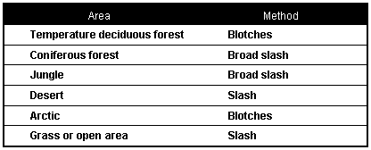

> In a survival situation, especially in a hostile environment, you may find it necessary to camouflage yourself, your equipment, and your movement. Effective camouflage may mean the difference between survival and capture by the enemy. Camouflage and movement techniques, such as stalking, will also help you get animals or game for food using primitive weapons and skills.

### PERSONAL CAMOUFLAGE

21-1\. When camouflaging yourself, consider that certain shapes are particular to humans. The enemy will look for these shapes. The shape of a hat, helmet, or black boots can give you away. Even animals know and run from the shape of a human silhouette. Break up your outline by placing small amounts of vegetation from the surrounding area in your uniform, equipment, and headgear. Try to reduce any shine from skin or equipment. Blend in with the surrounding colors and simulate the texture of your surroundings.

**SHAPE AND OUTLINE**

21-2\. Change the outline of weapons and equipment by tying vegetation or strips of cloth onto them. Make sure the added camouflage does not hinder the equipment's operation. When hiding, cover yourself and your equipment with leaves, grass, or other local debris. Conceal any signaling devices you have prepared, but keep them ready for use.

**COLOR AND TEXTURE**

21-3\. Each area of the world and each climatic condition (arctic/winter, temperate/jungle, or swamp/desert) has color patterns and textures that are natural for that area. While color is self-explanatory, texture defines the surface characteristics of something when looking at it. For example, surface textures may be smooth, rough, rocky, leafy, or many other possible combinations. Use color and texture together to camouflage yourself effectively. It makes little sense to cover yourself with dead, brown vegetation in the middle of a large grassy field. Similarly, it would be useless to camouflage yourself with green grass in the middle of a desert or rocky area.

21-4\. To hide and camouflage movement in any specific area of the world, you must take on the color and texture of the immediate surroundings. Use natural or man-made materials to camouflage yourself. A few examples include camouflage paint, charcoal from burned paper or wood, mud, grass, leaves, strips of cloth or burlap, pine boughs, and camouflaged uniforms.

21-5\. Cover all areas of exposed skin, including face, hands, neck, and ears. Use camouflage paint, charcoal, or mud to camouflage yourself. Cover areas that stick out more and catch more light (forehead, nose, cheekbones, chin, and ears) with a darker color. Cover other areas, particularly recessed or shaded areas (around the eyes and under the chin), with lighter colors. Be sure to use an irregular pattern. Attach vegetation from the area or strips of cloth of the proper color to clothing and equipment. If you use vegetation, replace it as it wilts. As you move through an area, be alert to the color changes and modify your camouflage colors as necessary.

21-6\. [Figure 21-1](#fig21-1) gives a general idea of how to apply camouflage for various areas and climates. Use appropriate colors for your surroundings. The blotches or slashes will help to simulate texture.

**Figure 21-1\. Camouflage Methods for Specific Areas**

**SHINE**

21-7\. As skin gets oily, it becomes shiny. Equipment with worn-off paint is also shiny. Even painted objects, if smooth, may shine. Glass objects such as mirrors, glasses, binoculars, and telescopes shine. You must cover these glass objects when not in use. Anything that shines will automatically attract attention and will give away your location.

21-8\. Whenever possible, wash oily skin and reapply camouflage. Skin oil will wash off camouflage, so reapply it frequently. If you must wear glasses, camouflage them by applying a thin layer of dust to the outside of the lenses. This layer of dust will reduce the reflection of light. Cover shiny spots on equipment by painting, covering with mud, or wrapping with cloth or tape. Pay particular attention to covering boot eyelets, buckles on equipment, watches and jewelry, zippers, and uniform insignia. Carry a signal mirror in its designed pouch or in a pocket with the mirror portion facing your body.

**SHADOW**

21-9\. When hiding or traveling, stay in the deepest part of the shadows. The outer edges of the shadows are lighter and the deeper parts are darker. Remember, if you are in an area where there is plenty of vegetation, keep as much vegetation between you and a potential enemy as possible. This action will make it very hard for the enemy to see you as the vegetation will partially mask you from his view. Forcing an enemy to look through many layers of masking vegetation will fatigue his eyes very quickly.

21-10\. When traveling, especially in built-up areas at night, be aware of where you cast your shadow. It may extend out around the corner of a building and give away your position. Also, if you are in a dark shadow and there is a light source to one side, an enemy on the other side can see your silhouette against the light.

**MOVEMENT**

21-11\. Movement, especially fast movement, attracts attention. If possible, avoid movement in the presence of an enemy. If capture appears imminent in your present location and you must move, move away slowly, making as little noise as possible. By moving slowly in a survival situation, you decrease the chance of detection and conserve energy that you may need for long-term survival or long-distance evasion.

21-12\. When moving past obstacles, avoid going over them. If you must climb over an obstacle, keep your body level with its top to avoid silhouetting yourself. Do not silhouette yourself against the skyline when crossing hills or ridges. When you are moving, you will have difficulty detecting the movement of others. Stop frequently, listen, and look around slowly to detect signs of hostile movement.

**NOISE**

21-13\. Noise attracts attention, especially if there is a sequence of loud noises such as several snapping twigs. If possible, avoid making any noise. Slow your pace as much as necessary to avoid making noise when moving around or away from possible threats.

21-14\. Use background noises to cover the noise of your movement. Sounds of aircraft, trucks, generators, strong winds, and people talking will cover some or all the sounds produced by your movement. Rain will mask a lot of movement noise, but it also reduces your ability to detect potential enemy noise.

**SCENT**

21-15\. Whether hunting animals or avoiding the enemy, it is always wise to camouflage the scent associated with humans. Start by washing yourself and your clothes without using soap. This washing method removes soap and body odors. Avoiding strong smelling foods, such as garlic, helps reduce body odors. Do not use tobacco products, candy, gum, or cosmetics.

21-16\. You can use aromatic herbs or plants to wash yourself and your clothing, to rub on your body and clothing, or to chew on to camouflage your breath. Pine needles, mint, or any similar aromatic plant will help camouflage your scent from both animals and humans. Standing in smoke from a fire can help mask your scent from animals. While animals are afraid of fresh smoke from a fire, older smoke scents are normal smells after forest fires and do not scare them.

21-17\. While traveling, use your sense of smell to help you find or avoid humans. Pay attention to smells associated with humans, such as fire, cigarettes, gasoline, oil, soap, and food. Such smells may alert you to their presence long before you can see or hear them, depending on wind speed and direction. Note the wind's direction and, when possible, approach from or skirt around on the downwind side when nearing humans or animals.

### METHODS OF STALKING

21-18\. Sometimes you need to move, undetected, to or from a location. You need more than just camouflage to make these moves successfully. The ability to stalk or move without making any sudden quick movement or loud noise is essential to avoiding detection. Always pick your route carefully to keep you concealed; use trenches, slight rises in terrain, thick vegetation for concealment. Avoid lateral movement to the observer unless you have good concealment, otherwise stalk straight in toward the observer.

21-19\. You must practice stalking if it is to be effective. Use the following techniques when practicing.

**UPRIGHT STALKING**

21-20\. Take steps about half your normal stride when stalking in the upright position. Such strides help you to maintain your balance. You should be able to stop at any point in that movement and hold that position as long as necessary. Curl the toes up out of the way when stepping down so the outside edge of the ball of the foot touches the ground. Feel for sticks and twigs that may snap when you place your weight on them. If you start to step on one, lift your foot and move it. After making contact with the outside edge of the ball of your foot, roll to the inside ball of your foot, place your heel down, followed by your toes. Then gradually shift your weight forward to the front foot. Lift the back foot to about knee height and start the process over again.

21-21\. Keep your hands and arms close to your body and avoid waving them about or hitting vegetation. When moving in a crouch, you gain extra support by placing your hands on your knees. One step usually takes 1 minute to complete, but the time it takes will depend on the situation.

**CRAWLING**

21-22\. Crawl on your hands and knees when the vegetation is too low to allow you to walk upright without being seen. Move one limb at a time and be sure to set it down softly, feeling for anything that may snap and make noise. Be careful that your toes and heels do not catch on vegetation.

**PRONE STAKING**

21-23\. To stalk in the prone position, you do a low, modified push-up on your hands and toes, moving yourself forward slightly, and then lowering yourself again slowly. Avoid dragging and scraping along the ground as this makes excessive noise and leaves large trails for trackers to follow.

**ANIMAL STALKING**

21-24\. Before stalking an animal, select the best route. If the animal is moving, you will need an intercepting route. Pick a route that puts objects between you and the animal to conceal your movement from it. By positioning yourself in this way, you will be able to move faster, until you pass that object. Some objects such as large rocks and trees may totally conceal you, and others such as small bushes and grass may only partially conceal you. Pick the route that offers the best concealment and requires the least amount of effort.

21-25\. Keep your eyes on the animal and stop when it looks your way or turns its ears your way, especially if it suspects your presence. As you get close, squint your eyes slightly to conceal both the light-dark contrast of the whites of the eyes and any shine from your eyes. Keep your mouth closed so that the animal does not see the whiteness or shine of your teeth.

**ANTITRACKING**

21-26\. Along with camouflage of your body, you need to camouflage your movement from visual trackers. Antitracking techniques should be used; countertracking techniques are of little use to the evader, as they would pinpoint his location or route. During movement this can be accomplished by using the following methods:

*   Restore vegetation—Use a stick to lift the vegetation you crushed down during movement through it. This can slow you down and it is hard to tell if you are being effective.

*   Brush out tracks—Use a tree branch to brush or pat out tracks in open ground. This is effective in concealing the number in the party, but leaves obvious signs in itself.

*   Use hard or stony ground—Using this type of terrain minimizes the signs you leave slowing the visual tracker.

*   Make abrupt direction changes—Using this technique combined with the use of hard or stony ground can be very effective in slowing the visual tracker as it will be much harder to detect the direction change.

*   Use well-used paths—Although the use of paths is not advisable, there may be times you can use them to your advantage. For example, if you have been in an area long enough to surveil the path to determine the traffic patterns, you could use the path prior to a farmer moving a heard of cows down the path, eliminating your sign.

*   Use foot coverings—They can assist in aging or virtually eliminating your signs. Examples include sandbags, rags, old socks, or commercial foot coverings made from imitation sheepskin (these seem to work the best).

*   Change footgear—Use this method in an area such as hard or stony ground. Vary the tread pattern.

*   Use custom footgear—Militaries generally have a standard issue footgear, although with the world economy, this is changing. If you know that the area you are working in has a standard issue footgear, you may want to acquire a pair or have that tread pattern put on your boots.

*   Walk backwards—This can be useful at times but there are pitfalls to avoid. Avoid turning your foot out. When you look over your left shoulder your left foot tends to turn outward and visa versa. Avoid dragging dirt backwards. Try to place your footfalls so that the toe indention is deeper than your heel indention to give the appearance of moving forward.

*   Confuse the start point—Whatever the point on the ground you start your evasion, try to confuse it by walking numerous cloverleaf patterns out of and back into it before you leave on your initial route (this can assist in delaying dog trackers also).

*   Use streams, lakes, waterways—This is a judgement call on your part. Ask yourself: Is the stream moving in the direction you need to go? Is it fast or slow moving water? Will it put you that much farther ahead of the trackers? (Note: You will leave more signs upon exiting the water.)

*   Crossing roads or paths with the traffic pattern—When crossing roads or paths try to cross with the direction of travel, not perpendicular, this will assist in your tracks blending into normal traffic patterns and making them harder to follow.

*   Careful placement of footfalls leaving little heel or toe dig—Try to leave as little sign as possible. Last but not least, always vary your techniques so as not to educate the tracker as to what to look for if he loses the track!

**ANTIDOG TRACKING**

21-27\. When trying to elude dog trackers always remember you are trying to beat the handler not the dog! Whatever you do, it should be done to either tire the handler or decrease the handler's confidence in his dog. Some techniques to use against dog tracker teams are as follows:

*   Open ground—Although this is a danger area, if the wind is high it will blow the scent to vegetated areas; thus the team will not be directly on your tracks and it will slow the team's progression.

*   Thick terrain—Using a zigzag pattern of movement will slow and tire the handler and possibly decrease the handler's confidence.

*   Hard or stony ground—In high winds or high temperatures these areas will dissipate your scent quicker, increasing the chance of the dog losing the track.

*   Crowded places—If the dog is not scent-specific trained, and you move through an area where many other people have recently been he may lose the track.

*   Freshly plowed or fertilized fields—The dog may lose the track in these areas due to the overpowering scent of fresh dirt and human or animal manure used as fertilizer (do not rely too much on this theory).

*   Speed—Try to maintain a constant speed. Try not to run. Running increases the scent, due to more soil and vegetation disturbance and more body odor from sweat or adrenaline.

*   Transportation—Using a vehicle will greatly increase your time and distance but you could still be tracked; however, it would be at a much slower pace.
