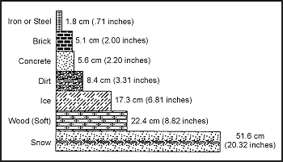

> Nuclear, chemical, and biological (NBC) weapons have become potential realities on any modern battlespace. Recent experience in Afghanistan, Cambodia, and other areas of conflict has proved the use of chemical and biological weapons (such as mycotoxins). The warfighting doctrine of the North Atlantic Treaty Organization and former Warsaw Pact nations addresses the use of both nuclear and chemical weapons. The potential use of these weapons intensifies the problems of survival because of the serious dangers posed by either radioactive fallout or contamination produced by persistent biological or chemical agents.
> 
> You must use special precautions if you expect to survive in these man-made hazards. If you are subjected to any of the effects of nuclear, chemical, or biological warfare, the survival procedures recommended in this chapter may save your life. This chapter presents some background information on each type of hazard so you may better understand the true nature of the hazard. Awareness of the hazards, knowledge of this chapter, and application of common sense can keep you alive.

### THE NUCLEAR ENVIRONMENT

23-1\. Prepare yourself to survive in a nuclear environment. Make sure you know what to expect and how to react to a nuclear hazard.

**EFFECTS OF NUCLEAR WEAPONS**

23-2\. The effects of nuclear weapons are classified as either initial or residual. Initial effects occur in the immediate area of the explosion and are hazardous in the first minute after the explosion. Residual effects can last for days or years and cause death. The principal initial effects are blast and radiation.

**Blast**

23-3\. Blast is the brief and rapid movement of air away from the explosion's center and the pressure accompanying this movement. Strong winds accompany the blast. Blast hurls debris and personnel, collapses lungs, ruptures eardrums, collapses structures and positions, and causes immediate death or injury with its crushing effect.

**Thermal Radiation**

23-4\. This effect is the heat and light radiation a nuclear explosion's fireball emits. Light radiation consists of both visible light and ultraviolet and infrared light. Thermal radiation produces extensive fires, skin burns, and flash blindness.

**Nuclear Radiation**

23-5\. Nuclear radiation breaks down into two categories. The effects can be initial radiation and residual radiation.

23-6\. Initial nuclear radiation consists of intense gamma rays and neutrons produced during the first minute after the explosion. This radiation causes extensive damage to cells throughout the body. Radiation damage may cause headaches, nausea, vomiting, diarrhea, and even death, depending on the radiation dose received. The major problem in protecting yourself against the initial radiation's effects is that you may have received a lethal or incapacitating dose before taking any protective action. Personnel exposed to lethal amounts of initial radiation may well have been killed or fatally injured by blast or thermal radiation.

23-7\. Residual radiation consists of all radiation produced after 1 minute from the explosion. It has more effect on you than initial radiation. A discussion of residual radiation takes place in a subsequent paragraph.

**TYPES OF NUCLEAR BURSTS**

23-8\. There are three types of nuclear bursts: subsurface burst, airburst, and surface burst. The type of burst directly affects your chances of survival. A subsurface burst occurs completely underground or underwater. Its effects remain beneath the surface or in the immediate area where the surface collapses into a crater over the burst's location. Subsurface bursts cause you little or no radioactive hazard unless you enter the immediate area of the crater.

23-9\. An airburst occurs in the air above its intended target. The airburst provides the maximum radiation effect on the target and is, therefore, most dangerous to you in terms of **immediate** nuclear effects.

23-10\. A surface burst occurs on the ground or water surface. Large amounts of fallout result, with serious long-term effects for you. This type of burst is your **greatest** nuclear hazard.

**NUCLEAR INJURIES**

23-11\. Most injuries in the nuclear environment result from the initial nuclear effects of the detonation. These injuries are classed as blast, thermal, or radiation injuries. Further radiation injuries may occur if you do not take proper precautions against fallout. Individuals in the area near a nuclear explosion will probably suffer a combination of all three types of injuries.

**Blast Injuries**

23-12\. Blast injuries produced by nuclear weapons are similar to those caused by conventional high-explosive weapons. Blast overpressure can collapse lungs and rupture internal organs. Projectile wounds occur as the explosion's force hurls debris at you. Large pieces of debris striking you will cause fractured limbs or massive internal injuries. Blast overpressure may throw you long distances, and you will suffer severe injury upon impact with the ground or other objects. Substantial cover and distance from the explosion are the best protection against blast injury. Cover blast injury wounds as soon as possible to prevent the entry of radioactive dust particles.

**Thermal Injuries**

23-13\. The heat and light the nuclear fireball emits cause thermal injuries. First-, second-, or third-degree burns may result. Flash blindness also occurs. This blindness may be permanent or temporary depending on the degree of exposure of the eyes. Substantial cover and distance from the explosion can prevent thermal injuries. Clothing will provide significant protection against thermal injuries. Cover as much exposed skin as possible before a nuclear explosion. First aid for thermal injuries is the same as first aid for burns. Cover open burns (second- or third-degree) to prevent the entry of radioactive particles. Wash all burns before covering.

**Radiation Injuries**

23-14\. Neutrons, gamma radiation, alpha radiation, and beta radiation cause radiation injuries. Neutrons are high-speed, extremely penetrating particles that actually smash cells within your body. Gamma radiation is similar to X rays and is also highly penetrating radiation. During the initial fireball stage of a nuclear detonation, initial gamma radiation and neutrons are the most serious threat. Beta and alpha radiation are radioactive particles normally associated with radioactive dust from fallout. They are short-range particles. You can easily protect yourself against them if you take precautions. See "Bodily Reactions to Radiation," below, for the symptoms of radiation injuries.

**RESIDUAL RADIATION**

23-15\. Residual radiation is all radiation emitted after 1 minute from the instant of the nuclear explosion. Residual radiation consists of induced radiation and fallout.

**Induced Radiation**

23-16\. This term describes a relatively small, intensely radioactive area directly underneath the nuclear weapon's fireball. The irradiated earth in this area will remain highly radioactive for an extremely long time. You should not travel into an area of induced radiation.

**Fallout**

23-17\. Fallout consists of radioactive soil and water particles, as well as weapon fragments. During a surface detonation, or if an airburst's nuclear fireball touches the ground, large amounts of soil and water are vaporized along with the bomb's fragments, and forced upward to altitudes of 25,000 meters (82,000 feet) or more. When these vaporized contents cool, they can form more than 200 different radioactive products. The vaporized bomb contents condense into tiny radioactive particles that the wind carries until they fall back to earth as radioactive dust. Fallout particles emit alpha, beta, and gamma radiation. Alpha and beta radiation are relatively easy to counteract, and residual gamma radiation is much less intense than the gamma radiation emitted during the first minute after the explosion. Fallout is your most significant radiation hazard, provided you have not received a lethal radiation dose from the initial radiation.

**BODILY REACTIONS TO RADIATION**

23-18\. The effects of radiation on the human body can be broadly classed as either chronic or acute. Chronic effects are those that occur some years after exposure to radiation. Examples are cancer and genetic defects. Chronic effects are of minor concern insofar as they affect your immediate survival in a radioactive environment. On the other hand, acute effects are of primary importance to your survival. Some acute effects occur within hours after exposure to radiation. These effects result from the radiation's direct physical damage to tissue. Radiation sickness and beta burns are examples of acute effects. Radiation sickness symptoms include nausea, diarrhea, vomiting, fatigue, weakness, and loss of hair. Penetrating beta rays cause radiation burns; the wounds are similar to fire burns.

**Recovery Capability**

23-19\. The extent of body damage depends mainly on the part of the body exposed to radiation and how long it was exposed, as well as its ability to recover. The brain and kidneys have little recovery capability. Other parts (skin and bone marrow) have a great ability to recover from damage. Usually, a dose of 600 centigrays (cGy) to the entire body will result in almost certain death. If only your hands received this same dose, your overall health would not suffer much, although your hands would suffer severe damage.

**External and Internal Hazards**

23-20\. An external or internal hazard can cause body damage. Highly penetrating gamma radiation or the less penetrating beta radiation that causes burns can cause external damage. The entry of alpha or beta radiation-emitting particles into the body can cause internal damage. The external hazard produces overall irradiation and beta burns. The internal hazard results in irradiation of critical organs such as the gastrointestinal tract, thyroid gland, and bone. A very small amount of radioactive material can cause extreme damage to these and other internal organs. The internal hazard can enter the body either through consumption of contaminated water or food or by absorption through cuts or abrasions. Material that enters the body through breathing presents only a minor hazard. You can greatly reduce the internal radiation hazard by using good personal hygiene and carefully decontaminating your food and water.

**Symptoms**

23-21\. The symptoms of radiation injuries include nausea, diarrhea, and vomiting. The severity of these symptoms is due to the extreme sensitivity of the gastrointestinal tract to radiation. The severity of the symptoms and the speed of onset after exposure are good indicators of the degree of radiation damage. The gastrointestinal damage can come from either the external or the internal radiation hazard.

**COUNTERMEASURES AGAINST PENETRATING EXTERNAL RADIATION**

23-22\. Knowledge of the radiation hazards discussed earlier is extremely important in surviving in a fallout area. It is also critical to know how to protect yourself from the most dangerous form of residual radiation—penetrating external radiation.

23-23\. The means you can use to protect yourself from penetrating external radiation are time, distance, and shielding. You can reduce the level of radiation and help increase your chance of survival by controlling the duration of exposure. You can also get as far away from the radiation source as possible. Finally, you can place some radiation-absorbing or shielding material between you and the radiation.

**Time**

23-24\. Time is important, in two ways, when you are in a survival situation. First, radiation dosages are cumulative. The longer you are exposed to a radioactive source, the greater the dose you will receive. Obviously, spend as little time in a radioactive area as possible. Second, radioactivity decreases or decays over time. This concept is known as radioactive _half-life._ Thus, a radioactive element decays or loses half of its radioactivity within a certain time. The rule of thumb for radioactivity decay is that it decreases in intensity by a factor of ten for every sevenfold increase in time following the peak radiation level. For example, if a nuclear fallout area had a maximum radiation rate of 200 cGy per hour when fallout is complete, this rate would fall to 20 cGy per hour after 7 hours; it would fall still further to 2 cGy per hour after 49 hours. Even an untrained observer can see that the greatest hazard from fallout occurs immediately after detonation, and that the hazard decreases quickly over a relatively short time. You should try to avoid fallout areas until the radioactivity decays to safe levels. If you can avoid fallout areas long enough for most of the radioactivity to decay, you enhance your chance of survival.

**Distance**

23-25\. Distance provides very effective protection against penetrating gamma radiation because radiation intensity decreases by the square of the distance from the source. For example, if exposed to 1,000 cGy of radiation standing 30 centimeters (12 inches) from the source, at 60 centimeters (24 inches), you would only receive 250 cGy. Thus, when you double the distance, radiation decreases to (0.5)2 or 0.25 the amount. While this formula is valid for concentrated sources of radiation in small areas, it becomes more complicated for large areas of radiation such as fallout areas.

**Shielding**

23-26\. Shielding is the most important method of protection from penetrating radiation. Of the three countermeasures against penetrating radiation, shielding provides the greatest protection and is the easiest to use under survival conditions. Therefore, it is the most desirable method. If shielding is not possible, use the other two methods to the maximum extent practical.

23-27\. Shielding actually works by absorbing or weakening the penetrating radiation, thereby reducing the amount of radiation reaching your body. The denser the material, the better the shielding effect. Lead, iron, concrete, and water are good examples of shielding materials.

**Special Medical Aspects**

23-28\. The presence of fallout material in your area requires slight changes in first aid procedures. You must cover all wounds to prevent contamination and the entry of radioactive particles. You must first wash burns of beta radiation, then treat them as ordinary burns. Take extra measures to prevent infection. Your body will be extremely sensitive to infections due to changes in your blood chemistry. Pay close attention to the prevention of colds or respiratory infections. Rigorously practice personal hygiene to prevent infections. Cover your eyes with improvised goggles to prevent the entry of particles.

**SHELTER**

23-29\. As stated earlier, the shielding material's effectiveness depends on its thickness and density. An ample thickness of shielding material will reduce the level of radiation to negligible amounts.

23-30\. The primary reason for finding and building a shelter is to get protection against the high-intensity radiation levels of early gamma fallout as fast as possible. Five minutes to locate the shelter is a good guide. Speed in finding shelter is absolutely essential. Without shelter, the dosage received in the first few hours will exceed that received during the rest of a week in a contaminated area. The dosage received in this first week will exceed the dosage accumulated during the rest of a lifetime spent in the same contaminated area.

**Shielding Materials**

23-31\. The thickness required to weaken gamma radiation from fallout is far less than that needed to shield against initial gamma radiation. Fallout radiation has less energy than a nuclear detonation's initial radiation. For fallout radiation, a relatively small amount of shielding material can provide adequate protection. [Figure 23-1](#fig23-1) shows the thickness of various materials needed to reduce residual gamma radiation transmission by 50 percent.

**Figure 23-1\. Materials to Reduce Gamma Radiation**

23-32\. The principle of **half-value layer thickness** is useful in understanding the absorption of gamma radiation by various materials. According to this principle, if 5 centimeters (2 inches) of brick reduce the gamma radiation level by one-half, adding another 5 centimeters (2 inches) of brick (another half-value layer) will reduce the intensity by another half, namely, to one-fourth the original amount. Fifteen centimeters (6 inches) will reduce gamma radiation fallout levels to one-eighth its original amount, 20 centimeters (8 inches) to one-sixteenth, and so on. Thus, a shelter protected by 1 meter (3 feet) of dirt would reduce a radiation intensity of 1,000 cGy per hour on the outside to about 0.5 cGy per hour inside the shelter.

**Natural Shelters**

23-33\. Terrain that provides natural shielding and easy shelter construction is the ideal location for an emergency shelter. Good examples are ditches, ravines, rocky outcropping, hills, and riverbanks. In level areas without natural protection, dig a fighting position or slit trench.

**Trenches**

23-34\. When digging a trench, work from inside the trench as soon as it is large enough to cover part of your body thereby not exposing all your body to radiation. In open country, try to dig the trench from a prone position, stacking the dirt carefully and evenly around the trench. On level ground, pile the dirt around your body for additional shielding. Depending upon soil conditions, shelter construction time will vary from a few minutes to a few hours. If you dig as quickly as possible, you will reduce the dosage you receive.

**Other Shelters**

23-35\. While an underground shelter covered by 1 meter (3 feet) or more of earth provides the best protection against fallout radiation, the following unoccupied structures (in order listed) offer the next best protection:

*   Caves and tunnels covered by more than 1 meter (3 feet) of earth.

*   Storm or storage cellars.

*   Culverts.

*   Basements or cellars of abandoned buildings.

*   Abandoned buildings made of stone or mud.

**Roofs**

23-36\. It is not mandatory that you build a roof on your shelter. Build one only if the materials are readily available with only a brief exposure to outside contamination. If building a roof would require extended exposure to penetrating radiation, it would be wiser to leave the shelter roofless. A roof's sole function is to reduce radiation from the fallout source to your body. Unless you use a thick roof, a roof provides very little shielding.

23-37\. You can construct a simple roof from a poncho anchored down with dirt, rocks, or other refuse from your shelter. You can remove large particles of dirt and debris from the top of the poncho by beating it off from the inside at frequent intervals. This cover will not offer shielding from the radioactive particles deposited on the surface, but it will increase the distance from the fallout source and keep the shelter area from further contamination.

**Shelter Site Selection and Preparation**

23-38\. To reduce your exposure time and thereby reduce the dosage received, remember the following factors when selecting and setting up a shelter:

*   Where possible, seek a crude, existing shelter that you can improve. If none is available, dig a trench.

*   Dig the shelter deep enough to get good protection, then enlarge it as required for comfort.

*   Cover the top of the fighting position or trench with any readily available material and a thick layer of earth, if you can do so without leaving the shelter. While a roof and camouflage are both desirable, it is probably safer to do without them than to expose yourself to radiation outside your fighting position.

*   While building your shelter, keep all parts of your body covered with clothing to protect it against beta burns.

*   Clean the shelter site of any surface deposit using a branch or other object that you can discard. Do this cleaning to remove contaminated materials from the area you will occupy. The cleaned area should extend at least 1.5 meters (5 feet) beyond your shelter's area.

*   Decontaminate any materials you bring into the shelter. These materials include grass or foliage that you use as insulation or bedding, and your outer clothing (especially footgear). If the weather permits and you have heavily contaminated outer clothing, you may want to remove it and bury it under a foot of earth at the end of your shelter. You may retrieve it later (after the radioactivity decays) when leaving the shelter. If the clothing is dry, you may decontaminate it by beating or shaking it outside the shelter's entrance to remove the radioactive dust. You may use any body of water, even though contaminated, to rid materials of excess fallout particles. Simply dip the material into the water and shake it to get rid of the excess water. Do not wring it out, this action will trap the particles.

*   If possible and without leaving the shelter, wash your body thoroughly with soap and water, even if the water on hand may be contaminated. This washing will remove most of the harmful radioactive particles that are likely to cause beta burns or other damage. If water is not available, wipe your face and any other exposed skin surface to remove contaminated dust and dirt. You may wipe your face with a clean piece of cloth or a handful of uncontaminated dirt. You get this uncontaminated dirt by scraping off the top few inches of soil and using the "clean" dirt.

*   Upon completing the shelter, lie down, keep warm, and sleep and rest as much as possible while in the shelter.

*   When not resting, keep busy by planning future actions, studying your maps, or making the shelter more comfortable and effective.

*   Don't panic if you experience nausea and symptoms of radiation sickness. Your main danger from radiation sickness is infection. There is no first aid for this sickness. Resting, drinking fluids, taking any medicine that prevents vomiting, maintaining your food intake, and preventing additional exposure will help avoid infection and aid recovery. Even small doses of radiation can cause these symptoms, which may disappear in a short time.

**Exposure Timetable**

23-39\. The following timetable provides you with the information needed to avoid receiving a serious dosage and still let you cope with survival problems:

*   Complete isolation from 4 to 6 days following delivery of the last weapon.

*   A very brief exposure to get water on the third day is permissible, but exposure should not exceed 30 minutes.

*   One exposure of not more than 30 minutes on the seventh day.

*   One exposure of not more than 1 hour on the eighth day.

*   Exposure of 2 to 4 hours from the ninth day through the twelfth day.

*   Normal operation, followed by rest in a protected shelter, from the thirteenth day on.

*   In all instances, make your exposures as brief as possible. Consider only mandatory requirements as valid reasons for exposure. Decontaminate at every stop.

23-40\. The times given above are conservative. If forced to move after the first or second day, you may do so. Make sure that the exposure is no longer than absolutely necessary.

**WATER PROCUREMENT**

23-41\. In a fallout-contaminated area, available water sources may be contaminated. If you wait at least 48 hours before drinking any water to allow radioactive decay to take place and select the safest possible water source, you will greatly reduce the danger of ingesting harmful amounts of radioactivity.

23-42\. Although many factors (wind direction, rainfall, sediment) will influence your choice in selecting water sources, consider the following guidelines.

**Safest Water Sources**

23-43\. Water from springs, wells, or other underground sources that undergo natural filtration will be your safest sources. Any water found in the pipes or containers of abandoned houses or stores will also be free from radioactive particles. This water will be safe to drink, although you will have to take precautions against bacteria in the water.

23-44\. Snow taken from 15 centimeters (6 inches) or more below the surface during the fallout is also a safe source of water.

**Streams and Rivers**

23-45\. Water from streams and rivers will be relatively free from fallout within several days after the last nuclear explosion because of dilution. If possible, filter such water before drinking to get rid of radioactive particles. The best filtration method is to dig sediment holes or seepage basins along the side of a water source. The water will seep laterally into the hole through the intervening soil that acts as a filtering agent and removes the contaminated fallout particles that settled on the original body of water. This method can remove up to 99 percent of the radioactivity in water. You must cover the hole in some way to prevent further contamination. See [Figure 6-9](06) for an example of a water filter.

**Standing Water**

23-46\. Water from lakes, pools, ponds, and other standing sources is likely to be heavily contaminated; though most of the heavier, long-lived radioactive isotopes will settle to the bottom. Use the settling technique to purify this water. First, fill a bucket or other deep container three-fourths full with contaminated water. Then take dirt from a depth of 10 centimeters (4 inches) or more below the ground surface and stir it into the water. Use about 2.5 centimeters (1 inch) of dirt for every 10 centimeters (4 inches) of water. Stir the water until you see most dirt particles suspended in the water. Let the mixture settle for at least 6 hours. The settling dirt particles will carry most of the suspended fallout particles to the bottom and cover them. You can then dip out the clear water. Purify this water using a filtration device.

**Additional Precautions**

23-47\. As an additional precaution against disease, treat all water with water purification tablets from your survival kit or boil it.

**FOOD PROCUREMENT**

23-48\. Obtaining edible food in a radiation-contaminated area is a serious but not insurmountable problem. You need to follow a few special procedures in selecting and preparing rations and local foods for use. Since secure packaging protects your combat rations, they will be perfectly safe for use. Supplement your rations with any food you can find on trips outside your shelter.

Abandoned buildings may have stores of processed foods. They are safe for use after decontaminating them. Canned and packaged foods should have containers or wrappers removed or washed free of fallout particles. These processed foods also include food stored in any closed container and food stored in protected areas (such as cellars). All such foods must be washed before eating or handling them.

23-49\. If little or no processed food is available in your area, you may have to supplement your diet with local food sources. Animals and plants are local food sources.

**Animals—A Food Source**

23-50\. Assume that all animals, regardless of their habitat or living conditions, were exposed to radiation. The effects of radiation on animals are similar to those on humans. Thus, most of the wild animals living in a fallout area are likely to become sick or die from radiation during the first month after the nuclear explosion. Although animals may not be free from harmful radioactive materials, you can and must use them in survival conditions as a food source if other foods are not available. With careful preparation and by following several important principles, animals can be safe food sources.

23-51\. First, do not eat an animal that appears to be sick. It may have developed a bacterial infection because of radiation poisoning. Contaminated meat, even if thoroughly cooked, could cause severe illness or death if eaten.

23-52\. Carefully skin all animals to prevent any radioactive particles on the skin or fur from entering the body. Do not eat meat close to the bones and joints as an animal's skeleton contains over 90 percent of the radioactivity. However, the remaining animal muscle tissue will be safe to eat. Before cooking it, cut the meat away from the bone, leaving at least a 3-millimeter (1/8-inch) thickness of meat on the bone. Discard all internal organs (heart, liver, and kidneys) since they tend to concentrate beta and gamma radioactivity.

23-53\. Cook all meat until it is very well done. To be sure the meat is well done, cut it into less than 13-millimeter-thick (4 1/2-inch-thick) pieces before cooking. Such cuts will also reduce cooking time and save fuel.

23-54\. The extent of contamination in fish and aquatic animals will be much greater than that of land animals. This is also true for water plants, especially in coastal areas. Use aquatic food sources only in conditions of extreme emergency.

23-55\. All eggs, even if laid during the period of fallout, will be safe to eat. Completely avoid milk from any animals in a fallout area because animals absorb large amounts of radioactivity from the plants they eat.

**Plants—A Food Source**

23-56\. Plant contamination occurs by the accumulation of fallout on their outer surfaces or by absorption of radioactive elements through their roots. Your first choice of plant food should be vegetables such as potatoes, turnips, carrots, and other plants whose edible portion grows underground. These are the safest to eat once you scrub them and remove their skins.

23-57\. Second, in order of preference, are those plants with edible parts that you can decontaminate by washing and peeling their outer surfaces. Examples are bananas, apples, tomatoes, prickly pears, and other such fruits and vegetables.

23-58\. Any smooth-skinned vegetable, fruit, or plant that you cannot easily peel or effectively decontaminate by washing will be your third choice of emergency food.

23-59\. The effectiveness of decontamination by scrubbing is inversely proportional to the roughness of the fruit's surface. Smooth-surfaced fruits will lose 90 percent of their contamination after washing, but rough-surfaced plants will lose only about 50 percent.

23-60\. Eat rough-surfaced plants (such as lettuce) only as a last resort because you cannot effectively decontaminate them by peeling or washing. Other difficult foods to decontaminate by washing with water include dried fruits (figs, prunes, peaches, apricots, pears) and soybeans.

23-61\. In general, you can use any plant food that is ready for harvest if you can effectively decontaminate it. However, growing plants can absorb some radioactive materials through their leaves as well as from the soil, especially if rains have occurred during or after the fallout period. Avoid using these plants for food except in an emergency.

### BIOLOGICAL ENVIRONMENTS

23-62\. The use of biological agents is real. Prepare yourself for survival by being proficient in the tasks identified in your soldier's manuals of common tasks (SMCTs). Know what to do to protect yourself against these agents.

**BIOLOGICAL AGENTS AND EFFECTS**

23-63\. Biological agents are microorganisms that can cause disease among personnel, animals, or plants. They can also cause the deterioration of material. These agents fall into two broad categories—pathogens (usually called germs) and toxins. Pathogens are living microorganisms that cause lethal or incapacitating diseases. Bacteria, rickettsiae, fungi, and viruses are included in the pathogens. Toxins are poisons that plants, animals, or microorganisms produce naturally. Possible biological warfare toxins include a variety of neurotoxic (affecting the central nervous system) and cytotoxic (causing cell death) compounds.

**Germs**

23-64\. Germs are living organisms. Some nations have used them in the past as weapons. Only a few germs can start an infection, especially if inhaled into the lungs. Because germs are so small and weigh so little, the wind can spread them over great distances; they can also enter unfiltered or nonairtight places. Buildings and bunkers can trap them, causing a higher concentration. Germs do not affect the body immediately. They must multiply inside the body and overcome the body's defenses—a process called the incubation period. Incubation periods vary from several hours to several months, depending on the germ. Most germs must live within another living organism (host), such as your body, to survive and grow. Weather conditions such as wind, rain, cold, and sunlight rapidly kill germs.

23-65\. Some germs can form protective shells, or spores, to allow survival outside the host. Spore-producing agents are a long-term hazard you must neutralize by decontaminating infected areas or personnel. Fortunately, most live agents are not spore producing. These agents must find a host within roughly a day of their delivery or they die. Germs have three basic routes of entry into your body—through the respiratory tract, through a break in the skin, and through the digestive tract. Symptoms of infection vary according to the disease.

**Toxins**

23-66\. Toxins are substances that plants, animals, or germs produce naturally. These toxins are what actually harm man, not bacteria. An example is botulin, which produces botulism. Modern science has allowed large-scale production of these toxins without the use of the germ that produces the toxin. Toxins may produce effects similar to those of chemical agents. However, toxic victims may not respond to first aid measures used against chemical agents. Toxins enter the body in the same manner as germs. However, some toxins, unlike germs, can penetrate unbroken skin. Symptoms appear almost immediately, since there is no incubation period. Many toxins are extremely lethal, even in very small doses. Symptoms may include any of the following:

*   Dizziness.

*   Mental confusion.

*   Blurred or double vision.

*   Numbness or tingling of skin.

*   Paralysis.

*   Convulsions.

*   Rashes or blisters.

*   Coughing.

*   Fever.

*   Aching muscles.

*   Tiredness.

*   Nausea, vomiting, or diarrhea.

*   Bleeding from body openings.

*   Blood in urine, stool, or saliva.

*   Shock.

*   Death.

**DETECTION OF BIOLOGICAL AGENTS**

23-67\. Biological agents are, by nature, difficult to detect. You cannot detect them by any of the five physical senses. Often, the first sign of a biological agent will be symptoms of the victims exposed to the agent. Your best chance of detecting biological agents before they can affect you is to recognize their means of delivery. The three main means of delivery are—

*   _Bursting-type munitions._ These may be bombs or projectiles whose burst causes very little damage. The burst will produce a small cloud of liquid or powder in the immediate impact area. This cloud will disperse eventually; the rate of dispersion depends on terrain and weather conditions.

*   _Spray tanks or generators._ Aircraft, vehicle spray tanks, or ground-level aerosol generators produce an aerosol cloud of biological agents.

*   _Vectors._ Insects such as mosquitoes, fleas, lice, and ticks deliver pathogens. Large infestations of these insects may indicate the use of biological agents.

23-68\. Sign of a possible biological attack are the presence of unusual substances on the ground or vegetation, or sick-looking plants, crops, or animals.

**INFLUENCE OF WEATHER AND TERRAIN**

23-69\. Your knowledge of how weather and terrain affect the agents can help you avoid contamination by biological agents. Major weather factors that affect biological agents are sunlight, wind, and precipitation. Aerosol sprays will tend to concentrate in low areas of terrain, similar to early morning mist.

23-70\. Sunlight contains visible and ultraviolet solar radiation that rapidly kills most germs used as biological agents. However, natural or man-made cover may protect some agents from sunlight. Other man-made mutant strains of germs may be resistant to sunlight.

23-71\. High wind speeds increase the dispersion of biological agents, dilute their concentration, and dehydrate them. The further downwind the agent travels, the less effective it becomes due to dilution and death of the pathogens. However, the downwind hazard area of the biological agent is significant and you cannot ignore it.

23-72\. Precipitation in the form of moderate to heavy rain tends to wash biological agents out of the air, reducing downwind hazard areas. However, the agents may still be very effective where they were deposited on the ground.

**PROTECTION AGAINST BIOLOGICAL AGENTS**

23-73\. While you must maintain a healthy respect for biological agents, there is no reason for you to panic. You can reduce your susceptibility to biological agents by maintaining current immunizations, avoiding contaminated areas, and controlling rodents and pests. You must also use proper first aid measures in the treatment of wounds, and only safe or properly decontaminated sources of food and water. You must ensure that you get enough sleep to prevent a run-down condition. You must always use proper field sanitation procedures.

23-74\. Assuming you do not have a protective mask, always try to keep your face covered with some type of cloth to protect yourself against biological agent aerosols. Dust may contain biological agents; wear some type of mask when dust is in the air.

23-75\. Your uniform and gloves will protect you against bites from vectors (mosquitoes and ticks) that carry diseases. Completely button your clothing and tuck your trousers tightly into your boots. Wear a chemical protective overgarment, if available, as it provides better protection than normal clothing. Covering your skin will also reduce the chance of the agent entering your body through cuts or scratches. Always practice high standards of personal hygiene and sanitation to help prevent the spread of vectors.

23-76\. Bathe with soap and water whenever possible. Use germicidal soap, if available. Wash your hair and body thoroughly. Clean under your fingernails. Clean teeth, gums, tongue, and the roof of your mouth frequently. Wash your clothing in hot, soapy water if you can. If you cannot wash your clothing, lay it out in an area of bright sunlight and allow the light to kill the microorganisms. After a toxin attack, decontaminate yourself as if for a chemical attack using the M258A2 kit (if available) or by washing with soap and water.

**SHELTER**

23-77\. You can build expedient shelters under biological contamination conditions using the same techniques described in [Chapter 5](05). However, you must make slight changes to reduce the chance of biological contamination. Do not build your shelter in depressions in the ground. Aerosol sprays tend to concentrate in these depressions. Avoid building your shelter in areas of vegetation, as vegetation provides shade and some degree of protection to biological agents. Avoid using vegetation in constructing your shelter. Place your shelter's entrance at a 90-degree angle to the prevailing winds. Such placement will limit the entry of airborne agents and prevent air stagnation in your shelter. Always keep your shelter clean.

**WATER PROCUREMENT**

23-78\. Water procurement under biological conditions is difficult but not impossible. Whenever possible, try to use water that has been in a sealed container. You can assume that the water inside the sealed container is not contaminated. Wash the water container thoroughly with soap and water or boil it for at least 10 minutes before breaking the seal.

23-79\. If water in sealed containers is not available, your next choice, **only under emergency conditions**, is water from springs. Again, boil the water for at least 10 minutes before drinking. Keep the water covered while boiling to prevent contamination by airborne pathogens. Your last choice, **only in an extreme emergency**, is to use standing water. Vectors and germs can survive easily in stagnant water. Boil this water as long as practicable to kill all organisms. Filter this water through a cloth to remove the dead vectors. Use water purification tablets in all cases.

**FOOD PROCUREMENT**

23-80\. Food procurement, like water procurement, is not impossible, but you must take special precautions. Your combat rations are sealed, and you can assume they are not contaminated. You can also assume that sealed containers or packages of processed food are safe. To ensure safety, decontaminate all food containers by washing with soap and water or by boiling the container in water for 10 minutes.

23-81\. You should consider supplementing your rations with local plants or animals only in **extreme** emergencies. No matter what you do to prepare the food, there is no guarantee that cooking will kill all the biological agents. Use local food only in life-or-death situations. Remember, you can survive for a long time without food, especially if the food you eat may kill you!

23-82\. If you must use local food, select only healthy-looking plants and animals. Do not select known carriers of vectors such as rats or other vermin. Select and prepare plants as you would in radioactive areas. Prepare animals as you do plants. Always use gloves and protective clothing when handling animals or plants. Cook all plant and animal food by boiling only. Boil all food for at least 10 minutes to kill all pathogens. Do not try to fry, bake, or roast local food. There is no guarantee that all infected portions have reached the required temperature to kill all pathogens. Do not eat raw food.

### CHEMICAL ENVIRONMENTS

23-83\. Chemical agent warfare is real. It can create extreme problems in a survival situation, but you can overcome the problems with the proper equipment, knowledge, and training. In a survival situation, your first line of defense against chemical agents is your proficiency in individual NBC training, to include donning and wearing the protective mask and overgarment, personal decontamination, recognition of chemical agent symptoms, and individual first aid for chemical agent contamination. The SMCTs cover these subjects. If you are not proficient in these skills, you will have little chance of surviving a chemical environment.

23-84\. The subject matter covered below is not a substitute for any of the individual tasks in which you must be proficient. The SMCTs address the various chemical agents, their effects, and first aid for these agents. The following information is provided under the assumption that you are proficient in the use of chemical protective equipment and know the symptoms of various chemical agents.

**DETECTION OF CHEMICAL AGENTS**

23-85\. The best method for detecting chemical agents is the use of a chemical agent detector. If you have one, use it. However, in a survival situation, you will most likely have to rely solely on the use of all of your physical senses. You must be alert and able to detect any clues indicating the use of chemical warfare. General indicators of the presence of chemical agents are tears, difficult breathing, choking, itching, coughing, and dizziness. With agents that are very hard to detect, you must watch for symptoms in other personnel. Your surroundings will provide valuable clues to the presence of chemical agents; for example, dead animals, sick people, or people and animals displaying abnormal behavior.

23-86\. Your sense of smell may alert you to some chemical agents, but most will be odorless. The odor of newly cut grass or hay may indicate the presence of choking agents. A smell of almonds may indicate blood agents.

23-87\. Sight will help you detect chemical agents. Most chemical agents in the solid or liquid state have some color. In the vapor state, you can see some chemical agents as a mist or thin fog immediately after the bomb or shell bursts. By observing for symptoms in others and by observing delivery means, you may be able to have some warning of chemical agents. Mustard gas in the liquid state will appear as oily patches on leaves or on buildings.

23-88\. The sound of enemy munitions will give some clue to the presence of chemical weapons. Muffled shell or bomb detonations are a good indicator.

23-89\. Irritation in the nose or eyes or on the skin is an urgent warning to protect your body from chemical agents. Additionally, a strange taste in food, water, or cigarettes may serve as a warning that they have been contaminated.

**PROTECTION AGAINST CHEMICAL AGENTS**

23-90\. In a survival situation, always perform the following steps, in the order listed, to protect yourself from a chemical attack:

*   Use protective equipment.

*   Give quick and correct self-aid when contaminated.

*   Avoid areas where chemical agents exist.

*   Decontaminate your equipment and body as soon as possible.

23-91\. Your protective mask and overgarment are the key to your survival. Without these, you stand very little chance of survival. You must take care of these items and protect them from damage. You must practice and know correct self-aid procedures before exposure to chemical agents. The detection of chemical agents and the avoidance of contaminated areas are extremely important to your survival. Use whatever detection kits may be available to help in detection. Since you are in a survival situation, avoid contaminated areas at all costs. You can expect no help should you become contaminated. If you do become contaminated, decontaminate yourself as soon as possible using proper procedures.

**SHELTER**

23-92\. If you find yourself in a contaminated area, try to move out of the area as fast as possible. Travel crosswind or upwind to reduce the time spent in the downwind hazard area. If you cannot leave the area immediately and have to build a shelter, use normal shelter construction techniques, with a few changes. Build the shelter in a clearing, away from all vegetation. Remove all topsoil in the area of the shelter to decontaminate the area. Keep the shelter's entrance closed and oriented at a 90-degree angle to the prevailing wind. Do not build a fire using contaminated wood; the smoke will be toxic. Use extreme caution when entering your shelter so that you will not bring contamination inside.

**WATER PROCUREMENT**

23-93\. As with biological and nuclear environments, getting water in a chemical environment is difficult. Obviously, water in sealed containers is your best and safest source. You must protect this water as much as possible. Be sure to decontaminate the containers before opening.

23-94\. If you cannot get water in sealed containers, try to get it from a closed source such as underground water pipes. You may use rainwater or snow if there is no evidence of contamination. Use water from slow-moving streams, if necessary, but always check first for signs of contamination, and always filter the water as described under nuclear conditions. Signs of water source contamination are foreign odors such as garlic, mustard, geranium, or bitter almonds; oily spots on the surface of the water or nearby; and the presence of dead fish or animals. If these signs are present, do not use the water. Always boil or purify the water to prevent bacteriological infection.

**FOOD PROCUREMENT**

23-95\. It is extremely difficult to eat while in a contaminated area. You will have to break the seal on your protective mask to eat. If you eat, find an area in which you can safely unmask. The safest source of food is your sealed combat rations. Food in sealed cans or bottles will also be safe. Decontaminate all sealed food containers before opening, otherwise you will contaminate the food.

23-96\. If you must supplement your combat rations with local plants or animals, **do not** use plants from contaminated areas or animals that appear to be sick. When handling plants or animals, always use protective gloves and clothing.
