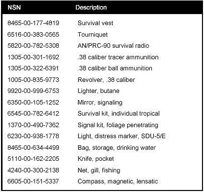

> The Army has several basic survival kits, primarily for issue to aviators. There are kits for cold climates, hot climates, and overwater. There is also an individual survival kit with a general packet and medical packet. The cold, hot, and overwater kits are in canvas carrying bags. These kits are normally stowed in the helicopter's cargo and passenger area.
> 
> An aviator's survival vest (SRU-21P), worn by helicopter crews, also contains survival items.
> 
> U.S. Army aviators flying fixed-wing aircraft equipped with ejection seats use the SRFU-31/P survival vest. The individual survival kits are stowed in the seat pan. Like all other kits, the rigid seat survival kit (RSSK) you use depends on the environment.
> 
> Items contained in the kits may be ordered separately through supply channels. All survival kits and vests are Common Table of Allowances 50-900 items and can be ordered by authorized units. [Figures A-1 through A-6](#figa-1) describe the various survival kits and their contents.

<table cellspacing="0" cellpadding="7" border="1" width="426" align="center">

<tbody>

<tr>

<td valign="top">

*   Food packets.
*   Snare wire.
*   Smoke, illumination signals.
*   Waterproof matchbox.
*   Saw/knife blade.
*   Wood matches.
*   First aid kit.
*   MC-1 magnetic compass.
*   Pocket knife.
*   Saw/knife/shovel handle.
*   Frying pan.
*   Illuminating candles.
*   Compressed trioxane fuel.
*   Signaling mirror.
*   Survival fishing kit.
*   Plastic spoon.
*   Poncho.
*   Insect headnet.
*   Ejector snap.
*   Attaching strap.
*   Kit, outer case.
*   Kit, inner case.
*   Shovel.
*   Water bag.
*   Kit, packing list.
*   Sleeping bag.

</td>

</tr>

</tbody>

</table>

**Figure A-1\. Cold Climate Kit**

<table cellspacing="0" cellpadding="7" border="1" width="426" align="center">

<tbody>

<tr>

<td valign="top">

*   Canned drinking water.
*   Waterproof matchbox.
*   Plastic whistle.
*   Smoke, illumination signals.
*   Pocket knife.
*   Signaling mirror.
*   Plastic water bag.
*   First aid kit.
*   Sunburn-prevention cream.
*   Plastic spoon.
*   Food packets.
*   Compression trioxane fuel.
*   Fishing tackle kit.
*   MC-1 magnetic compass.
*   Snare wire.
*   Frying pan.
*   Wood matches.
*   Insect headnet.
*   Reversible sun hat.
*   Tool kit.
*   Kit, packing list.
*   Tarpaulin.
*   Kit, inner case.
*   Kit, outer case.
*   Attaching strap.
*   Ejector snap.

</td>

</tr>

</tbody>

</table>

**Figure A-2\. Hot Climate Kit**

<table cellspacing="0" cellpadding="7" border="1" width="426" align="center">

<tbody>

<tr>

<td valign="top">

*   Kit, packing list.
*   Raft boat paddle.
*   Insect headnet.
*   Reversible sun hat.
*   Water storage bag.
*   MC-1 magnetic compass.
*   Boat bailer.
*   Sponge.
*   Sunburn-prevention cream.
*   Wood matches.
*   First aid kit.
*   Plastic spoon.
*   Pocket knife.
*   Food packets.
*   Fluorescent sea marker.
*   Frying pan.
*   Seawater desalter kit.
*   Compressed trioxane fuel.
*   Smoke, illumination signals.
*   Signaling mirror.
*   Fishing tackle kit.
*   Waterproof matchbox.
*   Raft repair kit.

</td>

</tr>

</tbody>

</table>

**Figure A-3\. Overwater Kit**

****

**Figure A-4\. Individual Survival Kit With General and Medical Packets**

****

**Figure A-4\. Individual Survival Kit With General and Medical Packets (Continued)**

****

**Figure A-4\. Individual Survival Kit With General and Medical Packets (Continued)**

****

**

**

**Figure A-5\. SRU-21P Aviator's Survival Kit**

****

**Figure A-6\. OV-1 Rigid Seat Survival Kits**
