> In a survival situation, plants can provide food and medicine. Their safe use requires absolutely positive identification, knowing how to prepare them for eating, and knowing any dangerous properties they might have. Familiarity with botanical structures of plants and information on where they grow will make them easier to locate and identify. This appendix provides pictures, descriptions, habitats and distribution, and edible parts of the most common plants that you might encounter.

* * *

**Abal**
_Calligonum comosum_

**Description:** The abal is one of the few shrubby plants that exist in the shady deserts. This plant grows to about 1.2 meters (4 feet), and its branches look like wisps from a broom. The stiff, green branches produce an abundance of flowers in March and April.

**Habitat and Distribution:** This plant is found in desert scrub and waste in any climatic zone. It inhabits much of the North African desert. It may also be found on the desert sands of the Middle East and as far eastward as the Rajputana desert of western India.

**Edible Parts:** This plant's general appearance would not indicate its usefulness to you, but while this plant is flowering in the spring, its fresh flowers can be eaten. It is common in the areas where it is found. An analysis of the abal's food value has shown it to be high in sugar and nitrogenous components.

* * *

**Acacia** 
_Acacia farnesiana_

**Description:** Acacia is a spreading, usually short tree with spines and alternate compound leaves. Its individual leaflets are small. Its flowers are ball-shaped, bright yellow, and very fragrant. Its bark is a whitish-gray color. Its fruits are dark brown and podlike.

**Habitat and Distribution:** Acacia grows in open, sunny areas. It is found throughout all tropical regions.

**NOTE:** There are about 500 species of acacia. These plants are especially prevalent in Africa, southern Asia, and Australia, but many species are found in the warmer and drier parts of America.

**Edible Parts:** Its young leaves, flowers, and pods are edible raw or cooked.

* * *

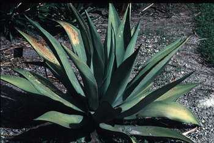

**Agave**
_Agave_ species

**Description:** These plants have large clusters of thick, fleshy leaves borne close to the ground and surrounding a central stalk. The plants flower only once, then die. They produce a massive flower stalk.

**Habitat and Distribution:** Agaves prefer dry, open areas. They are found throughout Central America, the Caribbean, and parts of the western deserts of the United States and Mexico.

**Edible Parts:** Its flowers and flower buds are edible. Boil them before eating.

> **CAUTION**
>
> The juice of some species causes dermatitis in some individuals.

**Other Uses:** Cut the huge flower stalk and collect the juice for drinking. Some species have very fibrous leaves. Pound the leaves and remove the fibers for weaving and making ropes. Most species have thick, sharp needles at the tips of the leaves. Use them for sewing or making hacks. The sap of some species contains a chemical that makes the sap suitable for use as a soap.

* * *

**Almond**
_Prunus amygdalus_

**Description:** The almond tree, which sometimes grows to 12.2 meters (40 feet), looks like a peach tree. The fresh almond fruit resembles a gnarled, unripe peach and grows in clusters. The stone (the almond itself) is covered with a thick, dry, woolly skin.

**Habitat and Distribution:** Almonds are found in the scrub and thorn forests of the tropics, the evergreen scrub forests of temperate areas, and in desert scrub and waste in all climatic zones. The almond tree is also found in the semidesert areas of the Old World in southern Europe, the eastern Mediterranean, Iran, the Middle East, China, Madeira, the Azores, and the Canary Islands.

**Edible Parts:** The mature almond fruit splits open lengthwise down the side, exposing the ripe almond nut. You can easily get the dry kernel by simply cracking open the stone. Almond meats are rich in food value, like all nuts. Gather them in large quantities and shell them for further use as survival food. You could live solely on almonds for rather long periods. When you boil them, the kernel's outer covering comes off and only the white meat remains.

* * *

**Amaranth**
_Amaranthus_ species

**Description:** These plants, which grow 90 to 150 centimeters (35 to 60 inches) tall, are abundant weeds in many parts of the world. All amaranth have alternate simple leaves. They may have some red color present on the stems. They bear minute, greenish flowers in dense clusters at the top of the plants. Their seeds may be brown or black in weedy species and light-colored in domestic species.

**Habitat and Distribution:** Look for amaranth along roadsides, in disturbed waste areas, or as weeds in crops throughout the world. Some amaranth species have been grown as a grain crop and a garden vegetable in various parts of the world, especially in South America.

**Edible Parts:** All parts are edible, but some may have sharp spines you should remove before eating. The young plants or the growing tips of older plants are an excellent vegetable. Simply boil the young plants or eat them raw. Their seeds are very nutritious. Shake the tops of older plants to get the seeds. Eat the seeds raw, boiled, ground into flour, or popped like popcorn.

* * *

**Arctic willow**
_Salix arctica_

**Description:** The arctic willow is a shrub that never exceeds more than 60 centimeters (24 inches) in height and grows in clumps that form dense mats on the tundra.

**Habitat and Distribution:** The arctic willow is common on tundras in North America, Europe, and Asia. You can also find it in some mountainous areas in temperate regions.

**Edible Parts:** You can collect the succulent, tender young shoots of the arctic willow in early spring. Strip off the outer bark of the new shoots and eat the inner portion raw. You can also peel and eat raw the young underground shoots of any of the various kinds of arctic willow. Young willow leaves are one of the richest sources of vitamin C, containing 7 to 10 times more than an orange.

* * *

**Arrowroot**_
Maranta and Sagittaria_ species

**Description:** The arrowroot is an aquatic plant with arrow-shaped leaves and potatolike tubers in the mud.

**Habitat and Distribution:** Arrowroot is found worldwide in temperate zones and the tropics. It is found in moist to wet habitats.

**Edible Parts:** The rootstock is a rich source of high quality starch. Boil the rootstock and eat it as a vegetable.

* * *

**Asparagus**
_Asparagus officinalis_

**Description:** The spring growth of this plant resembles a cluster of green fingers. The mature plant has fernlike, wispy foliage and red berries. Its flowers are small and greenish in color. Several species have sharp, thornlike structures.

**Habitat and Distribution:** Asparagus is found worldwide in temperate areas. Look for it in fields, old homesites, and fencerows.

**Edible Parts:** Eat the young stems before leaves form. Steam or boil them for 10 to 15 minutes before eating. Raw asparagus may cause nausea or diarrhea. The fleshy roots are a good source of starch.

> **WARNING**
>
> Do not eat the fruits of any since some are toxic.

* * *

**Bael fruit**
_Aegle marmelos_

**Description:** This is a tree that grows from 2.4 to 4.6 meters (8 to 15 feet) tall, with a dense spiny growth. The fruit is 5 to 10 centimeters (2 to 4 inches) in diameter, gray or yellowish, and full of seeds.

**Habitat and Distribution:** Bael fruit is found in rain forests and semievergreen seasonal forests of the tropics. It grows wild in India and Burma.

**Edible Parts:** The fruit, which ripens in December, is at its best when just turning ripe. The juice of the ripe fruit, diluted with water and mixed with a small amount of tamarind and sugar or honey, is sour but refreshing. Like other citrus fruits, it is rich in vitamin C.

* * *

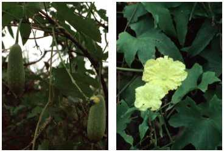

**Bamboo**
Various species including _Bambusa, Dendrocalamus, Phyllostachys_

**Description:** Bamboos are woody grasses that grow up to 15 meters (50 feet) tall. The leaves are grasslike and the stems are the familiar bamboos used in furniture and fishing poles.

**Habitat and Distribution:** Look for bamboo in warm, moist regions in open or jungle country, in lowland, or on mountains. Bamboos are native to the Far East (temperate and tropical zones) but have been widely planted around the world.

**Edible Parts:** The young shoots of almost all species are edible raw or cooked. Raw shoots have a slightly bitter taste that is removed by boiling. To prepare, remove the tough protective sheath that is coated with tawny or red hairs. The seed grain of the flowering bamboo is also edible. Boil the seeds like rice or pulverize them, mix with water, and make into cakes.

**Other Uses:** Use the mature bamboo to build structures or to make containers, ladles, spoons, and various other cooking utensils. Also, use bamboo to make tools and weapons. You can make a strong bow by splitting the bamboo and putting several pieces together.

> **CAUTION**
>
> Green bamboo may explode in a fire. Green bamboo has an internal membrane you must remove before using it as a food or water container.

* * *

**Banana and plantain**
_Musa_ species

**Description:** These are treelike plants with several large leaves at the top. Their flowers are borne in dense hanging clusters.

**Habitat and Distribution:** Look for bananas and plantains in open fields or margins of forests where they are grown as a crop. They grow in the humid tropics.

**Edible Parts:** Their fruits are edible raw or cooked. They may be boiled or baked. You can boil their flowers and eat them like a vegetable. You can cook and eat the rootstocks and leaf sheaths of many species. The center or "heart" of the plant is edible year-round, cooked or raw.

**Other Uses:** You can use the layers of the lower third of the plants to cover coals to roast food. You can also use their stumps to get water (see [Chapter 6](06)). You can use their leaves to wrap other foods for cooking or storage.

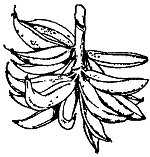

* * *

**Baobab**
_Adansonia digitata_

**Description:** The baobab tree may grow as high as 18 meters (60 feet) and may have a trunk 9 meters (30 feet) in diameter. The tree has short, stubby branches and a gray, thick bark. Its leaves are compound and their segments are arranged like the palm of a hand. Its flowers, which are white and several centimeters across, hang from the higher branches. Its fruit is shaped like a football, measures up to 45 centimeters (18 inches) long, and is covered with short dense hair.

**Habitat and Distribution:** These trees grow in savannas. They are found in Africa, in parts of Australia, and on the island of Madagascar.

**Edible Parts:** You can use the young leaves as a soup vegetable. The tender root of the young baobab tree is edible. The pulp and seeds of the fruit are also edible. Use one handful of pulp to about one cup of water for a refreshing drink. To obtain flour, roast the seeds, and then grind them.

**Other Uses:** Drinking a mixture of pulp and water will help cure diarrhea. Often the hollow trunks are good sources of fresh water. The bark can be cut into strips and pounded to obtain a strong fiber for making rope.

* * *

**Batoko plum**
_Flacourtia inermis_

**Description:** This shrub or small tree has dark green, alternate, simple leaves. Its fruits are bright red and contain six or more seeds.

**Habitat and Distribution:** This plant is a native of the Philippines but is widely cultivated for its fruit in other areas. It can be found in clearings and at the edges of the tropical rain forests of Africa and Asia.

**Edible Parts:** Eat the fruit raw or cooked.

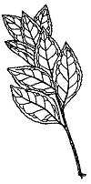
* * *

**Bearberry or kinnikinnick**
_Arctostaphylos uvaursi_

**Description:** This plant is a common evergreen shrub with reddish, scaly bark and thick, leathery leaves 4 centimeters (1 1/2 inches) long and 1 centimeter (1/2 inch) wide. It has white flowers and bright red fruits.

**Habitat and Distribution:** This plant is found in arctic, subarctic, and temperate regions, most often in sandy or rocky soil.

**Edible Parts:** Its berries are edible raw or cooked. You can make a refreshing tea from its young leaves.

* * *

**Beech**
_Fagus_ species

**Description:** Beech trees are large (9 to 24 meters [30 to 80 feet]), symmetrical forest trees that have smooth, light-gray bark and dark green foliage. The character of its bark, plus its clusters of prickly seedpods, clearly distinguish the beech tree in the field.

**Habitat and Distribution:** This tree is found in the temperate zone. It grows wild in the eastern United States, Europe, Asia, and North Africa. It is found in moist areas, mainly in the forests. This tree is common throughout southeastern Europe and across temperate Asia. Beech relatives are also found in Chile, New Guinea, and New Zealand.

**Edible Parts:** The mature beechnuts readily fall out of the husklike seedpods. You can eat these dark-brown, triangular nuts by breaking the thin shell with your fingernail and removing the white, sweet kernel inside. Beechnuts are one of the most delicious of all wild nuts. They are a most useful survival food because of the kernel's high oil content. You can also use the beechnuts as a coffee substitute. Roast them so that the kernel becomes golden brown and quite hard. Then pulverize the kernel and, after boiling or steeping in hot water, you have a passable coffee substitute.

* * *

**Bignay**
_Antidesma bunius_

**Description:** Bignay is a shrub or small tree, 3 to 12 meters (10 to 40 feet) tall, with shiny, pointed leaves about 15 centimeters (6 inches) long. Its flowers are small, clustered, and green. It has fleshy, dark red or black fruit and a single seed. The fruit is about 1 centimeter (1/2 inch) in diameter.

**Habitat and Distribution:** This plant is found in rain forests and semievergreen seasonal forests in the tropics. It is found in open places and in secondary forests. It grows wild from the Himalayas to Sri Lanka and eastward through Indonesia to northern Australia. However, it may be found anywhere in the tropics in cultivated forms.

**Edible Parts:** The fruit is edible raw. Do not eat any other parts of the tree. In Africa, the roots are toxic. Other parts of the plant may be poisonous.

> **CAUTION**
>
> Eaten in large quantities, the fruit may have a laxative effect.

* * *

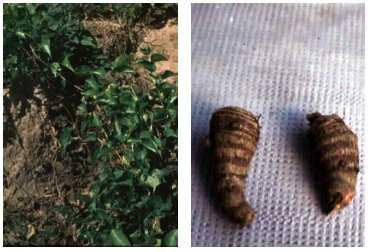

**Blackberry, raspberry, and dewberry**
_Rubus_ species

**Description:** These plants have prickly stems (canes) that grow upward, arching back toward the ground. They have alternate, usually compound leaves. Their fruits may be red, black, yellow, or orange. This plant is often confused with poison ivy during some seasons but these stems have thorns.

**Habitat and Distribution:** These plants grow in open, sunny areas at the margin of woods, lakes, streams, and roads throughout temperate regions. There is also an arctic raspberry.

**Edible Parts:** The fruits and peeled young shoots are edible. Flavor varies greatly.

**Other Uses:** Use the leaves to make tea. To treat diarrhea, drink a tea made by brewing the dried root bark of the blackberry bush.

* * *

**Blueberry and huckleberry**
_Vaccinium_ and _Gaylussacia_ species

**Description:** These shrubs vary in size from 30 centimeters (12 inches) to 3.7 meters (12 feet) tall. All have alternate, simple leaves. Their fruits may be dark blue, black, or red and have many small seeds.

**Habitat and Distribution:** These plants prefer open, sunny areas. They are found throughout much of the north temperate regions and at higher elevations in Central America.

**Edible Parts:** Their fruits are edible raw.

* * *

**Breadfruit**
_Artocarpus incisa_

**Description:** This tree may grow up to 9 meters (30 feet) tall. It has dark green, deeply divided leaves that are 75 centimeters (29 inches) long and 30 centimeters (12 inches) wide. Its fruits are large, green, ball-like structures up to 30 centimeters (12 inches) across when mature.

**Habitat and Distribution:** Look for this tree at the margins of forests and homesites in the humid tropics. It is native to the South Pacific region but has been widely planted in the West Indies and parts of Polynesia.

**Edible Parts:** The fruit pulp is edible raw. The fruit can be sliced, dried, and ground into flour for later use. The seeds are edible cooked.

**Other Uses:** The thick sap can serve as glue and caulking material. You can also use it as birdlime (to entrap small birds by smearing the sap on twigs where they usually perch).

* * *

**Burdock**
_Arctium lappa_

**Description:** This plant has wavy-edged, arrow-shaped leaves and flower heads in burrlike clusters. It grows up to 2 meters (7 feet) tall, with purple or pink flowers and a large, fleshy root.

**Habitat and Distribution:** Burdock is found worldwide in the north temperate zone. Look for it in open waste areas during the spring and summer.

**Edible Parts:** Peel the tender leaf stalks and eat them raw or cook them like greens. The roots are also edible boiled or baked.

> **CAUTION**
>
> Do not confuse burdock with rhubarb that has poisonous leaves.

**Other Uses:** A liquid made from the roots will help to produce sweating and increase urination. Dry the root, simmer it in water, strain the liquid, and then drink the strained liquid. Use the fiber from the dried stalk to weave cordage.

* * *

**Burl Palm**
_Corypha elata_

**Description:** This tree may reach 18 meters (60 feet) in height. It has large, fan-shaped leaves up to 3 meters (10 feet) long and split into about 100 narrow segments. It bears flowers in huge dusters at the top of the tree. The tree dies after flowering.

**Habitat and Distribution:** This tree grows in coastal areas of the East Indies.

**Edible Parts:** The trunk contains starch that is edible raw. The very tip of the trunk is also edible raw or cooked. You can get large quantities of liquid by bruising the flowering stalk. The kernels of the nuts are edible.

> **CAUTION**
>
> The seed covering may cause dermatitis in some individuals.

**Other Uses:** You can use the leaves as weaving material.

* * *

**Canna lily**
_Canna indica_

**Description:** The canna lily is a coarse perennial herb, 90 centimeters (36 inches) to 3 meters (10 feet) tall. The plant grows from a large, thick, underground rootstock that is edible. Its large leaves resemble those of the banana plant but are not so large. The flowers of wild canna lily are usually small, relatively inconspicuous, and brightly colored reds, oranges, or yellows.

**Habitat and Distribution:** As a wild plant, the canna lily is found in all tropical areas, especially in moist places along streams, springs, ditches, and the margins of woods. It may also be found in wet temperate, mountainous regions. It is easy to recognize because it is commonly cultivated in flower gardens in the United States.

**Edible Parts:** The large and much-branched rootstocks are full of edible starch. The younger parts may be finely chopped and then boiled or pulverized into a meal. Mix in the young shoots of palm cabbage for flavoring.

* * *

**Carob tree**
_Ceratonia siliqua_

**Description:** This large tree has a spreading crown. Its leaves are compound and alternate. Its seedpods, also known as Saint John's bread, are up to 45 centimeters (18 inches) long and are filled with round, hard seeds and a thick pulp.

**Habitat and Distribution:** This tree is found throughout the Mediterranean, the Middle East, and parts of North Africa.

**Edible Parts:** The young, tender pods are edible raw or boiled. You can pulverize the seeds in mature pods and cook as porridge.

* * *

**Cashew nut**
_Anacardium occidentale_

**Description:** The cashew is a spreading evergreen tree growing to a height of 12 meters (40 feet), with leaves up to 20 centimeters (8 inches) long and 10 centimeters (4 inches) wide. Its flowers are yellowish-pink. Its fruit is very easy to recognize because of its peculiar structure. The fruit is thick and pear-shaped, pulpy and red or yellow when ripe. This fruit bears a hard, green, kidney-shaped nut at its tip. This nut is smooth, shiny, and green or brown according to its maturity.

**Habitat and Distribution:** The cashew is native to the West Indies and northern South America, but transplantation has spread it to all tropical climates. In the Old World, it has escaped from cultivation and appears to be wild at least in parts of Africa and India.

**Edible Parts:** The nut encloses one seed. The seed is edible when roasted. The pear-shaped fruit is juicy, sweet acid, and astringent. It is quite safe and considered delicious by most people who eat it.

> **CAUTION**
>
> The green hull surrounding the nut contains a resinous irritant poison that will blister the lips and tongue like poison ivy. Heat destroys this poison when the nuts are roasted.

* * *

**Cattail**
_Typha latifolia_

**Description:** Cattails are grasslike plants with strap-shaped leaves 1 to 5 centimeters (1/4 to 2 inches) wide and growing up to 1.8 meters (6 feet) tall. The male flowers are borne in a dense mass above the female flowers. The male flowers last only a short time, leaving the female flowers, which develop into the brown cattail. Pollen from the male flowers is often abundant and bright yellow.

**Habitat and Distribution:** Cattails are found throughout most of the world. Look for them in full sun areas at the margins of lakes, streams, canals, rivers, and brackish water.

**Edible Parts:** The young tender shoots are edible raw or cooked. The rhizome is often very tough but is a rich source of starch. Pound the rhizome to remove the starch and use as a flour. The pollen is also an exceptional source of starch. When the cattail is immature and still green, you can boil the female portion and eat it like corn on the cob.

**Other Uses:** The dried leaves are an excellent source of weaving material you can use to make floats and rafts. The cottony seeds make good pillow stuffing and insulation. The fluff makes excellent tinder. Dried cattails are effective insect repellents when burned.

* * *

**Cereus cactus**
_Cereus_ species

**Description:** These cacti are tall and narrow with angled stems and numerous spines.

**Habitat and Distribution:** They may be found in true deserts and other dry, open, sunny areas throughout the Caribbean region, Central America, and the western United States.

**Edible Parts:** The fruits are edible, but some may have a laxative effect.

**Other Uses:** The pulp of the cactus is a good source of water. Break open the stem and scoop out the pulp.

* * *

**Chestnut**
_Castanea sativa_

**Description:** The European chestnut is usually a large tree, up to 18 meters (60 feet) in height.

**Habitat and Distribution:** In temperate regions, the chestnut is found in both hardwood and coniferous forests. In the tropics, it is found in semievergreen seasonal forests. They are found over all of middle and south Europe and across middle Asia to China and Japan. They are relatively abundant along the edge of meadows and as a forest tree. The European chestnut is one of the most common varieties. Wild chestnuts in Asia belong to the related chestnut species.

**Edible Parts:** Chestnuts are highly useful as survival food. Ripe nuts are usually picked in autumn, although unripe nuts picked while green may also be used for food. Perhaps the easiest way to prepare them is to roast the ripe nuts in embers. Cooked this way, they are quite tasty, and you can eat large quantities. Another way is to boil the kernels after removing the outer shell. After boiling the nuts until fairly soft, you can mash them like potatoes.

* * *

**Chicory**
_Cichorium intybus_

**Description:** This plant grows up to 1.8 meters (6 feet) tall. It has leaves clustered at the base of the stem and some leaves on the stem. The base leaves resemble those of the dandelion. The flowers are sky blue and stay open only on sunny days. Chicory has a milky juice.

**Habitat and Distribution:** Look for chicory in old fields, waste areas, weedy lots, and along roads. It is a native of Europe and Asia, but is also found in Africa and most of North America, where it grows as a weed.

**Edible Parts:** All parts are edible. Eat the young leaves as a salad or boil to eat as a vegetable. Cook the roots as a vegetable. For use as a coffee substitute, roast the roots until they are dark brown and then pulverize them.

* * *

**Chufa**
_Cyperus esculentus_

**Description:** This very common plant has a triangular stem and grasslike leaves. It grows to a height of 20 to 60 centimeters (8 to 24 inches). The mature plant has a soft, furlike bloom that extends from a whorl of leaves. Tubers 1 to 2.5 centimeters (1/2 to 1 inch) in diameter grow at the ends of the roots.

**Habitat and Distribution:** Chufa grows in moist sandy areas throughout the world. It is often an abundant weed in cultivated fields.

**Edible Parts:** The tubers are edible raw, boiled, or baked. You can also grind them and use them as a coffee substitute.

* * *

**Coconut**
_Cocos nucifera_

**Description:** This tree has a single, narrow, tall trunk with a cluster of very large leaves at the top. Each leaf may be over 6 meters (20 feet) long with over 100 pairs of leaflets.

**Habitat and Distribution:** Coconut palms are found throughout the tropics. They are most abundant near coastal regions.

**Edible Parts:** The nut is a valuable source of food. The milk of the young coconut is rich in sugar and vitamins and is an excellent source of liquid. The nut meat is also nutritious but is rich in oil. To preserve the meat, spread it in the sun until it is completely dry.

**Other Uses:** Use coconut oil to cook and to protect metal objects from corrosion. Also, use the oil to treat saltwater sores, sunburn, and dry skin. Use the oil in improvised torches. Use the tree trunk as building material and the leaves as thatch. Hollow out the large stump for use as a food container. The coconut husks are good flotation devices and the husk's fibers are used to weave ropes and other items. Use the gauzelike fibers at the leaf bases as strainers or use them to weave a bug net or to make a pad to use on wounds. The husk makes a good abrasive. Dried husk fiber is an excellent tinder. A smoldering husk helps to repel mosquitoes. Smoke caused by dripping coconut oil in a fire also repels mosquitoes. To render coconut oil, put the coconut meat in the sun, heat it over a slow fire, or boil it in a pot of water. Coconuts washed out to sea are a good source of fresh liquid for the sea survivor.

* * *

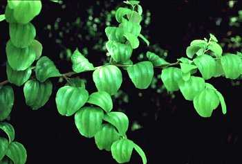

**Common jujube**
_Ziziphus jujuba_

**Description:** The common jujube is either a deciduous tree growing to a height of 12 meters (40 feet) or a large shrub, depending upon where it grows and how much water is available for growth. Its branches are usually spiny. Its reddish-brown to yellowish-green fruit is oblong to ovoid, 3 centimeters (1 inch) or less in diameter, smooth, and sweet in flavor, but with a rather dry pulp around a comparatively large stone. Its flowers are green.

**Habitat and Distribution:** The jujube is found in forested areas of temperate regions and in desert scrub and waste areas worldwide. It is common in many of the tropical and subtropical areas of the Old World. In Africa, it is found mainly bordering the Mediterranean. In Asia, it is especially common in the drier parts of India and China. The jujube is also found throughout the East Indies. It can be found bordering some desert areas.

**Edible Parts:** The pulp, crushed in water, makes a refreshing beverage. If time permits, you can dry the ripe fruit in the sun like dates. Its fruit is high in vitamins A and C.

* * *

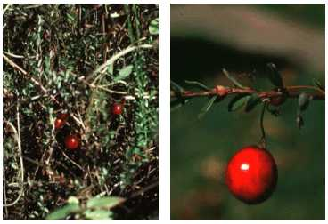

**Cranberry**
_Vaccinium macrocarpon_

**Description:** This plant has tiny leaves arranged alternately. Its stem creeps along the ground. Its fruits are red berries.

**Habitat and Distribution:** It only grows in open, sunny, wet areas in the colder regions of the Northern Hemisphere.

**Edible Parts:** The berries are very tart when eaten raw. Cook in a small amount of water and add sugar, if available, to make a jelly.

**Other Uses:** Cranberries may act as a diuretic. They are useful for treating urinary tract infections.

* * *

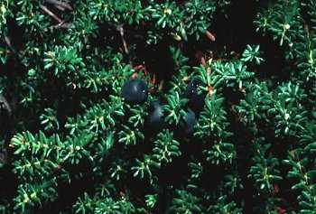

**Crowberry**
_Empetrum nigrum_

**Description:** This is a dwarf evergreen shrub with short needlelike leaves. It has small, shiny, black berries that remain on the bush throughout the winter.

**Habitat and Distribution:** Look for this plant in tundra throughout arctic regions of North America and Eurasia.

**Edible Parts:** The fruits are edible fresh or can be dried for later use.

* * *

**Cuipo tree**
_Cavanillesia platanifolia_

**Description:** This is a very dominant and easily detected tree because it extends above the other trees. Its height ranges from 45 to 60 meters (149 to 198 feet). It has leaves only at the top and is bare 11 months out of the year. It has rings on its bark that extend to the top to make it easily recognizable. Its bark is reddish or gray in color. Its roots are light reddish-brown or yellowish-brown.

**Habitat and Distribution:** The cuipo tree is located primarily in Central American tropical rain forests in mountainous areas.

**Edible Parts:** To get water from this tree, cut a piece of the root and clean the dirt and bark off one end, keeping the root horizontal. Put the clean end to your mouth or canteen and raise the other. The water from this tree tastes like potato water.

**Other Uses:** Use young saplings and the branches' inner bark to make rope.

* * *

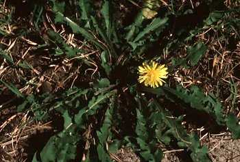

**Dandelion**
_Taraxacum officinale_

**Description:** Dandelion leaves have a jagged edge, grow close to the ground, and are seldom more than 20 centimeters (8 inches) long. The flowers are bright yellow. There are several dandelion species.

**Habitat and Distribution:** Dandelions grow in open, sunny locations throughout the Northern Hemisphere.

**Edible Parts:** All parts are edible. Eat the leaves raw or cooked. Boil the roots as a vegetable. Roots roasted and ground are a good coffee substitute. Dandelions are high in vitamins A and C and in calcium.

**Other Uses:** Use the white juice in the flower stems as glue.

* * *

**Date palm**
_Phoenix dactylifera_

**Description:** The date palm is a tall, unbranched tree with a crown of huge, compound leaves. Its fruit is yellow when ripe.

**Habitat and Distribution:** This tree grows in arid semitropical regions. It is native to North Africa and the Middle East but has been planted in the arid semitropics in other parts of the world.

**Edible Parts:** Its fruit is edible fresh but is very bitter if eaten before it is ripe. You can dry the fruits in the sun and preserve them for a long time.

**Other Uses:** The trunks provide valuable building material in desert regions where few other treelike plants are found. The leaves are durable, and you can use them for thatching and as weaving material. The base of the leaves resembles coarse cloth that you can use for scrubbing and cleaning.

* * *

**Daylily**
_Hemerocallis fulva_

**Description:** This plant has unspotted, tawny blossoms that open for 1 day only. It has long, swordlike, green basal leaves. Its root is a mass of swollen and elongated tubers.

**Habitat and Distribution:** Daylilies are found worldwide in tropic and temperate zones. They are grown as a vegetable in the Orient and as an ornamental plant elsewhere.

**Edible Parts:** The young green leaves are edible raw or cooked. Tubers are also edible raw or cooked. You can eat its flowers raw, but they taste better cooked. You can also fry the flowers for storage.

> **CAUTION**
>
> Eating excessive amounts of raw flowers may cause diarrhea.

* * *

**Duchesnea or Indian strawberry**
_Duchesnea indica_

**Description:** The duchesnea is a small plant that has runners and three-parted leaves. Its flowers are yellow and its fruit resembles a strawberry.

**Habitat and Distribution:** It is native to southern Asia but is a common weed in warmer temperate regions. Look for it in lawns, gardens, and along roads.

**Edible Parts:** Its fruit is edible. Eat it fresh.

* * *

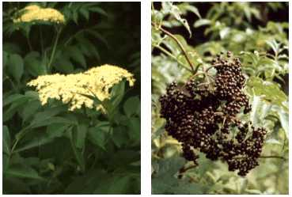

**Elderberry**
_Sambucus canadensis_

**Description:** Elderberry is a many-stemmed shrub with opposite, compound leaves. It grows to a height of 6 meters (20 feet). Its flowers are fragrant, white, and borne in large flat-topped clusters up to 30 centimeters (12 inches) across. Its berrylike fruits are dark blue or black when ripe.

**Habitat and Distribution:** This plant is found in open, usually wet areas at the margins of marshes, rivers, ditches, and lakes. It grows throughout much of eastern North America.

**Edible Parts:** The flowers and fruits are edible. You can make a drink by soaking the flower heads for 8 hours, discarding the flowers, and drinking the liquid.

> **CAUTION**
>
> All other parts of the plant are poisonous and dangerous if eaten.

* * *

**Fireweed**
_Epilobium angustifolium_

**Description:** This plant grows up to 1.8 meters (6 feet) tall. It has large, showy, pink flowers and lance-shaped leaves. Its relative, the dwarf fireweed (_Epilobium latifolium_), grows 30 to 60 centimeters (12 to 24 inches) tall.

**Habitat and Distribution:** Tall fireweed is found in open woods, on hillsides, on stream banks, and near seashores in arctic regions. It is especially abundant in burned-over areas. Dwarf fireweed is found along streams, sandbars, and lakeshores and on alpine and arctic slopes.

**Edible Parts:** The leaves, stems, and flowers are edible in the spring but become tough in summer. You can split open the stems of old plants and eat the pith raw.

* * *

**Fishtail palm**
_Caryota urens_

**Description:** Fishtail palms are large trees, at least 18 meters (60 feet) tall. Their leaves are unlike those of any other palm; the leaflets are irregular and toothed on the upper margins. All other palms have either fan-shaped or featherlike leaves. Its massive flowering shoot is borne at the top of the tree and hangs downward.

**Habitat and Distribution:** The fishtail palm is native to the tropics of India, Assam, and Myanmar. Several related species also exist in Southeast Asia and the Philippines. These palms are found in open hill country and jungle areas.

**Edible Parts:** The chief food in this palm is the starch stored in large quantities in its trunk. The juice from the fishtail palm is very nourishing and you have to drink it shortly after getting it from the palm flower shoot. Boil the juice down to get a rich sugar syrup. Use the same method as for the sugar palm to get the juice. The palm cabbage may be eaten raw or cooked.

* * *

**Foxtail grass**
_Setaria_ species

**Description:** This weedy grass is readily recognized by the narrow, cylindrical head containing long hairs. Its grains are small, less than 6 millimeters (1/4 inch) long. The dense heads of grain often droop when ripe.

**Habitat and Distribution:** Look for foxtail grasses in open, sunny areas, along roads, and at the margins of fields. Some species occur in wet, marshy areas. Species of _Setaria_ are found throughout the United States, Europe, western Asia, and tropical Africa. In some parts of the world, foxtail grasses are grown as a food crop.

**Edible Parts:** The grains are edible raw but are very hard and sometimes bitter. Boiling removes some of the bitterness and makes them easier to eat.

* * *

**Goa bean**
_Psophocarpus tetragonolobus_

**Description:** The goa bean is a climbing plant that may cover small shrubs and trees. Its bean pods are 22 centimeters (9 inches) long, its leaves 15 centimeters (6 inches) long, and its flowers are bright blue. The mature pods are 4-angled, with jagged wings on the pods.

**Habitat and Distribution:** This plant grows in tropical Africa, Asia, the East Indies, the Philippines, and Taiwan. This member of the bean (legume) family serves to illustrate a kind of edible bean common in the tropics of the Old World. Wild edible beans of this sort are most frequently found in clearings and around abandoned garden sites. They are more rare in forested areas.

**Edible Parts:** You can eat the young pods like string beans. The mature seeds are a valuable source of protein after parching or roasting them over hot coals. You can germinate the seeds (as you can many kinds of beans) in damp moss and eat the resultant sprouts. The thickened roots are edible raw. They are slightly sweet, with the firmness of an apple. You can also eat the young leaves as a vegetable, raw or steamed.

* * *

**Hackberry**
_Celtis_ species

**Description:** Hackberry trees have smooth, gray bark that often has corky warts or ridges. The tree may reach 39 meters (129 feet) in height. Hackberry trees have long-pointed leaves that grow in two rows. This tree bears small, round berries that can be eaten when they are ripe and fall from the tree. The wood of the hackberry is yellowish.

**Habitat and Distribution:** This plant is widespread in the United States, especially in and near ponds.

**Edible Parts:** Its berries are edible when they are ripe and fall from the tree.

* * *

**Hazelnut or wild filbert**
_Corylus_ species

**Description:** Hazelnuts grow on bushes 1.8 to 3.6 meters (6 to 12 feet) high. One species in Turkey and another in China are large trees. The nut itself grows in a very bristly husk that conspicuously contracts above the nut into a long neck. The different species vary in this respect as to size and shape.

**Habitat and Distribution:** Hazelnuts are found over wide areas in the United States, especially the eastern half of the country and along the Pacific coast. These nuts are also found in Europe where they are known as filberts. The hazelnut is common in Asia, especially in eastern Asia from the Himalayas to China and Japan. The hazelnut usually grows in the dense thickets along stream banks and open places. They are not plants of the dense forest.

**Edible Parts:** Hazelnuts ripen in the autumn, when you can crack them open and eat the kernel. The dried nut is extremely delicious. The nut's high oil content makes it a good survival food. When they are unripe, you can crack them open and eat the fresh kernel.

* * *

**Horseradish tree**
_Moringa pterygosperma_

**Description:** This tree grows from 4.5 to 14 meters (15 to 46 feet) tall. Its leaves have a fernlike appearance. Its flowers and long, pendulous fruits grow on the ends of the branches. Its fruit (pod) looks like a giant bean. Its 25- to 60-centimeter-long pods are triangular in cross section, with strong ribs. Its roots have a pungent odor.

**Habitat and Distribution:** This tree is found in the rain forests and semievergreen seasonal forests of the tropical regions. It is widespread in India, Southeast Asia, Africa, and Central America. Look for it in abandoned fields and gardens and at the edges of forests.

**Edible Parts:** The leaves are edible raw or cooked, depending on their hardness. Cut the young seedpods into short lengths and cook them like string beans or fry them. You can get oil for frying by boiling the young fruits of palms and skimming the oil off the surface of the water. You can eat the flowers as part of a salad. You can chew fresh, young seedpods to eat the pulpy and soft seeds. The roots may be ground as a substitute for seasoning similar to horseradish.

* * *

**Iceland moss**
_Cetraria islandica_

**Description:** This moss grows only a few inches high. Its color may be gray, white, or even reddish.

**Habitat and Distribution:** Look for it in open areas. It is found only in the arctic.

**Edible Parts:** All parts of the Iceland moss are edible. During the winter or dry season, it is dry and crunchy but softens when soaked. Boil the moss to remove the bitterness. After boiling, eat by itself or add to milk or grains as a thickening agent. Dried plants store well.

* * *

**Indian potato or Eskimo potato**
_Claytonia_ species

**Description:** All Claytonia species are somewhat fleshy plants only a few centimeters tall, with showy flowers about 2.5 centimeters (1 inch) across.

**Habitat and Distribution:** Some species are found in rich forests, where they are conspicuous before the leaves develop. Western species are found throughout most of the northern United States and in Canada.

**Edible Parts:** The tubers are edible but you should boil them before eating.

* * *

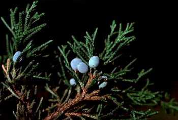

**Juniper**
_Juniperus_ species

**Description:** Junipers, sometimes called cedars, are trees or shrubs with very small, scalelike leaves densely crowded around the branches. Each leaf is less than 1.2 centimeters (1/3 inch) long. All species have a distinct aroma resembling the well-known cedar. The berrylike cones are usually blue and covered with a whitish wax.

**Habitat and Distribution:** Look for junipers in open, dry, sunny areas throughout North America and northern Europe. Some species are found in southeastern Europe, across Asia to Japan, and in the mountains of North Africa.

**Edible Parts:** The berries and twigs are edible. Eat the berries raw or roast the seeds to use as a coffee substitute. Use dried and crushed berries as a seasoning for meat. Gather young twigs to make a tea.

> **CAUTION**
>
> Many plants may be called cedars but are not related to junipers and may be harmful. Always look for the berrylike structures, needle leaves, and resinous, fragrant sap to be sure the plant you have is a juniper.

* * *

**Lotus**
_Nelumbo_ species

**Description:** There are two species of lotus: one has yellow flowers and the other pink flowers. The flowers are large and showy. The leaves, which may float on or rise above the surface of the water, often reach 1.5 meters (5 feet) in radius. The fruit has a distinctive flattened shape and contains up to 20 hard seeds.

**Habitat and Distribution:** The yellow-flowered lotus is native to North America. The pink-flowered species, which is widespread in the Orient, is planted in many other areas of the world. Lotuses are found in quiet freshwater.

**Edible Parts:** All parts of the plant are edible raw or cooked. The underwater parts contain large quantities of starch. Dig the fleshy portions from the mud and bake or boil them. Boil the young leaves and eat them as a vegetable. The seeds have a pleasant flavor and are nutritious. Eat them raw, or parch and grind them into flour.

* * *

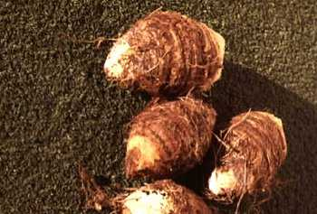

**Malanga**
_Xanthosoma caracu_

**Description:** This plant has soft, arrow-shaped leaves up to 60 centimeters (24 inches) long. The leaves have no aboveground stems.

**Habitat and Distribution:** This plant grows widely in the Caribbean region. Look for it in open, sunny fields.

**Edible Parts:** The tubers are rich in starch. Cook them before eating to destroy a poison contained in all parts of the plant.

> **WARNING**
>
> Always cook before eating.

* * *

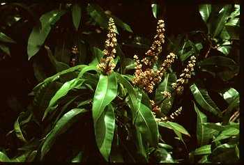

**Mango**
_Mangifera indica_

**Description:** This tree may reach 30 meters (90 feet) in height. It has alternate, simple, shiny, dark green leaves. Its flowers are small and inconspicuous. Its fruits have a large single seed. There are many cultivated varieties of mango. Some have red flesh, others yellow or orange, often with many fibers and a kerosene taste.

**Habitat and Distribution:** This tree grows in warm, moist regions. It is native to northern India, Myanmar, and western Malaysia. It is now grown throughout the tropics.

**Edible Parts:** The fruits are a nutritious food source. The unripe fruit can be peeled and its flesh eaten by shredding it and eating it like a salad. The ripe fruit can be peeled and eaten raw. Roasted seed kernels are edible.

> **CAUTION**
>
> If you are sensitive to poison ivy, avoid eating mangoes, as they cause a severe reaction in sensitive individuals.

* * *

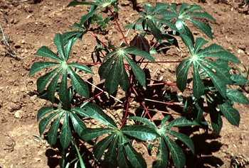

**Manioc**
_Manihot utillissima_

**Description:** Manioc is a perennial shrubby plant, 1 to 3 meters (3 to 9 feet) tall, with jointed stems and deep green, fingerlike leaves. It has large, fleshy rootstocks.

**Habitat and Distribution:** Manioc is widespread in all tropical climates, particularly in moist areas. Although cultivated extensively, it may be found in abandoned gardens and growing wild in many areas.

**Edible Parts:** The rootstocks are full of starch and high in food value. Two kinds of manioc are known: bitter and sweet. Both are edible. The bitter type contains poisonous hydrocyanic acid. To prepare manioc, first grind the fresh manioc root into a pulp, then cook it for at least 1 hour to remove the bitter poison from the roots. Then flatten the pulp into cakes and bake as bread. Manioc cakes or flour will keep almost indefinitely if protected against insects and dampness. Wrap manioc in banana leaves for protection.

> **CAUTION**
>
> For safety, always cook the roots of either type.

* * *

**Marsh marigold**
_Caltha palustris_

**Description:** This plant has rounded, dark green leaves arising from a short stem. It has bright yellow flowers.

**Habitat and Distribution:** This plant is found in bogs, lakes, and slow-moving streams. It is abundant in arctic and subarctic regions, and in much of the eastern region of the northern United States.

**Edible Parts:** All parts are edible if boiled.

> **CAUTION**
>
> As with all water plants, do not eat this plant raw. Raw water plants may carry dangerous organisms that are removed only by cooking.

* * *

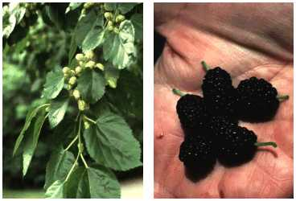

**Mulberry**
_Morus_ species

**Description:** This tree has alternate, simple, often lobed leaves with rough surfaces. Its fruits are blue or black and many-seeded.

**Habitat and Distribution:** Mulberry trees are found in forests, along roadsides, and in abandoned fields in temperate and tropical zones of North America, South America, Europe, Asia, and Africa.

**Edible Parts:** The fruit is edible raw or cooked. It can be dried for eating later.

**Other Uses:** You can shred the inner bark of the tree and use it to make twine or cord.

* * *

**Nettle**
_Urtica_ and _Laportea_ species

**Description:** These plants grow several feet high. They have small, inconspicuous flowers. Fine, hairlike bristles cover the stems, leafstalks, and undersides of leaves. The bristles cause a stinging sensation when they touch the skin.

**Habitat and Distribution:** Nettles prefer moist areas along streams or at the margins of forests. They are found throughout North America, Central America, the Caribbean, and northern Europe.

**Edible Parts:** Young shoots and leaves are edible. Boiling the plant for 10 to 15 minutes destroys the stinging element of the bristles. This plant is very nutritious.

**Other Uses:** Mature stems have a fibrous layer that you can divide into individual fibers and use to weave string or twine.

* * *

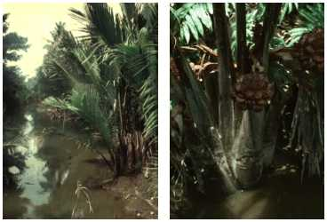

**Nipa palm**
Nipa fruticans

**Description:** This palm has a short, mainly underground trunk and very large, erect leaves up to 6 meters (20 feet) tall. The leaves are divided into leaflets. A flowering head forms on a short erect stern that rises among the palm leaves. The fruiting (seed) head is dark brown and may be 30 centimeters (12 inches) in diameter.

**Habitat and Distribution:** This palm is common on muddy shores in coastal regions throughout eastern Asia.

**Edible Parts:** The young flower stalk and the seeds provide a good source of water and food. Cut the flower stalk and collect the juice. The juice is rich in sugar. The seeds are hard but edible.

**Other Uses:** The leaves are excellent as thatch and coarse weaving material.

* * *

**Oak**
_Quercus_ species

**Description:** Oak trees have alternate leaves and acorn fruits. There are two main groups of oaks: red and white. The red oak group has leaves with bristles and smooth bark in the upper part of the tree. Red oak acorns take 2 years to mature. The white oak group has leaves without bristles and a rough bark in the upper portion of the tree. White oak acorns mature in 1 year.

**Habitat and Distribution:** Oak trees are found in many habitats throughout North America, Central America, and parts of Europe and Asia.

**Edible Parts:** All parts are edible, but often contain large quantities of bitter substances. White oak acorns usually have a better flavor than red oak acorns. Gather and shell the acorns. Soak red oak acorns in water for 1 to 2 days to remove the bitter substance. You can speed up this process by putting wood ashes in the water in which you soak the acorns. Boil the acorns or grind them into flour and use the flour for baking. You can use acorns that you baked until very dark as a coffee substitute.

> **CAUTION**
>
> Tannic acid gives the acorns their bitter taste. Eating an excessive amount of acorns high in tannic acid can lead to kidney failure. Before eating acorns, leach out this chemical.

**Oak (Continued)**

**Other Uses:** Oak wood is excellent for building or burning. Small oaks can be split and cut into long thin strips (3 to 6 millimeters [1/8 to 1/4 inch] thick and 1.2 centimeters [1/3 inch] wide) used to weave mats, baskets, or frameworks for packs, sleds, furniture, etc. Oak bark soaked in water produces a tanning solution used to preserve leather.

* * *

**Orach**
_Atriplex_ species

**Description:** This plant is vinelike in growth and has arrowhead-shaped, alternate leaves up to 5 centimeters (2 inches) long. Young leaves maybe silver-colored. Its flowers and fruits are small and inconspicuous.

**Habitat and Distribution:** Orach species are entirety restricted to salty soils. They are found along North America's coasts and on the shores of alkaline lakes inland. They are also found along seashores from the Mediterranean countries to inland areas in North Africa and eastward to Turkey and central Siberia.

**Edible Parts:** The entire plant is edible raw or boiled.

* * *

**Palmetto palm**
_Sabal palmetto_

**Description:** The palmetto palm is a tall, unbranched tree with persistent leaf bases on most of the trunk. The leaves are large, simple, and palmately lobed. Its fruits are dark blue or black with a hard seed.

**Habitat and Distribution:** The palmetto palm is found throughout the coastal regions of the southeastern United States.

**Edible Parts:** The fruits are edible raw. The hard seeds may be ground into flour. The heart of the palm is a nutritious food source at any time. Cut off the top of the tree to obtain the palm heart.

* * *

**Papaya or pawpaw**
_Carica papaya_

**Description:** The papaya is a small tree 1.8 to 6 meters (6 to 20 feet) tall, with a soft, hollow trunk. When cut, the entire plant exudes a milky juice. The trunk is rough and the leaves are crowded at the trunk's apex. The fruit grows directly from the trunk, among and below the leaves. The fruit is green before ripening. When ripe, it turns yellow or remains greenish with a squashlike appearance.

**Habitat and Distribution:** Papaya is found in rain forests and semievergreen seasonal forests in tropical regions and in some temperate regions as well. Look for it in moist areas near clearings and former habitations. It is also found in open, sunny places in uninhabited jungle areas.

**Edible Parts:** The ripe fruit is high in vitamin C. Eat it raw or cook it like squash. Place green fruit in the sun to make it ripen quickly. Cook the young papaya leaves, flowers, and stems carefully, changing the water as for taro.

**Other Uses:** Use the milky juice of the unripe fruit to tenderize tough meat. Rub the juice on the meat.

> **CAUTION**
>
> Be careful not to get the milky sap from the unripe fruit into your eyes. It will cause intense pain and temporary—sometimes even permanent—blindness.

* * *

**Persimmon**
_Diospyros virginiana_ and other species

**Description:** These trees have alternate, dark green, elliptic leaves with entire margins. The flowers are inconspicuous. The fruits are orange, have a sticky consistency, and have several seeds.

**Habitat and Distribution:** The persimmon is a common forest margin tree. It is wide spread in Africa, eastern North America, and the Far East.

**Edible Parts:** The leaves are a good source of vitamin C. The fruits are edible raw or baked. To make tea, dry the leaves and soak them in hot water. You can eat the roasted seeds.

> **CAUTION**
>
> Some persons are unable to digest persimmon pulp. Unripe persimmons are highly astringent and inedible.

* * *

**Pincushion cactus**
_Mammilaria_ species

**Description:** Members of this cactus group are round, short, barrel-shaped, and without leaves. Sharp spines cover the entire plant.

**Habitat and Distribution:** These cacti are found throughout much of the desert regions of the western United States and parts of Central America.

**Edible Parts:** They are a good source of water in the desert.

* * *

**Pine**
_Pinus_ species

**Description:** Pine trees are easily recognized by their needlelike leaves grouped in bundles. Each bundle may contain one to five needles, the number varying among species. The tree's odor and sticky sap provide a simple way to distinguish pines from similar looking trees with needlelike leaves.

**Habitat and Distribution:** Pines prefer open, sunny areas. They are found throughout North America, Central America, much of the Caribbean region, North Africa, the Middle East, Europe, and some places in Asia.

**Edible Parts:** The seeds of all species are edible. You can collect the young male cones, which grow only in the spring, as a survival food. Boil or bake the young cones. The bark of young twigs is edible. Peel off the bark of thin twigs. You can chew the juicy inner bark; it is rich in sugar and vitamins. Eat the seeds raw or cooked. Green pine needle tea is high in vitamin C.

**Other Uses:** Use the resin to waterproof articles. Also, use it as glue. Collect the resin from the tree. If there is not enough resin on the tree, cut a notch in the bark so more sap will seep out. Put the resin in a container and heat it. The hot resin is your glue. Use it as is or add a small amount of ash dust to strengthen it. Use it immediately. You can use hardened pine resin as an emergency dental filling.

* * *

**Plantain, broad and narrow leaf**
_Plantago_ species

**Description:** The broad leaf plantain has leaves over 2.5 centimeters (1 inch) across that grow close to the ground. The flowers are on a spike that rises from the middle of the cluster of leaves. The narrow leaf plantain has leaves up to 12 centimeters (5 inches) long and 2.5 centimeters (1 inch) wide, covered with hairs. The leaves form a rosette. The flowers are small and inconspicuous.

**Habitat and Distribution:** Look for these plants in lawns and along roads in the north temperate zone. This plant is a common weed throughout much of the world.

**Edible Parts:** The young tender leaves are edible raw. Older leaves should be cooked. Seeds are edible raw or roasted.

**Other Uses:** To relieve pain from wounds and sores, wash and soak the entire plant for a short time and apply it to the injured area. To treat diarrhea, drink tea made from 28 grams (1 ounce) of the plant leaves boiled in 0.5 liter of water. The seeds and seed husks act as laxatives.

* * *

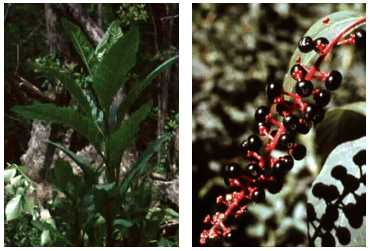

**Pokeweed**
_Phytolacca americana_

**Description:** This plant may grow as high as 3 meters (9 feet). Its leaves are elliptic and up to 1 meter (3 feet) in length. It produces many large clusters of purple fruits in late spring.

**Habitat and Distribution:** Look for this plant in open, sunny areas in forest clearings, in fields, and along roadsides in eastern North America, Central America, and the Caribbean.

**Edible Parts:** The young leaves and stems are edible cooked. Boil them twice, discarding the water from the first boiling. The berries are considered poisonous, even if cooked.

> **CAUTION**
>
> All parts of this plant are poisonous if eaten raw. Never eat the underground portions of the plant as these contain the highest concentrations of the poisons. Do not eat any plant over 25 centimeters (10 inches) tall or when red is showing in the plant.

**Other Uses:** Use the juice of fresh berries as a dye.

* * *

**Prickly pear cactus**
_Opuntia_ species

**Description:** This cactus has flat, padlike stems that are green. Many round, furry dots that contain sharp-pointed hairs cover these stems.

**Habitat and Distribution:** This cactus is found in arid and semiarid regions and in dry, sandy areas of wetter regions throughout most of the United States and Central and South America. Some species are planted in arid and semiarid regions of other parts of the world.

**Edible Parts:** All parts of the plant are edible. Peel the fruits and eat them fresh or crush them to prepare a refreshing drink. Avoid the tiny, pointed hairs. Roast the seeds and grind them to a flour.

> **CAUTION**
>
> Avoid any plant that resembles the prickly pear cactus and has milky sap.

**Other Uses:** The pad is a good source of water. Peel it carefully to remove all sharp hairs before putting it in your mouth. You can also use the pads to promote healing. Split them and apply the pulp to wounds.

* * *

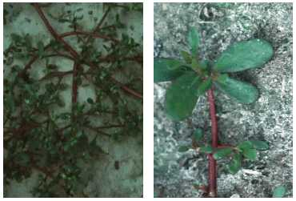

**Purslane**
_Portulaca oleracea_

**Description:** This plant grows close to the ground. It is seldom more than a few centimeters tall. Its stems and leaves are fleshy and often tinged with red. It has paddleshaped leaves, 2.5 centimeters (1 inch) or less long, clustered at the tips of the stems. Its flowers are yellow or pink. Its seeds are tiny and black.

**Habitat and Distribution:** It grows in full sun in cultivated fields, field margins, and other weedy areas throughout the world.

**Edible Parts:** All parts are edible. Wash and boil the plants for a tasty vegetable or eat them raw. Use the seeds as a flour substitute or eat them raw.

* * *

**Rattan palm**
_Calamus_ species

**Description:** The rattan palm is a stout, robust climber. It has hooks on the midrib of its leaves that it uses to remain attached to the trees on which it grows. Sometimes, mature stems grow to 90 meters (300 feet). It has alternate, compound leaves and a whitish flower.

**Habitat and Distribution:** The rattan palm is found from tropical Africa through Asia to the East Indies and Australia. It grows mainly in rain forests.

**Edible Parts:** Rattan palms hold a considerable amount of starch in their young stem tips. You can eat them roasted or raw. In other kinds, a gelatinous pulp, either sweet or sour, surrounds the seeds. You can suck out this pulp. The palm heart is also edible raw or cooked.

**Other Uses:** You can obtain large amounts of potable water by cutting the ends of the long stems (see [Chapter 6](06)). The stems can be used to make baskets and fish traps.

* * *

**Reed**
_Phragmites australis_

**Description:** This tall, coarse grass grows to 3.5 meters (12 feet) tall and has gray-green leaves about 4 centimeters (1 1/2 inch) wide. It has large masses of brown flower branches in early summer. These rarely produce grain and become fluffy, gray masses late in the season.

**Habitat and Distribution:** Look for reed in any open, wet area, especially one that has been disturbed through dredging. Reed is found throughout the temperate regions of both the Northern and Southern Hemispheres.

**Edible Parts:** All parts of the plant are edible raw or cooked in any season. Harvest the stems as they emerge from the soil and boil them. You can also harvest them just before they produce flowers, then dry and beat them into flour. You can also dig up and boil the underground stems, but they are often tough. Seeds are edible raw or boiled, but they are rarely found.

* * *

**Reindeer moss**
_Cladonia rangiferina_

**Description:** Reindeer moss is a low-growing plant only a few centimeters tall. It does not flower but does produce bright red reproductive structures.

**Habitat and Distribution:** Look for this lichen in open, dry areas. It is very common in much of North America.

**Edible Parts:** The entire plant is edible but has a crunchy, brittle texture. Soak the plant in water with some wood ashes to remove the bitterness; then dry, crush, and add it to milk or to other food.

* * *

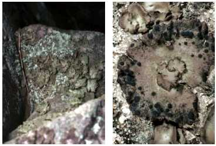

**Rock tripe**
_Umbilicaria_ species

**Description:** This plant forms large patches with curling edges. The top of the plant is usually black. The underside is lighter in color.

**Habitat and Distribution:** Look on rocks and boulders for this plant. It is common throughout North America.

**Edible Parts:** The entire plant is edible. Scrape it off the rock and wash it to remove grit. The plant may be dry and crunchy; soak it in water until it becomes soft. Rock tripes may contain large quantities of bitter substances; soaking or boiling the plant in several changes of water will remove the bitterness.

> **CAUTION**
>
> There are some reports of poisoning from rock tripe, so apply the Universal Edibility Test.

* * *

**Rose apple**
_Eugenia jambos_

**Description:** This tree grows 3 to 9 meters (9 to 27 feet) high. It has opposite, simple, dark green, shiny leaves. When fresh, it has fluffy, yellowish-green flowers and red to purple egg-shaped fruit.

**Habitat and Distribution:** This tree is widely planted in all of the tropics. It can also be found in a semiwild state in thickets, waste places, and secondary forests.

**Edible Parts:** The entire fruit is edible raw or cooked.

* * *

**Sago palm**
_Metroxylon sagu_

**Description:** These palms are low trees, rarely over 9 meters (27 feet) tall, with a stout, spiny trunk. The outer rind is about 5 centimeters (2 inches) thick and hard as bamboo. The rind encloses a spongy inner pith containing a high proportion of starch. It has typical palmlike leaves clustered at the tip.

**Habitat and Distribution:** The sago palm is found in tropical rain forests. It flourishes in damp lowlands in the Malay Peninsula, New Guinea, Indonesia, the Philippines, and adjacent islands. It is found mainly in swamps and along streams, lakes, and rivers.

**Edible Parts:** These palms, when available, are of great use to the survivor. One trunk, cut just before it flowers, will yield enough sago to feed a person for 1 year. Obtain sago starch from nonflowering palms. To extract the edible sage, cut away the bark lengthwise from one half of the trunk and pound the soft, whitish inner part (pith) as fine as possible. Knead the pith in water and strain it through a coarse cloth into a container. The fine, white sago will settle in the container. Once the sago settles, it is ready for use. Squeeze off the excess water and let it dry. Cook it as pancakes or oatmeal. Two kilograms of sago is the nutritional equivalent of 1.5 kilograms of rice. The upper part of the trunk's core does not yield sago, but you can roast it in lumps over a fire. You can also eat the young sago nuts and the growing shoots or palm cabbage.

* * *

**Sassafras**
_Sassafras albidum_

**Description:** This shrub or small tree bears different leaves on the same plant. Some leaves will have one lobe, some two lobes, and some no lobes. The flowers, which appear in early spring, are small and yellow. The fruits are dark blue. The plant parts have a characteristic root beer smell.

**Habitat and Distribution:** Sassafras grows at the margins of roads and forests, usually in open, sunny areas. It is a common tree throughout eastern North America.

**Edible Parts:** The young twigs and leaves are edible fresh or dried. You can add dried young twigs and leaves to soups. Dig the underground portion, peel off the bark, and let it dry. Then boil it in water to prepare sassafras tea.

**Other Uses:** Shred the tender twigs for use as a toothbrush.

* * *

**Saxaul**
_Haloxylon ammondendron_

**Description:** The saxaul is found either as a small tree or as a large shrub with heavy, coarse wood and spongy, water-soaked bark. The branches of the young trees are vivid green and pendulous. The flowers are small and yellow.

**Habitat and Distribution:** The saxaul is found in desert and arid areas. It is found on the arid salt deserts of Central Asia, particularly in the Turkestan region and east of the Caspian Sea.

**Edible Parts:** The thick bark acts as a water storage organ. You can get drinking water by pressing quantities of the bark. This plant is an important source of water in the arid regions in which it grows.

* * *

**Screw pine**
_Pandanus_ species

**Description:** The screw pine is a strange plant on stilts, or prop roots, that support the plant above ground so that it appears suspended in midair. These plants are either shrubby or treelike, 3 to 9 meters (9 to 27 feet) tall, with stiff leaves having sawlike edges. The fruits are large, roughened balls resembling pineapples but without the tuft of leaves at the end.

**Habitat and Distribution:** The screw pine is a tropical plant that grows in rain forests and semievergreen seasonal forests. It is found mainly along seashores, although certain kinds occur inland for some distance, from Madagascar to southern Asia and the islands of the southwestern Pacific. There are about 180 types.

**Edible Parts:** Knock the ripe fruit to the ground to separate the fruit segments from the hard outer covering. Chew the inner fleshy part. Cook in an earth oven fruit that is not fully ripe. Before cooking, wrap the whole fruit in banana leaves, breadfruit leaves, or any other suitable thick, leathery leaves. After cooking for about 2 hours, you can chew fruit segments like ripe fruit. Green fruit is inedible.

* * *

**Sea orach**
_Atriplex halimus_

**Description:** The sea orach is a sparingly branched herbaceous plant with small, gray-colored leaves up to 2.5 centimeters (1 inch) long. Sea orach resembles lamb's quarter, a common weed in most gardens in the United States. It produces its flowers in narrow, densely compacted spikes at the tips of its branches.

**Habitat and Distribution:** The sea orach is found in highly alkaline and salty areas along seashores from the Mediterranean countries to inland areas in North Africa and eastward to Turkey and central Siberia. Generally, it can be found in tropical scrub and thorn forests, steppes in temperate regions, and most desert scrub and waste areas.

**Edible Parts:** Its leaves are edible. In the areas where it grows, it has the healthy reputation of being one of the few native plants that can sustain man in times of want.

* * *

**Sheep sorrel**
_Rumex acerosella_

**Description:** These plants are seldom more than 30 centimeters (12 inches) tall. They have alternate leaves, often with arrowlike bases, very small flowers, and frequently reddish stems.

**Habitat and Distribution:** Look for these plants in old fields and other disturbed areas in North America and Europe.

**Edible Parts:** The plants are edible raw or cooked.

> **CAUTION**
>
> These plants contain oxalic acid that can be damaging if too many plants are eaten raw. Cooking seems to destroy the chemical.

* * *

**Sorghum**
_Sorghum_ species

**Description:** There are many different kinds of sorghum, all of which bear grains in heads at the top of the plants. The grains are brown, white, red, or black. Sorghum is the main food crop in many parts of the world.

**Habitat and Distribution:** Sorghum is found worldwide, usually in warmer climates. All species are found in open, sunny areas.

**Edible Parts:** The grains are edible at any stage of development. When young, the grains are milky and edible raw. Boil the older grains. Sorghum is a nutritious food.

**Other Uses:** Use the stems of tall sorghum as building materials.

* * *

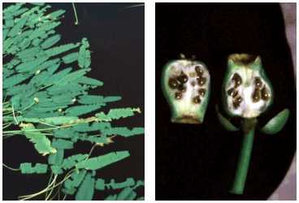

**Spatterdock or yellow water lily**
_Nuphar_ species

**Description:** This plant has leaves up to 60 centimeters (24 inches) long with a triangular notch at the base. The shape of the leaves is somewhat variable. The plant's yellow flowers are 2.5 centimeters (1 inch) across and develop into bottle-shaped fruits. The fruits are green when ripe.

**Habitat and Distribution:** These plants grow throughout most of North America. They are found in quiet, shallow (never deeper than 1.8 meters [6 feet]) freshwater.

**Edible Parts:** All parts of the plant are edible. The fruits contain several dark brown seeds you can parch or roast and then grind into flour. The large rootstock contains starch. Dig it out of the mud, peel off the outside, and boil the flesh. Sometimes the rootstock contains large quantities of a very bitter compound. Boiling the plant in several changes of water may remove the bitterness.

* * *

**Sterculia**
_Sterculia foetida_

**Description:** Sterculias are tall trees, rising in some instances to 30 meters (90 feet). Their leaves are either undivided or palmately lobed. Their flowers are red or purple. The fruit of all sterculias is similar in aspect, with a red, segmented seedpod containing many edible black seeds.

**Habitat and Distribution:** There are over 100 species of sterculias distributed through all warm or tropical climates. They are mainly forest trees.

**Edible Parts:** The large, red pods produce a number of edible seeds. The seeds of all sterculias are edible and have a pleasant taste similar to cocoa. You can eat them like nuts, either raw or roasted.

> **CAUTION**
>
> Avoid eating large quantities. The seeds may have a laxative effect.

* * *

**Strawberry**
_Fragaria_ species

**Description:** Strawberry is a small plant with a three-leaved growth pattern. It has small, white flowers usually produced during the spring. Its fruit is red and fleshy.

**Habitat and Distribution:** Strawberries are found in the north temperate zone and also in the high mountains of the southern Western Hemisphere. Strawberries prefer open, sunny areas. They are commonly planted.

**Edible Parts:** The fruit is edible fresh, cooked, or dried. Strawberries are a good source of vitamin C. You can also eat the plant's leaves or dry them to make a tea. Care should be taken with strawberries and other farm foods that have similar, pitted skins. In areas where human fertilizer is used, even bleach will not be able to effectively remove all bacteria.

> **WARNING**
>
> Eat only white-flowering true strawberries. Other similar plants without white flowers can be poisonous.

* * *

**Sugarcane**
_Saccharum officinarum_

**Description:** This plant grows up to 4.5 meters (15 feet) tall. It is a grass and has grasslike leaves. Its green or reddish stems are swollen where the leaves grow. Cultivated sugarcane seldom flowers.

**Habitat and Distribution:** Look for sugarcane in fields. It grows only in the tropics (throughout the world). Because it is a crop, it is often found in large numbers.

**Edible Parts:** The stem is an excellent source of sugar and is very nutritious. Peel the outer portion off with your teeth and eat the sugarcane raw. You can also squeeze juice out of the sugarcane.

* * *

**Sugar palm**
_Arenga pinnata_

**Description:** This tree grows about 15 meters (45 feet) high and has huge leaves up to 6 meters (18 feet) long. Needlelike structures stick out of the bases of the leaves. Flowers grow below the leaves and form large conspicuous dusters from which the fruits grow.

**Habitat and Distribution:** This palm is native to the East Indies but has been planted in many parts of the tropics. It can be found at the margins of forests.

**Edible Parts:** The chief use of this palm is for sugar. However, its seeds and the tip of its stems are a survival food. Bruise a young flower stalk with a stone or similar object and collect the juice as it comes out. It is an excellent source of sugar. Boil the seeds. Use the tip of the stems as a vegetable.

**Other Uses:** The shaggy material at the base of the leaves makes an excellent rope, as it is strong and resists decay.

> **CAUTION**
>
> The flesh covering the seeds may cause dermatitis.

* * *

**Sweetsop**
_Annona squamosa_

**Description:** This tree is small, seldom more than 6 meters (18 feet) tall, and multi-branched. It has alternate, simple, elongate, dark green leaves. Its fruit is green when ripe, round, and covered with protruding bumps on its surface. The fruit's flesh is white and creamy.

**Habitat and Distribution:** Look for sweetsop at margins of fields, near villages, and around homesites in tropical regions.

**Edible Parts:** The fruit flesh is edible raw.

**Other Uses:** You can use the finely ground seeds as an insecticide.

> **CAUTION**
>
> The ground seeds are extremely dangerous to the eyes.

* * *

**Tamarind**
_Tamarindus indica_

**Description:** The tamarind is a large, densely branched tree. It grows up to 25 meters (75 feet) tall. Its has pinnate leaves (divided like a feather) with 10 to 15 pairs of leaflets.

**Habitat and Distribution:** The tamarind grows in the drier parts of Africa, Asia, and the Philippines. Although it is thought to be a native of Africa, it has been cultivated in India for so long that it looks like a native tree. It is also found in the American tropics, the West Indies, Central America, and tropical South America.

**Edible Parts:** The pulp surrounding the seeds is rich in vitamin C and is an important survival food. You can make a pleasantly acid drink by mixing the pulp with water and sugar or honey and letting the mixture mature for several days. Suck the pulp to relieve thirst. Cook the young, unripe fruits or seedpods with meat. Use the young leaves in soup. You must cook the seeds. Roast them above a fire or in ashes. Another way is to remove the seed coat and soak the seeds in salted water and grated coconut for 24 hours, then cook them. You can peel the tamarind bark and chew it.

* * *

**Taro, cocoyam, elephant ears, eddo, dasheen**
_Colocasia_ and _Alocasia_ species

**Description:** All plants in these groups have large leaves, sometimes up to 1.8 meters (6 feet) tall, that grow from a very short stem. The rootstock is thick, fleshy, and filled with starch.

**Habitat and Distribution:** These plants grow in the humid tropics. Look for them in fields and near homesites and villages.

**Edible Parts:** All parts of the plant are edible when boiled or roasted. When boiling, change the water once to get rid of any poison.

> **CAUTION**
>
> If eaten raw, these plants will cause a serious inflammation of the mouth and throat.

* * *

**Thistle**
_Cirsium_ species

**Description:** This plant may grow as high as 1.5 meters (5 feet). Its leaves are long-pointed, deeply lobed, and prickly.

**Habitat and Distribution:** Thistles grow worldwide in dry woods and fields.

**Edible Parts:** Peel the stalks, cut them into short sections, and boil them before eating. The roots are edible raw or cooked.

> **CAUTION**
>
> Some thistle species are poisonous.

**Other Uses:** Twist the tough fibers of the stems to make a strong twine.

* * *

**Ti**
_Cordyline terminalis_

**Description:** The ti has unbranched stems with straplike leaves often clustered at the tip of the stem. The leaves vary in color and may be green or reddish. The flowers grow at the plant's top in large, plumelike clusters. The ti may grow up to 4.5 meters (15 feet) tall.

**Habitat and Distribution:** Look for this plant at the margins of forests or near homesites in tropical areas. It is native to the Far East but is now widely planted in tropical areas worldwide.

**Edible Parts:** The roots and very tender young leaves are good survival foods. Boil or bake the short, stout roots found at the base of the plant. They are a valuable source of starch. Boil the very young leaves to eat. You can use the leaves to wrap other food to cook over coals or to steam.

**Other Uses:** Use the leaves to cover shelters or to make a rain cloak. Cut the leaves into liners for shoes; this works especially well if you have a blister. Fashion temporary sandals from the leaves. The terminal leaf, if not completely unfurled, can be used as a sterile bandage. Cut the leaves into strips, then braid the strips into rope.

* * *

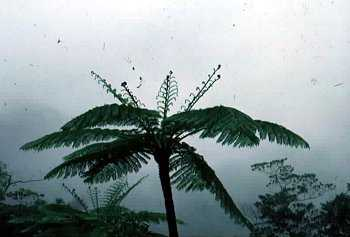

**Tree fern**
Various genera

**Description:** Tree ferns are tall trees with long, slender trunks that often have a very rough, barklike covering. Large, lacy leaves uncoil from the top of the trunk.

**Habitat and Distribution:** Tree ferns are found in wet, tropical forests.

**Edible Parts:** The young leaves and the soft inner portion of the trunk are edible. Boil the young leaves and eat as greens. Eat the inner portion of the trunk raw or bake it.

* * *

**Tropical almond**
_Terminalia catappa_

**Description:** This tree grows up to 9 meters (27 feet) tall. Its leaves are evergreen, leathery, 45 centimeters (18 inches) long, 15 centimeters (6 inches) wide, and very shiny. It has small, yellowish-green flowers. Its fruit is flat, 10 centimeters (4 inches) long, and not quite as wide. The fruit is green when ripe.

**Habitat and Distribution:** This tree is usually found growing near the ocean. It is a common and often abundant tree in the Caribbean and Central and South America. It is also found in the tropical rain forests of southeastern Asia, northern Australia, and Polynesia.

**Edible Parts:** The seed is a good source of food. Remove the fleshy, green covering and eat the seed raw or cooked.

* * *

**Walnut**
_Juglans_ species

**Description:** Walnuts grow on very large trees, often reaching 18 meters (54 feet) tall. The divided leaves characterize all walnut spades. The walnut itself has a thick outer husk that must be removed to reach the hard inner shell of the nut.

**Habitat and Distribution:** The English walnut, in the wild state, is found from southeastern Europe across Asia to China and is abundant in the Himalayas. Several other species of walnut are found in China and Japan. The black walnut is common in the eastern United States.

**Edible Parts:** The nut kernel ripens in the autumn. You get the walnut meat by cracking the shell. Walnut meats are highly nutritious because of their protein and oil content.

**Other Uses:** You can boil walnuts and use the juice as an antifungal agent. The husks of "green" walnuts produce a dark brown dye for clothing or camouflage. Crush the husks of "green" black walnuts and sprinkle them into sluggish water or ponds for use as fish poison.

* * *

**Water chestnut**
_Trapa natans_

**Description:** The water chestnut is an aquatic plant that roots in the mud and has finely divided leaves that grow underwater. Its floating leaves are much larger and coarsely toothed. The fruits, borne underwater, have four sharp spines on them.

**Habitat and Distribution:** The water chestnut is a freshwater plant only. It is a native of Asia but has spread to many parts of the world in both temperate and tropical areas.

**Edible Parts:** The fruits are edible raw and cooked. The seeds are also a source of food.

* * *

**Water lettuce**
_Ceratopteris_ species

**Description:** The leaves of water lettuce are much like lettuce and are very tender and succulent. One of the easiest ways of distinguishing water lettuce is by the little plantlets that grow from the margins of the leaves. These little plantlets grow in the shape of a rosette. Water lettuce plants often cover large areas in the regions where they are found.

**Habitat and Distribution:** Found in the tropics throughout the Old World in both Africa and Asia. Another kind is found in the New World tropics from Florida to South America. Water lettuce grows only in very wet places and often as a floating water plant. Look for water lettuce in still lakes, ponds, and the backwaters of rivers.

**Edible Parts:** Eat the fresh leaves like lettuce. Be careful not to dip the leaves in the contaminated water in which they are growing. Eat only the leaves that are well out of the water.

> **CAUTION**
>
> This plant has carcinogenic properties and should only be used as a last resort.

* * *

**Water lily**
_Nymphaea odorata_

**Description:** These plants have large, triangular leaves that float on the water's surface, large, fragrant flowers that are usually white, or red, and thick, fleshy rhizomes that grow in the mud.

**Habitat and Distribution:** Water lilies are found throughout much of the temperate and subtropical regions.

**Edible Parts:** The flowers, seeds, and rhizomes are edible raw or cooked. To prepare rhizomes for eating, peel off the corky rind. Eat raw, or slice thinly, allow to dry, and then grind into flour. Dry, parch, and grind the seeds into flour.

**Other Uses:** Use the liquid resulting from boiling the thickened root in water as a medicine for diarrhea and as a gargle for sore throats.

* * *

**Water plantain**
_Alisma plantago-aquatica_

**Description:** This plant has small, white flowers and heart-shaped leaves with pointed tips. The leaves are clustered at the base of the plant.

**Habitat and Distribution:** Look for this plant in freshwater and in wet, full sun areas in temperate and tropical zones.

**Edible Parts:** The rootstocks are a good source of starch. Boil or soak them in water to remove the bitter taste.

> **CAUTION**
>
> To avoid parasites, always cook aquatic plants.

* * *

**Wild caper**
_Capparis aphylla_

**Description:** This is a thorny shrub that loses its leaves during the dry season. Its stems are gray-green and its flowers pink.

**Habitat and Distribution:** These shrubs form large stands in scrub and thorn forests and in desert scrub and waste. They are common throughout North Africa and the Middle East.

**Edible Parts:** The fruit and the buds of young shoots are edible raw.

* * *

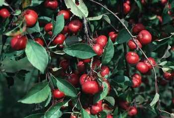

**Wild crab apple or wild apple**
_Malus_ species

**Description:** Most wild apples look enough like domestic apples that the survivor can easily recognize them. Wild apple varieties are much smaller than cultivated kinds; the largest kinds usually do not exceed 5 to 7.5 centimeters (2 to 3 inches) in diameter, and most often are smaller. They have small, alternate, simple leaves and often have thorns. Their flowers are white or pink and their fruits reddish or yellowish.

**Habitat and Distribution:** They are found in the savanna regions of the tropics. In temperate areas, wild apple varieties are found mainly in forested areas. Most frequently, they are found on the edge of woods or in fields. They are found throughout the Northern Hemisphere.

**Edible Parts:** Prepare wild apples for eating in the same manner as cultivated kinds. Eat them fresh, when ripe, or cooked. Should you need to store food, cut the apples into thin slices and dry them. They are a good source of vitamins.

> **CAUTION**
>
>Apple seeds contain cyanide compounds. Do not eat.

* * *

**Wild desert gourd or colocynth**
_Citrullus colocynthis_

**Description:** The wild desert gourd, a member of the watermelon family, produces a 2.4- to 3-meter-long (7 1/2- to 9-foot-long) ground-trailing vine. The perfectly round gourds are as large as an orange. They are yellow when ripe.

**Habitat and Distribution:** This creeping plant can be found in any climatic zone, generally in desert scrub and waste areas. It grows abundantly in the Sahara, in many Arab countries, on the southeastern coast of India, and on some of the islands of the Aegean Sea. The wild desert gourd will grow in the hottest localities.

**Edible Parts:** The seeds inside the ripe gourd are edible after they are completely separated from the very bitter pulp. Roast or boil the seeds—their kernels are rich in oil. The flowers are edible. The succulent stem tips can be chewed to obtain water.

* * *

**Wild dock and wild sorrel**
_Rumex crispus_ and _Rumex acetosella_

**Description:** Wild dock is a stout plant with most of its leaves at the base of its stem that is commonly 15 to 30 centimeters (6 to 12 inches) long. The plants usually develop from a strong, fleshy, carrotlike taproot. Its flowers are usually very small, growing in green to purplish plumelike clusters. Wild sorrel is similar to wild dock but smaller. Many of the basal leaves are arrow-shaped. They are smaller than those of dock and contain sour juice.

**Habitat and Distribution:** These plants can be found in almost all climatic zones of the world. They can grow in areas of high or low rainfall. Many kinds are found as weeds in fields, along roadsides, and in waste places.

**Edible Parts:** Because of the tender nature of their foliage, sorrel and dock are useful plants, especially in desert areas. You can eat their succulent leaves fresh or slightly cooked. To take away the strong taste, change the water once or twice during cooking—a useful hint in preparing many kinds of wild greens.

* * *

**Wild fig**
_Ficus_ species

**Description:** These trees have alternate, simple leaves with entire margins. Often, the leaves are dark green and shiny. All figs have a milky, sticky juice. The fruits vary in size depending on the species, but are usually yellow-brown when ripe.

**Habitat and Distribution:** Figs are plants of the tropics and semitropics. They grow in several different habitats, including dense forests, margins of forests, and around human settlements.

**Edible Parts:** The fruits are edible raw or cooked. Some figs have little flavor.

* * *

**Wild gourd or luffa sponge**
_Luffa cylindrica_

**Description:** The luffa sponge is widely distributed and fairly typical of a wild squash. There are several dozen kinds of wild squashes in tropical regions. Like most squashes, the luffa is a vine with leaves 7.5 to 20 centimeters (3 to 8 inches) across having 3 lobes. Some squashes have leaves twice this size. Luffa fruits are oblong or cylindrical, smooth, and many-seeded. Luffa flowers are bright yellow. The luffa fruit, when mature, is brown and resembles the cucumber.

**Habitat and Distribution:** A member of the squash family, which also includes the watermelon, cantaloupe, and cucumber, the luffa sponge is widely cultivated throughout the tropical zone. It may be found in a semiwild state in old clearings and abandoned gardens in rain forests and semievergreen seasonal forests.

**Edible Parts:** You can boil the young green (half-ripe) fruit and eat them as a vegetable. Adding coconut milk will improve the flavor. After ripening, the luffa sponge develops an inedible spongelike texture in the interior of the fruit. You can also eat the tender shoots, flowers, and young leaves after cooking them. Roast the mature seeds a little and eat them like peanuts.

* * *

**Wild grape vine**
_Vitis_ species

**Description:** The wild grapevine climbs with the aid of tendrils. Most grapevines produce deeply lobed leaves similar to the cultivated grape. Wild grapes grow in pyramidal, hanging bunches and are black-blue to amber, or white when ripe.

**Habitat and Distribution:** Wild grapes are distributed worldwide. Some kinds are found in deserts, others in temperate forests, and others in tropical areas. Wild grapes are commonly found throughout the eastern United States as well as in the southwestern desert areas. Most kinds are rampant climbers over other vegetation. The best place to look for wild grapes is on the edges of forested areas. Wild grapes are also found in Mexico. In the Old World, wild grapes are found from the Mediterranean region eastward through Asia, the East Indies, and to Australia. Africa also has several kinds of wild grapes.

**Edible Parts:** The ripe grape is the portion eaten. Grapes are rich in natural sugars and, for this reason, are much sought after as a source of energy-giving wild food. None are poisonous.

**Other Uses:** You can obtain water from severed grapevine stems. Cut off the vine at the bottom and place the cut end in a container. Make a slant-wise cut into the vine about 1.8 meters (6 feet) up on the hanging part. This cut will allow water to flow from the bottom end. As water diminishes in volume, make additional cuts farther down the vine.

> **CAUTION**
>
> To avoid poisoning, do not eat grapelike fruits with only a single seed (moonseed).

* * *

**Wild onion and garlic**
_Allium_ species

**Description:** _Allium cernuum_ is an example of the many species of wild onions and garlics, all easily recognized by their distinctive odor.

**Habitat and Distribution:** Wild onions and garlics are found in open, sunny areas throughout the temperate regions. Cultivated varieties are found anywhere in the world.

**Edible Parts:** The bulbs and young leaves are edible raw or cooked. Use in soup or to flavor meat.

> **CAUTION**
>
> There are several plants with onionlike bulbs that are extremely poisonous. Be certain that the plant you are using is a true onion or garlic. Do not eat bulbs with no onion smell.

**Other Uses:** Eating large quantities of onions will give your body an odor that will help to repel insects. Garlic juice works as an antibiotic on wounds.

* * *

**Wild pistachio**
_Pistacia_ species

**Description:** Some kinds of pistachio trees are evergreen; others lose their leaves during the dry season. The leaves alternate on the stem and have either three large leaves or a number of leaflets. The fruits or nuts are usually hard and dry at maturity.

**Habitat and Distribution:** About seven kinds of wild pistachio nuts are found in desert or semidesert areas surrounding the Mediterranean Sea to Turkey and Afghanistan. The pistachio is generally found in evergreen scrub forests or scrub and thorn forests.

**Edible Parts:** You can eat the oil nut kernels after parching them over coals.

* * *

**Wild rice**
_Zizania aquatica_

**Description:** Wild rice is a tall grass that typically is 1 to 1.5 meters (3 to 4 feet) in height, but may reach 4.5 meters (15 feet). Its grain grows in very loose heads at the top of the plant and is dark brown or blackish when ripe.

**Habitat and Distribution:** Wild rice grows only in very wet areas in tropical and temperate regions.

**Edible Parts:** During the spring and summer, the central portion of the lower stems and root shoots are edible. Remove the tough covering before eating. During the late summer and fall, collect the straw-covered husks. Dry and parch the husks, break them, and remove the rice. Boil or roast the rice and then beat it into flour.

* * *

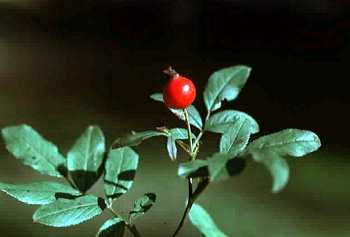

**Wild rose**
_Rosa_ species

**Description:** This shrub grows 60 centimeters to 2.5 meters (24 inches to 8 feet) high. It has alternate leaves and sharp prickles. Its flowers may be red, pink, or yellow. Its fruit, called rose hip, stays on the shrub year-round.

**Habitat and Distribution:** Look for wild roses in dry fields and open woods throughout the Northern Hemisphere.

**Edible Parts:** The flowers and buds are edible raw or boiled. In an emergency, you can peel and eat the young shoots. You can boil fresh, young leaves in water to make a tea. After the flower petals fall, eat the rose hips; the pulp is highly nutritious and an excellent source of vitamin C. Crush or grind dried rose hips to make flour.

> **CAUTION**
>
> Eat only the outer portion of the fruit as the seeds of some species are quite prickly and can cause internal distress.

* * *

**Wood sorrel**
_Oxalis_ species

**Description:** Wood sorrel resembles shamrock or four-leaf clover, with a bell-shaped pink, yellow, or white flower.

**Habitat and Distribution:** Wood sorrel is found in temperate zones worldwide, in lawns, open areas, and sunny woods.

**Edible Parts:** Cook the entire plant.

> **CAUTION**
>
> Eat only small amounts of this plant as it contains a fairly high concentration of oxalic acid that can be harmful.

* * *

**Yam**
_Dioscorea_ species

**Description:** These plants are vines that creep along the ground. They have alternate, heart- or arrow-shaped leaves. Their rootstock may be very large and weigh many kilograms.

**Habitat and Distribution:** True yams are restricted to tropical regions where they are an important food crop. Look for yams in fields, clearings, and abandoned gardens. They are found in rain forests, semievergreen seasonal forests, and scrub and thorn forests in the tropics. In warm temperate areas, they are found in seasonal hardwood or mixed hardwood-coniferous forests, as well as some mountainous areas.

**Edible Parts:** Boil the rootstock and eat it as a vegetable.

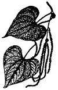

* * *

**Yam bean**
_Pachyrhizus erosus_

**Description:** The yam bean is a climbing plant of the bean family, with alternate, three-parted leaves and a turniplike root. The bluish or purplish flowers are pealike in shape. The plants are often so rampant that they cover the vegetation upon which they are growing.

**Habitat and Distribution:** The yam bean is native to the American tropics, but it was carried by man years ago to Asia and the Pacific islands. Now it is commonly cultivated in these places, and is also found growing wild in forested areas. This plant grows in wet areas of tropical regions.

**Edible Parts:** The tubers are about the size of a turnip and they are crisp, sweet, and juicy with a nutty flavor. They are nourishing and thirst quenching. Eat them raw or boiled. To make flour, slice the raw tubers, let them dry in the sun, and grind into a flour that is high in starch and may be used to thicken soup.

> **CAUTION**
>
> The raw seeds are poisonous.
