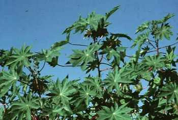
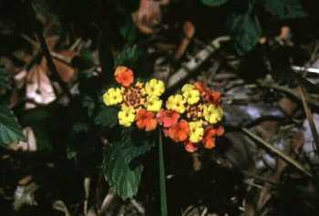
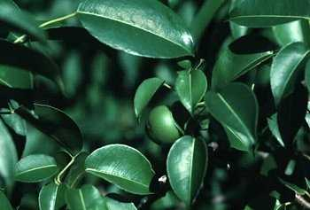
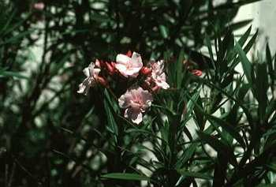
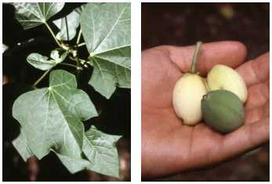
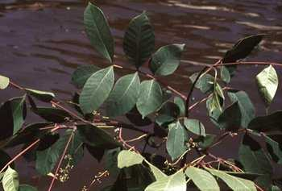
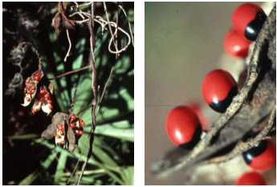
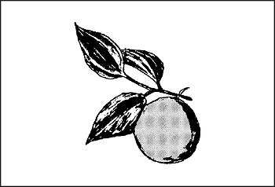
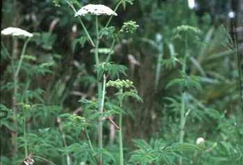

> Plants basically poison on contact, through ingestion, by absorption, or by inhalation. They cause painful skin irritations upon contact, they cause internal poisoning when eaten, and they poison through skin absorption or inhalation in to the respiratory system. Many edible plants have deadly relatives and look-alikes. Preparation for military missions includes learning to identify those harmful plants in the target area. Positive identification of edible plants will eliminate the danger of accidental poisoning. There is no room for experimentation where plants are concerned, especially in unfamiliar territory.

* * *

<table cellspacing="0" cellpadding="5" border="1" width="600">

<tbody>

<tr>

<td>

**Castor bean, castor-oil plant, palma Christi**  
_Ricinus communis_  
Spurge (_Euphorbiaceae_) Family  

**Description:** The castor bean is a semiwoody plant with large, alternate, starlike leaves that grows as a tree in tropical regions and as an annual in temperate regions. Its flowers are very small and inconspicuous. Its fruits grow in clusters at the tops of the plants.

<table cellspacing="0" cellpadding="7" border="1" width="400">

<tbody>

<tr>

<td valign="top">

**CAUTION**

All parts of the plant are very poisonous to eat. The seeds are large and may be mistaken for a beanlike food.

</td>

</tr>

</tbody>

</table>

**Habitat and Distribution:** This plant is found in all tropical regions and has been introduced to temperate regions.

</td>

</tr>

</tbody>

</table>

* * *

<table cellspacing="0" cellpadding="5" border="1" width="600">

<tbody>

<tr>

<td>

**Chinaberry**  
_Melia azedarach_  
Mahogany (_Meliaceae_) Family  

**Description:** This tree has a spreading crown and grows up to 14 meters (42 feet) tall. It has alternate, compound leaves with toothed leaflets. Its flowers are light purple with a dark center and grow in ball-like masses. It has marble-sized fruits that are light orange when first formed but turn lighter as they become older.

<table cellspacing="0" cellpadding="7" border="1" width="400">

<tbody>

<tr>

<td valign="top">

**CAUTION**

All parts of the tree should be considered dangerous if eaten. Its leaves are a natural insecticide and will repel insects from stored fruits and grains. Take care not to eat leaves mixed with the stored food.

</td>

</tr>

</tbody>

</table>

**Habitat and Distribution:** Chinaberry is native to the Himalayas and eastern Asia but is now planted as an ornamental tree throughout the tropical and subtropical regions. It has been introduced to the southern United States and has escaped to thickets, old fields, and disturbed areas.

</td>

</tr>

</tbody>

</table>

* * *

<table cellspacing="0" cellpadding="5" border="1" width="600">

<tbody>

<tr>

<td>

**Cowhage, cowage, cowitch**  
_Mucuna pruritum_  
Leguminosae (_Fabaceae_) Family  

**Description:** A vinelike plant that has oval leaflets in groups of three and hairy spikes with dull purplish flowers. The seeds are brown, hairy pods.

<table cellspacing="0" cellpadding="7" border="1" width="400">

<tbody>

<tr>

<td valign="top">

**CAUTION**

Contact with the pods and flowers causes irritation and blindness if in the eyes.

</td>

</tr>

</tbody>

</table>

**Habitat and Distribution:** Tropical areas and the United States.

</td>

</tr>

</tbody>

</table>

* * *

<table cellspacing="0" cellpadding="5" border="1" width="600">

<tbody>

<tr>

<td>

**Death camas, death lily**  
_Zigadenus_ species  
Lily (_Liliaceae_) Family  

**Description:** This plant arises from a bulb and may be mistaken for an onionlike plant. Its leaves are grasslike. Its flowers are six-parted and the petals have a green, heart-shaped structure on them. The flowers grow on showy stalks above the leaves.

<table cellspacing="0" cellpadding="7" border="1" width="400">

<tbody>

<tr>

<td valign="top">

**CAUTION**

All parts of this plant are very poisonous. Death camas does not have the onion smell.

</td>

</tr>

</tbody>

</table>

**Habitat and Distribution:** Death camas is found in wet, open, sunny habitats, although some species favor dry, rocky slopes. They are common in parts of the western United States. Some species are found in the eastern United States and in parts of the North American western subarctic and eastern Siberia.

</td>

</tr>

</tbody>

</table>

* * *

<table cellspacing="0" cellpadding="5" border="1" width="600">

<tbody>

<tr>

<td>

**Lantana**  
_Lantana camara_  
Vervain (_Verbenaceae_) Family  

**Description:** Lantana is a shrublike plant that may grow up to 45 centimeters (18 inches) high. It has opposite, round leaves and flowers borne in flat-topped clusters. The flower color (which varies in different areas) may be white, yellow, orange, pink, or red. It has a dark blue or black berrylike fruit. A distinctive feature of all parts of this plant is its strong scent.

<table cellspacing="0" cellpadding="7" border="1" width="400">

<tbody>

<tr>

<td valign="top">

**CAUTION**

All parts of this plant are poisonous if eaten and can be fatal. This plant causes dermatitis in some individuals.

</td>

</tr>

</tbody>

</table>

**Habitat and Distribution:** Lantana is grown as an ornamental in tropical and temperate areas and has escaped cultivation as a weed along roads and old fields.

</td>

</tr>

</tbody>

</table>

* * *

<table cellspacing="0" cellpadding="5" border="1" width="600">

<tbody>

<tr>

<td>

**Manchineel**  
_Hippomane mancinella_  
Spurge (_Euphorbiaceae_) Family  

**Description:** Manchineel is a tree reaching up to 15 meters (45 feet) high with alternate, shiny green leaves and spikes of small greenish flowers. Its fruits are green or greenish-yellow when ripe.

<table cellspacing="0" cellpadding="7" border="1" width="400">

<tbody>

<tr>

<td valign="top">

**CAUTION**

This tree is extremely toxic. It causes severe dermatitis in most individuals after only 0.5 hour. Even water dripping from the leaves may cause dermatitis. The smoke from burning it irritates the eyes. No part of this plant should be considered a food.

</td>

</tr>

</tbody>

</table>

**Habitat and Distribution:** The tree prefers coastal regions. It is found in south Florida, the Caribbean, Central America, and northern South America.

</td>

</tr>

</tbody>

</table>

* * *

<table cellspacing="0" cellpadding="5" border="1" width="600">

<tbody>

<tr>

<td>

**Oleander**  
_Nerium oleander_  
Dogbane (_Apocynaceae_) Family  

**Description:** This shrub or small tree grows to about 9 meters (27 feet), with alternate, very straight, dark green leaves. Its flowers may be white, yellow, red, pink, or intermediate colors. Its fruit is a brown, podlike structure with many small seeds.

<table cellspacing="0" cellpadding="7" border="1" width="400">

<tbody>

<tr>

<td valign="top">

**CAUTION**

All parts of the plant are very poisonous. Do not use the wood for cooking; it gives off poisonous fumes that can poison food.

</td>

</tr>

</tbody>

</table>

**Habitat and Distribution:** This native of the Mediterranean area is now grown as an ornamental in tropical and temperate regions.

</td>

</tr>

</tbody>

</table>

* * *

<table cellspacing="0" cellpadding="5" border="1" width="600">

<tbody>

<tr>

<td>

**Pangi**  
_Pangium edule_  
Pangi Family  

**Description:** This tree, with heart-shaped leaves in spirals, reaches a height of 18 meters (54 feet). Its flowers grow in spikes and are green in color. Its large, brownish, pear-shaped fruits grow in clusters.

<table cellspacing="0" cellpadding="7" border="1" width="400">

<tbody>

<tr>

<td valign="top">

**CAUTION**

All parts are poisonous, especially the fruit.

</td>

</tr>

</tbody>

</table>

**Habitat and Distribution:** Pangi trees grow in southeast Asia.

</td>

</tr>

</tbody>

</table>

* * *

<table cellspacing="0" cellpadding="5" border="1" width="600">

<tbody>

<tr>

<td>

**Physic nut**  
_Jatropha curcas_  
Spurge (_Euphoriaceae_) Family  

**Description:** This shrub or small tree has large, 3- to 5-parted alternate leaves. It has small, greenish-yellow flowers and its yellow, apple-sized fruits contain three large seeds.

<table cellspacing="0" cellpadding="7" border="1" width="400">

<tbody>

<tr>

<td valign="top">

**CAUTION**

The seeds taste sweet but their oil is violently purgative. All parts of the physic nut are poisonous.

</td>

</tr>

</tbody>

</table>

**Habitat and Distribution:** Throughout the tropics and southern United States.

</td>

</tr>

</tbody>

</table>

* * *

<table cellspacing="0" cellpadding="5" border="1" width="600">

<tbody>

<tr>

<td>

**Poison hemlock, fool's parsley**  
_Conium maculatum_  
Parsley (_Apiaceae_) Family  

**Description:** This biennial herb may grow to 2.5 meters (8 feet) high. The smooth, hollow stem may or may not be purple or red striped or mottled. Its white flowers are small and grow in small groups that tend to form flat umbels. Its long, turniplike taproot is solid.

<table cellspacing="0" cellpadding="7" border="1" width="400">

<tbody>

<tr>

<td valign="top">

**CAUTION**

This plant is very poisonous, and even a very small amount may cause death. This plant is easy to confuse with wild carrot or Queen Anne's lace, especially in its first stage of growth. Wild carrot or Queen Anne's lace has hairy leaves and stems and smells like carrot. Poison hemlock does not.

</td>

</tr>

</tbody>

</table>

**Habitat and Distribution:** Poison hemlock grows in wet or moist ground like swamps, wet meadows, stream banks, and ditches. Native to Eurasia, it has been introduced to the United States and Canada.

</td>

</tr>

</tbody>

</table>

* * *

<table cellspacing="0" cellpadding="5" border="1" width="600">

<tbody>

<tr>

<td>

**Poison ivy and poison oak**  
**Toxicodendron radicans** and **Toxicodendron diversibba**  
Cashew (_Anacardiacese_) Family  

**Description:** These two plants are quite similar in appearance and will often crossbreed to make a hybrid. Both have alternate, compound leaves with three leaflets. The leaves of poison ivy are smooth or serrated. Poison oak's leaves are lobed and resemble oak leaves. Poison ivy grows as a vine along the ground or climbs by red feeder roots. Poison oak grows like a bush. The greenish-white flowers are small and inconspicuous and are followed by waxy green berries that turn waxy white or yellow, then gray.

<table cellspacing="0" cellpadding="7" border="1" width="400">

<tbody>

<tr>

<td valign="top">

**CAUTION**

All parts, at all times of the year, can cause serious contact dermatitis.

</td>

</tr>

</tbody>

</table>

**Habitat and Distribution:** Poison ivy and oak can be found in almost any habitat in North America.

</td>

</tr>

</tbody>

</table>

* * *

<table cellspacing="0" cellpadding="5" border="1" width="600">

<tbody>

<tr>

<td>

**Poison sumac**  
_Toxicodendron vernix_  
Cashew (_Anacardiacese_) Family  

**Description:** Poison sumac is a shrub that grows to 8.5 meters (28 feet) tall. It has alternate, pinnately compound leafstalks with 7 to 13 leaflets. Flowers are greenish-yellow and inconspicuous and are followed by white or pale yellow berries.

<table cellspacing="0" cellpadding="7" border="1" width="400">

<tbody>

<tr>

<td valign="top">

**CAUTION**

All parts can cause serious contact dermatitis at all times of the year.

</td>

</tr>

</tbody>

</table>

**Habitat and Distribution:** Poison sumac grows only in wet, acid swamps in North America.

</td>

</tr>

</tbody>

</table>

* * *

<table cellspacing="0" cellpadding="5" border="1" width="600">

<tbody>

<tr>

<td>

**Rosary pea or crab's eyes**  
_Abrus precatorius_  
Leguminosae (_Fabaceae_) Family  

**Description:** This plant is a vine with alternate compound leaves, light purple flowers, and beautiful seeds that are red and black.

<table cellspacing="0" cellpadding="7" border="1" width="400">

<tbody>

<tr>

<td valign="top">

**CAUTION**

This plant is one of the most dangerous plants. One seed may contain enough poison to kill an adult.

</td>

</tr>

</tbody>

</table>

**Habitat and Distribution:** This is a common weed in parts of Africa, southern Florida, Hawaii, Guam, the Caribbean, and Central and South America.

</td>

</tr>

</tbody>

</table>

* * *

<table cellspacing="0" cellpadding="5" border="1" width="600">

<tbody>

<tr>

<td>

**Strychnine tree**  
_Nux vomica_  
Logania (_Loganiaceae_) Family  

**Description:** The strychnine tree is a medium-sized evergreen, reaching a height of about 12 meters (36 feet), with a thick, frequently crooked trunk. Its deeply veined oval leaves grow in alternate pairs. Small, loose clusters of greenish flowers appear at the ends of branches and are followed by fleshy, orange-red berries about 4 centimeters (1 1/2 inches) in diameter.

<table cellspacing="0" cellpadding="7" border="1" width="400">

<tbody>

<tr>

<td valign="top">

**CAUTION**

The berries contain the disklike seeds that yield the poisonous substance strychnine. All parts of the plant are poisonous.

</td>

</tr>

</tbody>

</table>

**Habitat and Distribution:** A native of the tropics and subtropics of southeastern Asia and Australia.

</td>

</tr>

</tbody>

</table>

* * *

<table cellspacing="0" cellpadding="5" border="1" width="600">

<tbody>

<tr>

<td>

**Trumpet vine or trumpet creeper**  
_Campsis radicans_  
Trumpet creeper (_Bignoniaceae_) Family  

**Description:** This woody vine may climb to 15 meters (45 feet) high. It has pealike fruit capsules. The leaves are pinnately compound, 7 to 11 toothed leaves per leaf stock. The trumpet-shaped flowers are orange to scarlet in color.

<table cellspacing="0" cellpadding="7" border="1" width="400">

<tbody>

<tr>

<td valign="top">

**CAUTION**

This plant causes contact dermatitis.

</td>

</tr>

</tbody>

</table>

**Habitat and Distribution:** This vine is found in wet woods and thickets throughout eastern and central North America.

</td>

</tr>

</tbody>

</table>

* * *

<table cellspacing="0" cellpadding="5" border="1" width="600">

<tbody>

<tr>

<td>

**Water hemlock or spotted cowbane**  
_Cicuta maculata_  
Parsley (_Apiaceae_) Family  

**Description:** This perennial herb may grow to 1.8 meters (6 feet) high. The stem is hollow and sectioned off like bamboo. It may or may not be purple or red striped or mottled. Its flowers are small, white, and grow in groups that tend to form flat umbels. Its roots may have hollow air chambers and, when cut, may produce drops of yellow oil.

<table cellspacing="0" cellpadding="7" border="1" width="400">

<tbody>

<tr>

<td valign="top">

**CAUTION**

This plant is very poisonous and even a very small amount of this plant may cause death. Its roots have been mistaken for parsnips.

</td>

</tr>

</tbody>

</table>

**Habitat and Distribution:** Water hemlock grows in wet or moist ground like swamps, wet meadows, stream banks, and ditches throughout the Unites States and Canada.

</td>

</tr>

</tbody>

</table>

