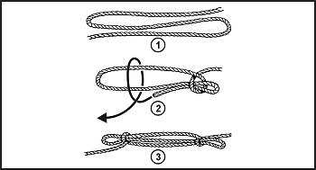

### TERMINOLOGY

G-1\. To be able to construct shelters, traps and snares, weapons and tools, and other devices; you should have a basic knowledge of ropes and knots and some of the terminology used with them. The terms are as follows:

*   _Bight_. A simple bend of rope in which the rope does not cross itself.

*   _Dressing the knot_. The orientation of all knot parts so that they are properly aligned, straightened, or bundled. Neglecting this can result in an additional 50 percent reduction in knot strength. This term is sometimes used for setting the knot which involves tightening all parts of the knot so they bind on one another and make the knot operational. A loosely tied knot can easily deform under strain and change, becoming a slipknot or worse, untying.

*   _Fraps_. A means of tightening the lashings by looping the rope perpendicularly around the wraps that hold the spars or sticks together.

*   _Lashings_. A means of using wraps and fraps to tie two or three spars or sticks together to form solid corners or to construct tripods. Lashings begin and end with clove hitches.

*   _Lay_. The lay of the rope is the same as the twist of the rope.

*   _Loop_. A loop is formed by crossing the running end over or under the standing end to form a ring or circle in the rope.

*   _Pig tail_. That part of the running end that is left after tying the knot. It should be no more than 4 inches long to conserve rope and prevent interference.

*   _Running end_. The free or working end of a rope. This is the part of the rope you are actually using to tie the knot.

*   _Standing end_. The static part of rope or rest of the rope besides the running end.

*   _Turn_. A loop around an object such as a post, rail, or ring with the running end continuing in the opposite direction to the standing end. A round turn continues to circle and exits in the same general direction as the standing end.

*   _Whipping_. Any method of preventing the end of a rope from untwisting or becoming unwound. It is done by wrapping the end tightly with a small cord, tape or other means. It should be done on both sides of an anticipated cut in a rope, before cutting the rope in two. This prevents the rope from immediately untwisting.

*   _Wraps_ ([Figure G-1](#figg-1)). Simple wraps of rope around two poles or sticks (square lashing) or three poles or sticks (tripod lashing). Wraps begin and end with clove hitches and get tighter with fraps. All together, they form a lashing.

**Figure G-1\. Wraps**

### BASIC KNOTS

G-2\. The basic knots and methods of tying them that you should know for your survival are as follows:

*   _Half-hitch._ This is the simplest of all knots and used to be the safety, or finishing, knot for all Army knots. Because it had a tendency to undo itself without load, it has since been replaced by the overhand.

*   _Overhand_ ([Figure G-2](#figg-2))_._ This is the simple knot that most people tie everyday as the first half of tying their shoes. It can also be used to temporarily whip the end of a rope. This knot should replace the half-hitch as a finishing knot for other knots. This knot alone will reduce the strength of a straight rope by 55 percent.

**Figure G-2\. Overhand Knot**

*   _Square_ ([Figure G-3](#figg-3))_._ A good, simple knot for general purpose use. This knot is basically two overhand knots that are reversed, as in Right over Left, Left over Right. It is used to tie the ends of two ropes of equal diameter together (just like your shoe laces) and must be secured with an overhand on both ends. It is easy to inspect, as it forms two loops and is easy to untie after being loaded.

*   _Round turn and two half-hitches_ ([Figure G-4](#figg-4))_._ This is the main anchor knot for one-rope bridges and other applications when a good anchor knot is required and where high loads would make other knots jam and difficult to untie. It is most used to anchor rope to a pole or tree.

**Figure G-3\. Square Knot Secured by Overhand Knots**

**Figure G-4\. Round Turn and Two Half-Hitches**

*   _Clove hitch and end-of-the-line clove hitch_ ([Figures G-5](#figg-5) and [G-6](#figg-6)). It can be used to fasten a rope to a tree or pipe and also puts little strain on the rope. It is an easy anchor knot but tension must remain on the knot or it will slip. This can be remedied by making another loop around the object and under the center of the clove hitch.

**Figure G-5\. Clove Hitch**

**Figure G-6\. End-of-the-Line Clove Hitch**

*   _Sheep shank_ ([Figure G-7](#figg-7))_._ A method of shortening a rope, it may also be used to take the load off of a weak spot in the rope. It is a temporary knot unless the eyes are fastened to the standing part of the rope on both ends.

**Figure G-7\. Sheep Shank**

*   _Double sheet bend_ ([Figure G-8](#figg-8)). This knot is used to tie together the ends of two ropes of equal or unequal diameter. It will also join wet rope and not slip or draw tight under load. It can be used to tie the ends of several ropes to the end of one rope. When a single rope is tied to multiple ropes, the bight is formed with the multiple of ropes.

**Figure G-8\. Double Sheet Bend**

*   _Prusik_ ([Figures G-9 through G-11](#figg-9)). This knot ties a short rope around a longer rope (for example, a sling rope around a climbing rope) in such a manner that the short rope will slide on the climbing rope if no tension is applied, and will hold if tension is applied on the short rope. This knot can be tied with an end of rope or bight of rope. When tied with an end of rope, the knot is finished off with a bowline. The nonslip nature of the knot on another rope allows climbing of ropes with foot holds. It can also be used to anchor ropes or the end of a traction splint on a branch or ski pole.

**Figure G-9\. Prusik, End of Line**

**Figure G-10\. Prusik, End of Line and Center of Line**

**Figure G-11\. Prusik, End of Line With Bowline for Safety**

*   _Bowline and bowline finished with an overhand knot_ ([Figure G-12](#figg-12)). Around-the-body bowline was the basic knot used for rescue for many years as it provided a loop, which could be placed around the body, that would not slip nor tighten up under strain. It has been replaced by the figure 8 in most applications as the figure 8 does not weaken the rope as much.

**Figure G-12\. Bowline and Bowline Finished With an Overhand Knot**

*   _Figure 8 and retraceable figure 8_ ([Figure G-13](#figg-13)). This knot is the main rescue knot in use today. It has the advantage of being stronger than the bowline and is easier to tie and check. Its one disadvantage is that when wet, it may be more difficult to untie than the bowline after being stressed. The figure 8 (or figure-of-eight) can be used as an anchor knot on fixed ropes. It can also be used to prevent the end of a rope from slipping through a fastening or loop in another rope when a knot larger than an overhand knot is needed.

**Figure G-13\. Figure 8 and Retraceable Figure 8**

### VARIOUS CONSTRUCTION LASHINGS

G-3\. There are numerous items that require lashings for construction. [Figures G-14 through G-16](#figg-14) show types of lashings that you can use when constructing tripods, shelters, and racks. Refer to [paragraphs 12-25 and 12-26](12#para12-25) if using field-expedient rope.

**Figure G-14\. Shears Lashing**

**Figure G-15\. Square Lashing**

**Figure G-16\. Tripod Lashing**
