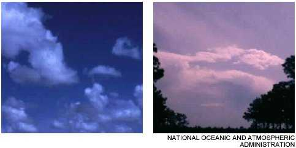
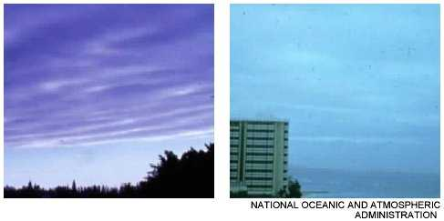
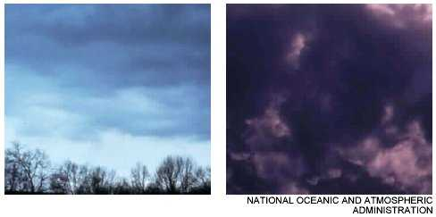

> About 200 years ago an Englishman classified clouds according to what they looked like to a person seeing them from the ground. He grouped them into three classes and gave them Latin names: cirrus, cumulus, and stratus. These three names, alone and combined with other Latin words, are still used to identify different cloud formations.
> 
> By being familiar with the different cloud formation and what weather they portend, you can take appropriate action for your protection.

**Cirrus clouds**  

Cirrus clouds are the very high clouds that look like thin streaks or curls. They are usually 6 kilometers (4 miles) or more above the earth and are usually a sign of fair weather. In cold climates, however, cirrus clouds that begin to multiply and are accompanied by increasing winds blowing steadily from a northerly direction indicate an oncoming blizzard.

* * *

**Cumulus clouds**  

Cumulus clouds are fluffy, white, heaped-up clouds. These clouds, which are much lower than cirrus clouds, are often fair weather clouds. They are apt to appear around midday on a sunny day, looking like large cotton balls with flat bottoms. As the day advances, they may become bigger and push higher into the atmosphere, piling up to appear like a mountain of clouds. These can turn into storm clouds.

* * *

**Stratus clouds**  

Stratus clouds are very low, gray clouds, often making an even gray layer over the whole sky. These clouds generally mean rain.

* * *

**Nimbus clouds**  

Nimbus clouds are rain clouds of uniform grayness that extend over the entire sky.

* * *

**Cumulonimbus clouds**  

Cumulonimbus is the cloud formation resulting from a cumulus cloud building up, extending to great heights, and forming in the shape of an anvil. You can expect a thunderstorm if this cloud is moving in your direction.

* * *

**Cirrostratus clouds**  

Cirrostratus is a fairly uniform layer of high stratus clouds that are darker than cirrus clouds. Cirrostratus clouds indicate good weather.

* * *

**Cirrocumulus clouds**  

Cirrocumulus is a small, white, round cloud at a high altitude. Cirrocumulus clouds indicate good weather.

* * *

**Scuds**  

A loose, vapory cloud (scud) driven before the wind is a sign of continuing bad weather.

</td>

</tr>

</tbody>

</table>

